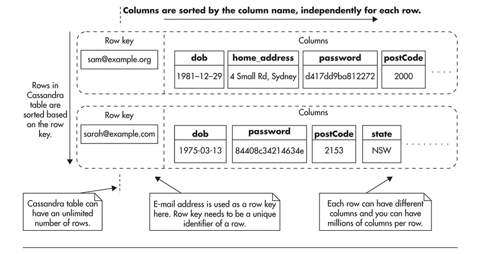
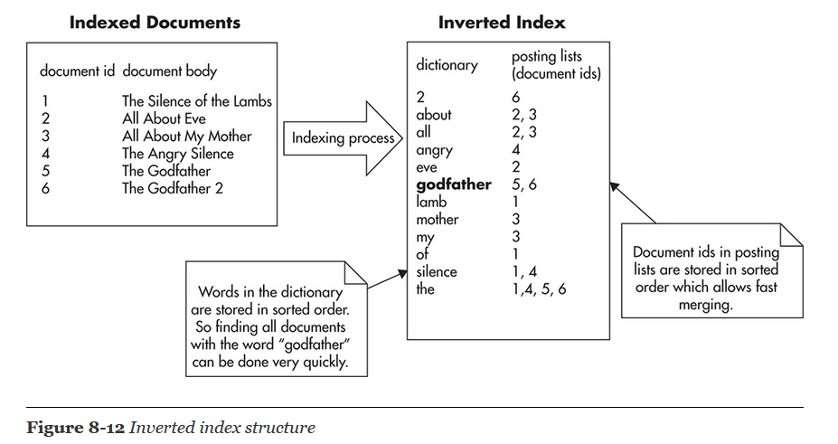
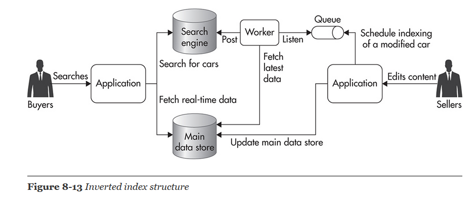

- Once we have a index, we can perform binary search
- **Cardinality** is a number of unique values stored in a particular field. Fields with high cardinality are good candidates for indexes, as they allow you to reduce the data set to a very small number of rows.
- The reason why low-cardinality fields are bad candidates for indexes is that they do not narrow down the search enough

**Two rules of indexes**
- The first rule of thumb when creating indexes on a data set is that the higher the cardinality
- creating indexes is that equal distribution leads to better index performance.

**composite index**, is an index that contains more than one field. You can use compound indexes to increase search efficiency where cardinality or distribution of values of individual fields is not good enough.

- When you use NoSQL data stores, you need to get used to thinking of data as if it were an index.
- The main challenge when designing and building the data layer of a scalable web application is identifying access patterns and modeling your data based on these access patterns.

## categories of Nosql
**Key-value data stores** 
- These data stores support only the most simplistic access patterns. To access data, you need to provide the key under which data was stored. 
- They are good for fast one-to-one lookups, but they are impractical when you need sorted lists of objects or when you need to model relationships between objects. 
- Examples of key-value stores are Dynamo and Riak. 
- Memcached is also a form of a key-value data store, but it does not persist data, which makes it more of a key-value cache than a data store. 

**Wide columnar data stores** 
- These data stores allow you to model data as if it was a compound index. 
- They are a good choice for huge data sets like user-generated content, event streams, and sensory data. 
- Examples of wide columnar data stores are BigTable, Cassandra, and HBase.

**Document-oriented data** 
- stores data stores allow more complex objects to be stored and indexed by the data store. 
- Document-based data stores use a concept of a document as the most basic building block in their data model. 
- Document stores usually offer a fairly rich data model, and they are a good use case for systems where data is difficult to fit into a predefined schema

  

## Search engines
-  web application like e-commerce platforms need to perform complex search like allow  users to search for products based on arbitrary combinations of criteria like category, price range, brand, availability, or location

- Search engines as data stores specializing in searching through text and other data types.
- **Inverted index** is a type of index that allows you to search for phrases or individual words (full text search).

  

**And and Or search**
- Searching for a phrase (“silence” AND “lamb”) requires you to merge posting lists of these two words by finding an intersection. 
- Searching for words (“silence” OR “lamb”) requires you to merge two lists by finding a union. 
- merging can be performed efficiently because lists of document IDs are stored in sorted order. Searching for phrases (AND queries) is slightly less expensive, as you can skip more document IDs and the resulting merged list is usually shorter than in the case of OR queries. In both cases, though, searching is still expensive and carries an O(n) time complexity

Complex search functionality like this is where dedicated search engines really shine

**Indexing mechanism**
A common pattern for indexing data in a search engine is to use a job queue (especially since search engines are near real time anyway). Anytime anyone modifies car metadata, they submit an asynchronous message for this particular car to be reindexed. At a later stage, a queue worker picks up the message from the queue, builds up the JSON document with all the information, and posts to the search engine to overwrite previous data.

  

