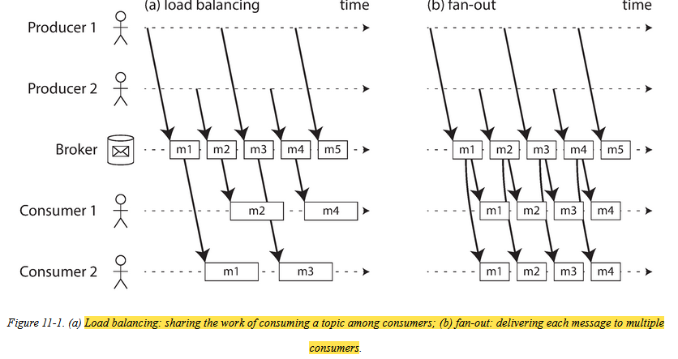
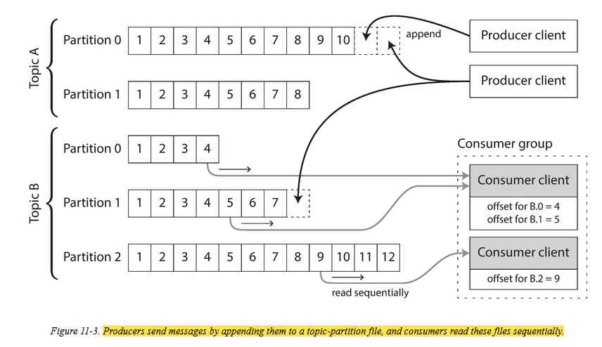
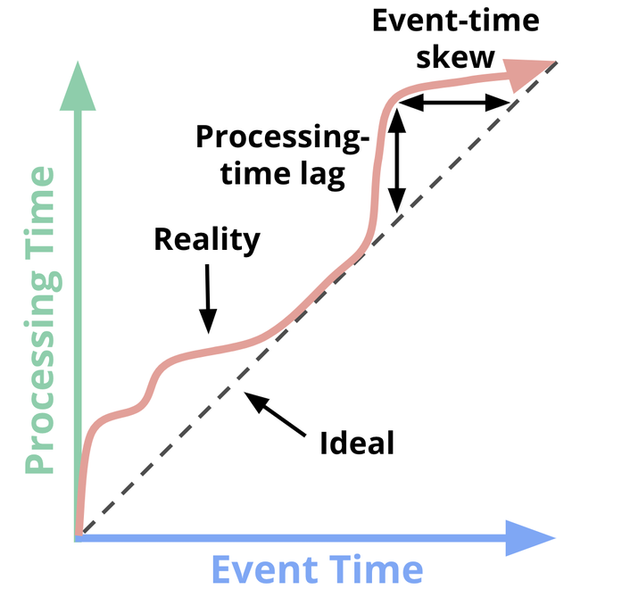
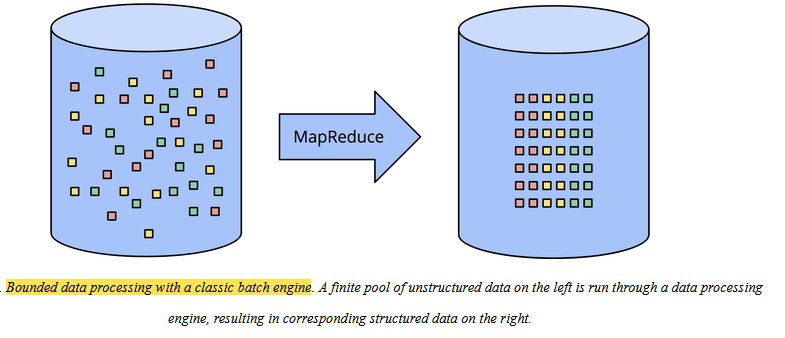
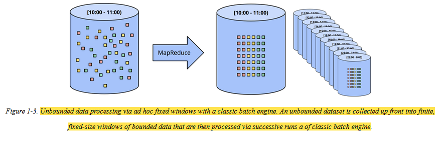
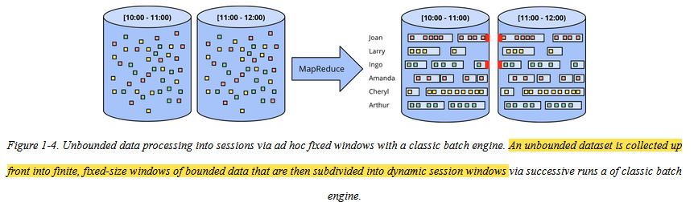
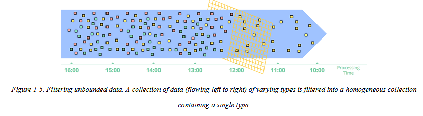
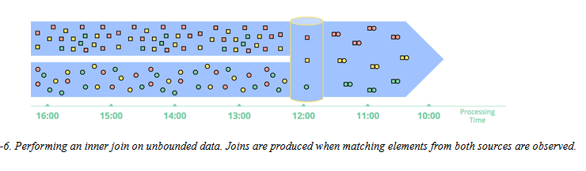
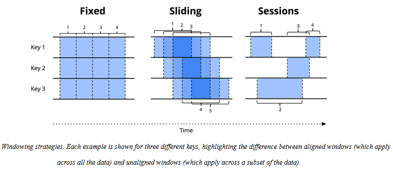
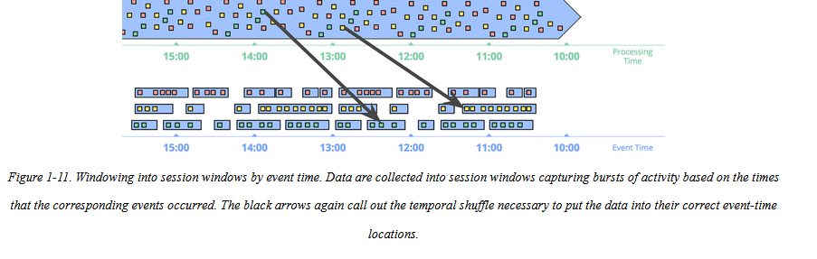

- [Streaming system](#streaming-system)
- [Two types of data](#two-types-of-data)
- [Transmitting Event Streams](#transmitting-event-streams)
  - [Messaging System](#messaging-system)
  - [Direct messaging from producers to consumers](#direct-messaging-from-producers-to-consumers)
  - [Message Brokers](#message-brokers)
  - [Multiple consumers](#multiple-consumers)
  - [Acknowledgement and Redelivery](#acknowledgement-and-redelivery)
  - [log-based message brokers](#log-based-message-brokers)
  - [Consumer offsets](#consumer-offsets)
  - [Disk Space Usage](#disk-space-usage)
  - [Replaying Old Messages](#replaying-old-messages)
- [Databases and Streams](#databases-and-streams)
- [Processing Streams](#processing-streams)
  - [uses of stream processing](#uses-of-stream-processing)
  - [Complex Event processing](#complex-event-processing)
  - [Search on streams](#search-on-streams)
  - [Message Passing](#message-passing)
  - [Stream-stream join (window join)](#stream-stream-join-window-join)
  - [Stream-table join (stream enrichment)](#stream-table-join-stream-enrichment)
  - [Table-table join (materialized view maintenance)](#table-table-join-materialized-view-maintenance)
  - [Fault Tolerance](#fault-tolerance)
    - [Microbatching and checkpointing](#microbatching-and-checkpointing)
- [Event Time Versus Processing Time](#event-time-versus-processing-time)
- [Data processing patterns](#data-processing-patterns)
  - [Bounded data:](#bounded-data)
  - [UnBounded data: Batch:](#unbounded-data-batch)
  - [Unbounded Data: Streaming](#unbounded-data-streaming)
  - [Approximation Algorithm](#approximation-algorithm)
- [Completeness estimation](#completeness-estimation)
## Streaming system		
A type of data processing engine that is designed with infinite datasets in mind

## Two types of data
**Bounded data**		
input is bounded a known and finite size. The batch process knows when it has finished reading its input.		
**Unbounded data**		
unbounded because it arrives gradually over time: your users produceddata yesterday and today, and they will continue to produce more

## Transmitting Event Streams

- An event usually contains a timestampindicating when it happened 
- An event may be encoded as a text string, or JSON, or perhaps in some binary form
- an event is generated once by a producer (also known as a publisher or sender), and then potentially processed by multiple consumers
- when moving toward continual processing with low delays, polling becomes expensive. it is betterfor consumers to be notified when new events appear.

### Messaging System
- A common approach for notifying consumers about new events is to use a messaging system: aproducer sends a message containing the event, which is then pushed to consumers
- messaging system allows multiple producer nodes to send messages to the same topic and allows multiple consumer nodes to receive messages in a topic.

### Direct messaging from producers to consumers
- A number of messaging systems use direct network communication between producers and consumers
  - UDP multicast is widely used in the financial industry for streams such as stock market feeds,where low latency is important. This is unreliable, but it doesnt matter
  - Brokerless messaging libraries such as **ZeroMQ** and nanomsg take a similar approach, implementing publish/subscribe messaging over TCP or IP multicast
  - **StatsD and Brubeck** use unreliable UDP messaging forcollecting metrics from all machines
  - Webhook, a callback URL of one service is registered with another service, and it makes a request to that URL whenever an event occurs  

**Cons**
- require the application code to be aware of the possibility of message loss. 
- Consumer offline is a problem

### Message Brokers
- send messages via a message broker
- Some message brokers only keep messages in memory, while others write them to disk so that they are not lost in case of a broker crash. 
- Faced with slow consumers, they generally allow unbounded queueing 
- consumers are generally asynchronous: when a producer sendsa message, it normally only waits for the broker to confirm that it has buffered the message and does not wait for the message to be processed by consumers

### Multiple consumers
- When multiple consumers read messages in the same topic, two main patterns of messaging a reused
  - **Load balancing:** 
    Each message is delivered to one of the consumers, so the consumers can share the work ofprocessing the messages in the topic. The broker may assign messages to consumers arbitrarily.
  - **Fan out:**
    Each message is delivered to all of the consumers. Fan-out allows several independent consumersto each “tune in” to the same broadcast of messages, without affecting each other

      

### Acknowledgement and Redelivery
- To ensure that the message is not lost, message brokers use acknowledgments: a client must explicitly tell the broker when it has finished processing a message so that the broker can remove it from the queue.
- If the connection to a client is closed or times out without the broker receiving an acknowledgment,it assumes that the message was not processed, and therefore it delivers the message again toanother consumer.

### log-based message brokers
- durable storage approach of databases with the low-latency notification facilities of Messaging
-  producer sends a message by appending it to the end of the log, and a consumer receives messages by reading the logsequentially. If a consumer reaches the end of the log, it waits for a notification that a newmessage has been appended. The Unix tool tail -f, which watches a file for data being appended,essentially works like this.
-  to scale to higher throughput than a single disk can offer, the log can be partitioned. Different partitions can then be hosted on differentmachines, making each partition a separate log that can be read and written independently from otherpartitions

  

### Consumer offsets
- Consuming a partition sequentially makes it easy to tell which messages have been processed: all messages with an offset less than a consumer’s current offset have already been processed, and all messages with a greater offset have not yet been seen. Thus, the broker does not need to track acknowledgments for every single message—it only needs to periodically record the consumer offsets.
- This offset is very similar to the log sequence number found in single-leader database replication

### Disk Space Usage
- If you only ever append to the log, you will eventually run out of disk space. To reclaim diskspace, the log is actually divided into segments, and from time to time old segments are deleted ormoved to archive storage
- if a slow consumer cannot keep up with the rate of messages, and it falls so farbehind that its consumer offset points to a deleted segment, it will miss some of the messages. Effectively, the log implements a bounded-size buffer that discards old messages when it gets full,also known as a **circular buffer or ring buffer**

### Replaying Old Messages
- Manipulating the consumer offset, we can read older data and return back to where we continued. 

## Databases and Streams

## Processing Streams
What you can do with the stream: 
- You can take the data in the events and write it to a database, cache, search index, or similarstorage system
- You can push the events to users in some way, for example by sending email alerts or pushnotifications, or by streaming the events 
  to a **real-time dashboard** where they are visualized
- You can process one or more input streams to produce one or more output streams. 

A piece of code that processes streams like this is known as an operator or a job

### uses of stream processing
- Fraud detection systems need to determine if the usage patterns of a credit card have unexpectedly changed, 
- Trading systems need to examine price changes in a financial market and execute trades according to specified rules. 
- Manufacturing systems need to monitor the status of machines in a factory, and quickly identify the problem if there is a malfunction.
- Military and intelligence systems need to track the activities of a potential aggressor, and raise the alarm if there are signs of an attackers

### Complex Event processing 
- Complex event processing (CEP) for analyzing event streams,especially geared toward the kind of application that requires searching for certain event patterns
- CEP systems use SQL like to describe the patterns of events that should be detected. These queries are submitted to a processing engine that consumes the input streams and internally maintains a state machine that performs the required matching

### Search on streams
- queries are stored, and the documents run past the queries, like in CEP. 
- index the queries as well as the documents, and thus narrow down the set of queries that may match

### Message Passing
Apache Storm has a feature called distributed RPC, which allows user queries to be farmedout to a set of nodes that also process event streams; these queries are then interleaved withevents from the input streams, and results can be aggregated and sent back to the user

### Stream-stream join (window join)
- you want to detect recent trends in searched-for URLs. Every time someone clicks one of the search results, you log another event recording the click. In order to calculate the click-through rate for each URL in the searchr esults, you need to bring together the events for the search action and the click action, which are connected by having the same session ID.
-  You can choose a suitable window for the join—forexample, you may choose to join a click with a search if they occur at most one hour apart.
-  stream processor needs to maintain state: for example, all theevents that occurred in the last hour, indexed by session ID. Whenever a search event or click eventoccurs, it is added to the appropriate index, and the stream processor also checks the other indexto see if another event for the same session ID has already arrived. If there is a matching event,you emit an event saying which search result was clicked.

### Stream-table join (stream enrichment)
- the input is a stream of activity events containing a user ID, and the output is astream of activity events in which the user ID has been augmented with profile information about theuser. This process is sometimes known as **enriching the activity** events with information from the database.
- load a copy of the database into the stream processor so that it can be queried locally without a network round-trip. the local copy of the database might be an in-memory hashtable if it is small enough, or an index on the local disk.
- the contents of the database are likely to change over time, so the stream processor’s local copy of the database needs to be kept up to date. This issue can be solved by change data capture: the stream processor can subscribe to a changelogof the user profile database as well as the stream of activity events. When a profile is created ormodified, the stream processor updates its local copy. Thus, we obtain a join between two streams:the activity events and the profile updates.

### Table-table join (materialized view maintenance)
- when a user wants to view their home timeline, it is too expensive to iterate over all thepeople the user is following, find their recent tweets, and merge them.
- we want a timeline cache: a kind of per-user “inbox” to which tweets are written as theyare sent, so that reading the timeline is a single lookup

*Materializing and maintaining this cache* requires the following event processing: 
- When user u sends a new tweet, it is added to the timeline of every user who is following u.
- When a user deletes a tweet, it is removed from all users’ timelines.
- To implement this cache maintenance in a stream processor, you need streams of events for tweets(sending and deleting) and for follow relationships (following and unfollowing). The stream process needs to maintain a database containing the set of followers for each user so that it knows which timelines need to be updated when a new tweet arrives

### Fault Tolerance
- if a task ina MapReduce job fails, it can simply be started again on another machine, and the output of thefailed task is discarded. This transparent retry is possible because input files are immutable, eachtask writes its output to a separate file on HDFS
- restarting tasks means that records may in fact be processed multiple times, the visibleeffect in the output is as if they had only been processed once. This principle is **known as exactly-once semantics**

#### Microbatching and checkpointing
- break the stream into small blocks, and treat each block like a miniature batchprocess. This approach is called microbatching, and it is used in Spark Streaming
- The batch size is typically around one second, which is the result of a performance compromise: smallerbatches incur greater scheduling and coordination overhead
- Microbatching also implicitly provides a tumbling window equal to the batch size 
- Apache Flink, is to periodically generate rolling checkpoints of state andwrite them to durable storage.
- If a stream operator crashes, it can restart from its most recent checkpoint and discard any output generated between the last checkpoint and the crash.
- An idempotent operation is one that you can perform multiple times, and it has the same effect as if you performed it only once. For example, setting a key in a key-value store to some fixed value is idempotent
- There may not even be necessary to replicate the state, because it can be rebuilt fromthe input streams. For example, if the state consists of aggregations over a fairly short window, itmay be fast enough to simply replay the input events corresponding to that window

## Event Time Versus Processing Time
Within any data processing system, two domains exist
- **Event time**		
This is the time at which events actually occurred.		

- **Processing time**		
  This is the time at which events are observed in the system.

In an ideal world, event time and processing time would always be equal, with events being processed immediately as they occur. 
In Reality there is a skew between event time and processing time and its a function of following:		
- Shared resource limitations, like network congestion, network partitions
- shared CPU in a nondedicated environment			
- Software causes such as distributed system logic, contention		
- Features of the data themselves, like key distribution, variance

  

## Data processing patterns
### Bounded data: 
  

### UnBounded data: Batch: 

**Fixed Windows**
- Unbounded dataset using repeated runs of a batch engine is by windowing the input data into fixed-size windows and then processing each of those windows as a - separate, bounded data source. Also called as tumbling windows.

  

**Sessions:** 
- Sessions are typically defined as periods of activity (e.g., for a specific user) terminated by a gap of inactivity. 
- When calculating sessions using a typical batch engine, you often end up with sessions that are split across batche

  

### Unbounded Data: Streaming
streaming systems are built for unbounded data.
- Highly unordered with respect to event times
- Of varying event-time skew

**Time Agnostic**
Time-agnostic processing is used for cases in which time is essentially irrelevant; that is, all relevant logic is data driven

**Filtering**
you’re processing web traffic logs and you want to filter out all traffic that didn’t originate from a specific domain. You would look at each record as it arrived, see if it belonged to the domain of interest, and drop it if not
  

**Inner Joins**
you’re processing web traffic logs and you want to filter out all traffic that didn’t originate from a specific domain. You would look at each record as it arrived, see if it belonged to the domain of interest, and drop it if not
  

### Approximation Algorithm
- Approximation algorithms, such as approximate Top-N, streaming k-means. 
- They take an unbounded source of input and provide output data that
- The upside of approximation algorithms is that, by design, they are low overhead and designed for unbounded data.

  

**Windowing**
Windowing is simply the notion of taking a data source (either unbounded or bounded), and chopping it up along temporal boundaries into finite chunks for processing

- Fixed windows (aka tumbling windows)
- Sliding windows (aka hopping windows)
  sliding windows are defined by a fixed length and a fixed period. If the period is less than the length, the windows overlap. If the period equals the length, you have fixed windows. And if the period is greater than the length, you have a weird sort of sampling window that looks only at subsets of the data over time. 
- Sessions		
  sessions are composed of sequences of events terminated by a gap of inactivity greater than some timeout. Sessions are commonly used for analyzing user behavior over time, by grouping together a series of temporally related events

  

**Windowing by processing time**
- Each arrived in processing-time windows that did not match the event-time windows to which each bit of data belonged. 
- If these data had been windowed into processing-time windows for a use case that cared about event times, the calculated results would have been incorrect.
  As you would expect, event-time correctness is one nice thing about using event-time windows.
    

## Completeness estimation

**Triggers:** 
- A trigger is a mechanism for declaring when the output for a window should be materialized relative to some external signal. 
- Triggers provide flexibility in choosing when outputs should be emitted. 
- You can think of them as a flow control mechanism for dictating when results should be materialized.

**WaterMarks**
- A watermark is a notion of input completeness with respect to event times. 
- A watermark with value of time X makes the statement: “all input data with event times less than X have been observed.” 

