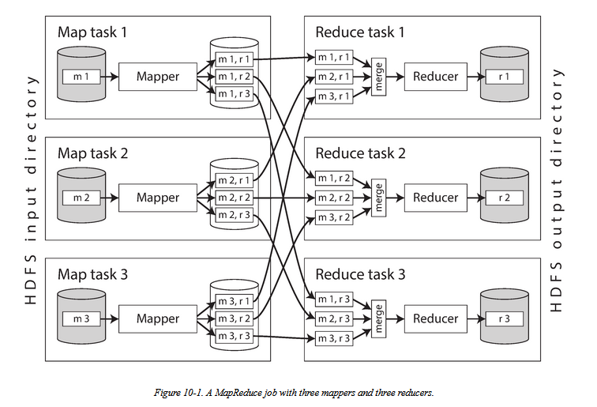

# Batch Processing

* [Batch Process](batch-processing.md#batch-process)
  * [What is service,batch and streams](batch-processing.md#what-is-servicebatch-and-streams)
  * [Batch processing with Unix tools](batch-processing.md#batch-processing-with-unix-tools)
    * [What are advantages in Unix Commands](batch-processing.md#what-are-advantages-in-unix-commands)
  * [Map reduce and distributed filesystems](batch-processing.md#map-reduce-and-distributed-filesystems)
    * [Where to use Map reduce](batch-processing.md#where-to-use-map-reduce)
    * [Advantages of Map reduce](batch-processing.md#advantages-of-map-reduce)
    * [materialisation disadvantages](batch-processing.md#materialisation-disadvantages)
    * [HDFS](batch-processing.md#hdfs)
      * [\(Architecture classification\)](batch-processing.md#architecture-classification)
      * [\(Replication advantage\)](batch-processing.md#replication-advantage)
    * [Mapper and Reducer](batch-processing.md#mapper-and-reducer)
      * [Workflow](batch-processing.md#workflow)
      * [Mapper](batch-processing.md#mapper)
      * [Reducer](batch-processing.md#reducer)
      * [Configure Mapper and Reducer](batch-processing.md#configure-mapper-and-reducer)
      * [Computation near the data](batch-processing.md#computation-near-the-data)
      * [How Large Sorting problem is solved](batch-processing.md#how-large-sorting-problem-is-solved)
      * [Combining several files together Reducer](batch-processing.md#combining-several-files-together-reducer)
      * [What is Shuffling](batch-processing.md#what-is-shuffling)
    * [Workflow chaining](batch-processing.md#workflow-chaining)
    * [DB and Map Reduce](batch-processing.md#db-and-map-reduce)
      * [Read data from databases](batch-processing.md#read-data-from-databases)
      * [Write batch output to databases](batch-processing.md#write-batch-output-to-databases)
      * [Hot key problem handling](batch-processing.md#hot-key-problem-handling)
      * [Resolution to Hot key](batch-processing.md#resolution-to-hot-key)
    * [Difference btw massively parallel processing \(MPP\) databases](batch-processing.md#difference-btw-massively-parallel-processing-mpp-databases)
  * [Beyond MapReduce](batch-processing.md#beyond-mapreduce)
    * [Map reduce Alternatives](batch-processing.md#map-reduce-alternatives)
  * [Graphs and iterative processing](batch-processing.md#graphs-and-iterative-processing)
    * [Why use Graph](batch-processing.md#why-use-graph)
    * [Graph communication](batch-processing.md#graph-communication)
    * [Fault tolerance](batch-processing.md#fault-tolerance)

      **Batch Process**

### What is service,batch and streams

* Service \(online\): waits for a request and sends back response as quicky
* Batch processing system \(offline\): takes a large amount of input data, runs a job to process it, and produces some output. _Hour to a day_
* Stream processing \(near-real-time\): A stream job operates on events shortly after they happen. _Seconds to Minutes_

### Batch processing with Unix tools

#### What are advantages in Unix Commands

* Unix commands automatically handle larger-than-memory datasets and automatically paralelizes sorting across multiple CPU cores.
* Programs must have the same data format to pass information to one another. In Unix, that interface is a file \(file descriptor\), an ordered sequence of bytes. 
* The unix approach works best if a program simply uses stdin and stdout. the program doesn't know or care where the input is coming from and where the output is going to.

### Map reduce and distributed filesystems

#### Where to use Map reduce

* Build indexes for Lucene full text search
* Machine learning systems such as classifiers and recommendation systems.

  **Advantages of Map reduce**

* Immutable inputs.

#### materialisation disadvantages

* The process of writing out the intermediate state to files is called materialisation.

  MapReduce's approach of fully materialising state has some downsides compared to Unix pipes:

  * A MapReduce job can only start when all tasks in the preceding jobs have completed.
  * Mappers are often redundant: they just read back the same file that was just written by a reducer.
  * Files are replicated across several nodes, which is often overkill for such temporary data.

#### HDFS

**\(Architecture classification\)**

* MapReduce jobs read and write files on a distributed filesystem. In Hadoop, that filesystem is called HDFS \(Hadoop Distributed File System\).
* **shared-nothing principe**. 
* HDFS consists of a daemon process running on each machine, exposing a network service that allows other nodes to access files stored on that machine. A central server called the NameNode keeps track of which file blocks are stored on which machine.

  **\(Replication advantage\)**

* File blocks are replicated on multiple machines. 
* erasure coding scheme such as Reed-Solomon codes, to recover lost data.

#### Mapper and Reducer

**Workflow**

1. Read a set of input files, and break it up into records.
2. Call the mapper function to extract a key and value from each input record.
3. Sort all of the key-value pairs by key.
4. Call the reducer function to iterate over the sorted key-value pairs.

**Mapper**

Called once for every input record, and its job is to extract the key and value from the input record.

**Reducer**

Takes the key-value pairs produced by the mappers, collects all the values belonging to the same key, and calls the reducer with an interator over that collection of values.

**Configure Mapper and Reducer**

* number of map tasks is determined by the number of input file blocks
* the number of reduce tasks is configured by the job author. 

  **Computation near the data**

* The MapReduce scheduler tries to run each mapper on one of the machines that stores a replica of the input file, putting the computation near the data.

**How Large Sorting problem is solved**

Sorting is performed in stages.

**Combining several files together Reducer**

The reduce task takes the files from the mappers and merges them together, preserving the sort order.

**What is Shuffling**

Partitioning by reducer, sorting and copying data partitions from mappers to reducers is called shuffle.

* Whenever a mapper finishes reading its input file and writing its sorted output files, the MapReduce scheduler notifies the reducers that they can start fetching the output files from that mapper.
* The reducers connect to each of the mappers and download the files of sorted key-value pairs for their partition. 

#### Workflow chaining

* MapReduce jobs can be chained together into workflows, the output of one job becomes the input to the next job.
* In Hadoop this chaining is done implicitly by directory name: the first job writes its output to a designated directory in HDFS, the second job reads that same directory name as its input.

#### DB and Map Reduce

**Read data from databases**

* If the query involves joins, it may require multiple index lookpus. MapReduce has no concept of indexes.
* Requests over the network are too slow and nondeterministic. Other databases could be prohibitive.
* A better approach is to take a copy of the data and put it in the same distributed filesystem.

**Write batch output to databases**

* Writing from the batch job directly to the database server is a bad idea
* Making a network request for every single record is magnitude slower than the normal throughput of a batch task.
* A much better solution is to write it as files, so it can be loaded in bulk into servers. Example: HBase bulk loading.

  **Hot key problem handling**

* In an example of a social network, small number of celebrities may have many millions of followers.
* A single reducer can lead to significant skew that is, one reducer that must process significantly more records than the others.

**Resolution to Hot key**

* The **skewed join method in Pig first** runs a sampling job to determine which keys are hot and then records related to the hot key need to be replicated to all reducers handling that key.
* Handling the hot key over several reducers is called **shared join method**.

  **Difference btw massively parallel processing \(MPP\) databases**

* MPP databases focus on parallel execution of analytic SQL queries on a cluster of machines, while the combination of MapReduce like a general-purpose operating system that can run arbitraty programs.
* Hadoop is dumping data into HDFS. MPP databases typically require careful upfront modeling of the data and query patterns before importing data into the database's proprietary storage format.
* If a node crashes while a query is executing, most MPP databases abort the entire query. MPP databases also prefer to keep as much data as possible in memory.

  MapReduce can tolerate the failure of a map or reduce task without it affecting the job. It is also very eager to write data to disk, partly for fault tolerance, and partly because the dataset might not fit in memory anyway.

### Beyond MapReduce

#### Map reduce Alternatives

* Spark, Tez and Flink. These new ones can handle an entire workflow as one job, rather than breaking it up into independent sub jobs.
* They are assembled in flexible ways, in functions called operators.
* if a machine fails and the intermediate state on that machine is lost, it is recomputed from other data that is still available.
* Spark uses the resilient distributed dataset \(RDD\) to track ancestry data.

### Graphs and iterative processing

#### Why use Graph

* Used to perform some kind of offline processing or analysis on an entire graph. This need often arises in machine learning applications such as recommednation engines, or in ranking systems.
* "repeating until done" cannot be expressed in plain MapReduce as it runs in a single pass over the data and some extra trickery is necessary.

#### Graph communication

* One vertex can "send a message" to another vertex, and typically those messages are sent along the edges in a graph.
* The fact that vertices can only communicate by message passing helps improve the performance, since messages can be batched.

#### Fault tolerance

* Fault tolerance is achieved by periodically checkpointing the state of all vertices at the end of an interation.
* Graph algorithms often have a lot of cross-machine communication overhead, and the intermediate state is often bigger than the original graph.

