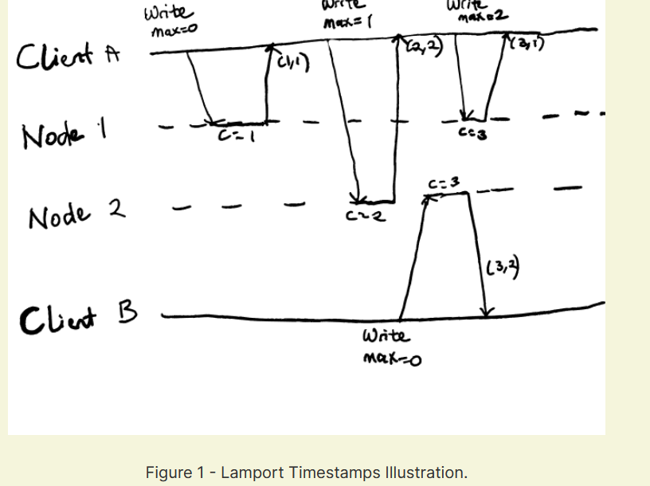

# Contention and Consensus

* [Eventual consistency cons](contention-and-consensus.md#eventual-consistency-cons)
* [Linearizability](contention-and-consensus.md#linearizability)
  * [Linearizability vs Serializability](contention-and-consensus.md#linearizability-vs-serializability)
  * [Relying on Linearizability](contention-and-consensus.md#relying-on-linearizability)
  * [Implementing Linearizable Systems](contention-and-consensus.md#implementing-linearizable-systems)
  * [The Cost of Linearizability](contention-and-consensus.md#the-cost-of-linearizability)
  * [Ordering and Causality](contention-and-consensus.md#ordering-and-causality)
    * [Sequence Number Ordering](contention-and-consensus.md#sequence-number-ordering)
    * [Noncausal sequence number generators](contention-and-consensus.md#noncausal-sequence-number-generators)
  * [Lamport Timestamps](contention-and-consensus.md#lamport-timestamps)
  * [Timestamp ordering is not sufficient](contention-and-consensus.md#timestamp-ordering-is-not-sufficient)
* [Total Order Broadcast](contention-and-consensus.md#total-order-broadcast)
  * [Using total order broadcast](contention-and-consensus.md#using-total-order-broadcast)
  * [Implementing linearizable storage using total order broadcast](contention-and-consensus.md#implementing-linearizable-storage-using-total-order-broadcast)
  * [Linearizable writes using total order broadcast](contention-and-consensus.md#linearizable-writes-using-total-order-broadcast)
  * [Linearizable reads using total order broadcast](contention-and-consensus.md#linearizable-reads-using-total-order-broadcast)
  * [Implementing total order broadcast using linearizable storage](contention-and-consensus.md#implementing-total-order-broadcast-using-linearizable-storage)
* [Distributed Transactions and Consensus](contention-and-consensus.md#distributed-transactions-and-consensus)
  * [Atomic Commit and Two-Phase Commit \(2PC\)](contention-and-consensus.md#atomic-commit-and-two-phase-commit-2pc)
    * [From single-node to distributed atomic commit](contention-and-consensus.md#from-single-node-to-distributed-atomic-commit)
* [Introduction to Two-phase commit](contention-and-consensus.md#introduction-to-two-phase-commit)
  * [Coordinator Failure](contention-and-consensus.md#coordinator-failure)
* [Three-phase commit](contention-and-consensus.md#three-phase-commit)
* [Distributed Transactions in Practice](contention-and-consensus.md#distributed-transactions-in-practice)
  * [Exactly-once message processing](contention-and-consensus.md#exactly-once-message-processing)
  * [XA Transactions](contention-and-consensus.md#xa-transactions)
  * [Holding locks while in doubt](contention-and-consensus.md#holding-locks-while-in-doubt)
* [Limitations of distributed transactions](contention-and-consensus.md#limitations-of-distributed-transactions)
* [Fault-Tolerant Consensus](contention-and-consensus.md#fault-tolerant-consensus)
* [Consensus algorithms and total order broadcast](contention-and-consensus.md#consensus-algorithms-and-total-order-broadcast)
* [Single-leader replication and consensus](contention-and-consensus.md#single-leader-replication-and-consensus)
* [Epoch numbering and quorums](contention-and-consensus.md#epoch-numbering-and-quorums)
* [Limitations of consensus](contention-and-consensus.md#limitations-of-consensus)
* [Membership and Coordination Services](contention-and-consensus.md#membership-and-coordination-services)
* [Allocating work to nodes](contention-and-consensus.md#allocating-work-to-nodes)
* [Service discovery](contention-and-consensus.md#service-discovery)

## Eventual consistency cons

Eventual consistency is a very weak guarantee as it doesn't say when the replicas will converge, it just says that they will converge.

## Linearizability

```text
Note: Linearizability is said to also be known as atomic consistency, strong consistency, immediate consistency or external consistency.
```

1. The idea behind Linearizability is that the database should always appear as if there is only one copy of the data. 

   making the same request on multiple nodes should always give the same response as long as no update is made between those requests.

2. Recency guarantee, meaning that the value read must be the most recent or up-to-date value, and is not from a stale cache. 

   client successfully completes a write, all other clients must see the value just written.

### Linearizability vs Serializability

**Linearizability:** This is a recency guarantee on reads and writes of a single object. This guarantee does not group multiple operations together into a transaction. meaning it cannot protect against a problem like write skew, where a transaction makes a write based on a value it read earlier that has now been updated by another concurrently running transaction.

**Serializability:** This is an isolation property of transactions that guarantees that transactions behave the same as if they had executed in some serial order. There is no guarantee on what serial order these transactions appear to run in, all that matters is that it is a serial order.

1. When a database provides both serializability and linearizability, the guarantee is known as strict serializability.
2. Two Phase-Locking and Actual Serial Execution are implementations of serializability that are also linearizable. 

   However, serializable snapshot isolation is not linearizable, since a transaction will be reading values from a consistent snapshot.

### Relying on Linearizability

linearizability is as a guarantee, it is not critical for all applications. there are examples of where linearizability is important for making a system work correctly:

**Locking and leader election**

1. A system with a single-reader replication model must ensure that there's only ever one leader at a time. 
2. One of the ways to implement leader election is by using a lock. All the eligible nodes start up and try to acquire a lock and the successful one becomes the leader. This lock must be linearizable. Once a node owns the lock, all the other nodes must see that it is that node that owns the lock.

   Apache ZooKeeper and etcd are often used to implement distributed locks and leader election.

**Constraints and uniqueness guarantees**

1. When multiple users are concurrently trying to register a value that must be unique, each user can be thought of as acquiring a lock on that value. E.g. a username or email address system.
2. We see similar issues in examples like ensuring that a bank account never goes negative, not selling more items than is available in stock, not concurrently booking the same seat on a flight, or in a theater for two people. For these constraints to be implemented properly, there needs to be a single up to date value that all nodes agree on.

### Implementing Linearizable Systems

the simplest way to implement it will be to actually have just one copy of the data. However, that won't be fault-tolerant if the node that has the single copy becomes unavailable.

other different replication methods:

1. Single-leader replication \(potentially linearizable\): If we make every read from the leader or from synchronously updated followers, the system has the potential to be linearizable. However, there is no absolute guarantee as the system can still be non-linearizable either by design \(because it uses snapshot isolation\) or due to concurrency bugs. Issues like split-brain can mean that a single-leader system can violate linearizability.
2. Consensus Algorithms \(linearizable\): They are similar to single-leader replication, but they contain additional measures to prevent stale replicas and split-brain. As a result, consensus protocols are used to implement linearizable storage safely. Zookeeper and Etcd work this way.

### The Cost of Linearizability

While linearizability is often desirable, there can be performance costs.

Consider a scenario where we have two data centers and there's a network interruption between those data centers:

1. In a multi-leader database setup, the operations can continue in each data center normally since the writes can be queued up until the network link is restored and replication can happen asynchronously.
2. In a single-leader setup, the leader must be in one of the data centers. Therefore, clients connected to a follower data center will not be able to contact the leader and cannot make any writes, nor any linearizable reads \(their reads will be stale if the leader keeps getting updated\).

### Ordering and Causality

**Why Ordering is important** For single-leader replication. The main purpose of the leader is to determine the order of writes in the replication log i.e. the order in which followers apply writes. Without a single leader, we can have conflicts due to concurrent operations.

With causality, an ordering of events is guaranteed such that cause always comes before effect. If one event happened before another, causality will ensure that that relationship is captured i.e. the _happens-before relationship_ . Some examples of this are:

* When a row is first created and then updated, a replica should not see the instruction to update the row before the creation instruction.

A system that obeys the ordering imposed by causality is said to be causally consistent.

**Capturing causal dependencies**

Causal consistency captures the notion that causally-related operations should appear in the same order on all processes—though processes may disagree about the order of causally independent operations - Jepsen

For a causally consistent database, when a replica processes an operation, it needs to ensure that all the operations that happened before it have already been processed; if a preceding operation is missing, the system must hold off on processing the later one until the preceding operation has been processed.

To determine causal ordering, the database needs to keep track of which version of the data was read by an application.

#### Sequence Number Ordering

1. A good way of keeping track of causal dependencies in a database is by using sequence numbers or timestamps to order the events. This timestamp can be a logical clock which is an algorithm that generates monotonically increasing numbers for each operation. These sequence numbers provide a total order meaning that if we have two sequence numbers, we can always determine which is greater.
2. With single-leader databases, the replication log defines a total order of write operations that is consistent with causality. Here, the leader can assign a monotonically increasing sequence number to each operation in the log. A follower that applies the writes in the order they appear in the replication log will always be in a causally consistent state.

#### Noncausal sequence number generators

In a multi-leader or leaderless database, generating sequence numbers for operations can be done in different ways such as:

1. Ensuring that each node generates an independent set of sequence numbers e.g. if we have two nodes, one node can generate even numbers while the other can generate odd numbers.
2. A timestamp from a time-of-day can be attached to each operation. We can preallocate blocks of sequence numbers. 

However, while these options perform better than pushing all operations through a single leader which increments the counter, the problem with them is that they these sequence number are not consistent with causality. They do not capture ordering across different nodes.

### Lamport Timestamps

1. The idea here is that each node has a unique identifier, and also keeps a counter of the number of operations it has processed. The Lamport timestamp is then a pair of \(counter, nodeID\). Multiple nodes can have the same counter value, but including the node ID in the timestamp makes it unique.
2. Lamport timestamps provide a total ordering: if there are two timestamps, the one with the greater counter value is the greater timestamp; if the counter values are the same, then we pick the one with the greater node ID as the greater timestamp.

**What makes Lamport timestamps consistent with causality is the following:**

"Every node and every client keeps track of the maximum counter value it has seen so far, and includes that maximum on every request. When a node receives a request or response with a maximum counter value greater than its own counter value, it immediately increases its own counter to that maximum."

Consider the diagram below:



In this figure, client A sends its requests to nodes 1 and 2, incrementing the counter of each one in the process. When client B sends its request to node 2, the current counter of the node is 2 which is greater than the maximum value seen by client B, and so it increases the counter to 3.

\(1,1\) -&gt; \(2, 2\) -&gt; \(3, 1\) -&gt; \(3,2\)

This ordering showcases a limitation of Lamport timestamps. Even though operation \(3,2\) appears to complete before \(3,1\), the ordering does not reflect that. The fact that those two have the same counter value means that they are concurrent and the operations do not know about each other, but Lamport timestamps must enforce a total ordering. With the ordering from Lamport timestamps, you cannot tell whether two operations are concurrent or causally dependent.

**Version Vectors** can help distinguish whether two operations are concurrent or whether one causally depends on the other, but Lamport timestamps have the advantage that they are more compact.

### Timestamp ordering is not sufficient

1. Although Lamport timestamps are great for defining a total order that is consistent with causality, they do not solve some common problems in distributed systems.
2. The key thing to note here is that they only define a total order of operations after you have collected all the operations. If one operation needs to decide right now whether a decision should be made, it might need to check with every other node that there's no concurrently executing operation that could affect its decision. Any of the other nodes being down will bring the system to a halt, which is not good for fault tolerance.
3. For example, if two users concurrently try to create an account with the same username, only one of them should succeed. It might seem as though we could simply pick the one with the lower timestamp as the winner and let the one with the greater timestamp fail. However, if a node needs to decide right now, it might simply not be aware that another node is in the process of concurrently creating an account, or might not know what timestamp the other node may assign to the operation.

## Total Order Broadcast

Total Order Broadcast \(or Atomic Broadcast\) is a broadcast a protocol for exchanging messages between nodes. It requires that the following safety properties are always satisfied:

1. Reliable delivery: No messages are lost. A message delivered to one node must be delivered to all the nodes.
2. Totally ordered delivery: Messages are delivered to every node in the same order.

An algorithm for total order broadcast must ensure that these properties are always satisfied, even in the face of network or node faults. In the face of failures, the algorithm must keep retrying so that messages can get through when the network is repaired.

Q: How can messages be delivered in the same order in multi-leader or leaderless replication systems?

A: In leaderless replication systems, a client typically directly sends its writes to several replicas and then uses a quorum to determine if it's successful or not. Leaderless replication does not enforce a particular order of writes.

### Using total order broadcast

Total order broadcast is exactly what is needed for database replication based on a principle known as state machine replication.

It's stated as follows: "If every message represents a write to the database, and every replica processes the same writes in the same order, then the replicas will remain consistent with each other \(aside from any temporary replication lag\)."

It can also be used to implement serializable transactions:

Total Order broadcast can also be seen as a way of creating a log \(like a replication log, transaction log, or write-ahead log\). Delivering a message is like appending to the log, and if all the nodes read from the log, they will see the same sequence of messages.

Another use of total order broadcast is for implementing fencing tokens. Each request to acquire the lock can be appended as a message to the log, and the messages can be given a sequence number in the order of their appearance in the log. This sequence number can then be used as a fencing token due to the fact that it's monotonically increasing.

### Implementing linearizable storage using total order broadcast

Although total order broadcast is a reasonably strong guarantee, it is not quite as strong as linearizability. However, they are closely related.

Total Order Broadcast guarantees that messages will be delivered reliably in the same order, but it provides no guarantee about when the message will be delivered \(so a read to a node may return stale data\). Linearizability, on the other hand, is a recency guarantee, it guarantees that a read will see the latest value written.

### Linearizable writes using total order broadcast

Linearizable writes are instantaneous writes, meaning that once a client has written a value, all other reads to that value must see the newly written value or the value of a later write.

To ensure linearizable writes in this system using total order broadcast:

1. Each node can append a message to the log indicating the username they want to claim.
2. The nodes then read the log, waiting for the message they appended to be delivered back to them.
3. If the first message that a node receives with the username it wants is its own message, then the node is successful and can commit the username claim. All other nodes that want to claim this username can then abort their operations.

This works because if there are several concurrent writes, all the nodes will agree on which came first, and these messages are delivered to all the nodes in the same order.

This algorithm does not guarantee linearizable reads though. A client can still get stale reads if they read from an asynchronously updated store.

### Linearizable reads using total order broadcast

There are a number of options for linearizable reads with total order broadcast:

1. When you want to read a value, you could append a message to the log, read the log and then perform the actual read of the value when the message you appended is delivered back to you. 
2. If you can fetch the position of the latest log message in a linearizable way, you can query that position, wait for all the entries up to that position to be delivered to you, and then actually perform the read. This is the idea used in Zookeeper's sync\(\) operation.

### Implementing total order broadcast using linearizable storage

What we're essentially implementing is a mechanism for generating sequence numbers for each message we want to send. The easiest way to do this is to assume that we have a linearizable register which stores an integer and has an atomic increment-and-get operation.

The algorithm is this:

"For every message you want to send through total order broadcast, you increment-and-get the linearizable integer, and then attach the value you got from the register as a sequence number to the message."

This way, we'll avoid race conditions on the integer and each message will have a unique sequence number.

## Distributed Transactions and Consensus

Simply put, consensus means getting several nodes to agree on something.

Some situations where it is important for the nodes to agree include:

**Leader election:** In a single-leader setup, all the nodes need to agree on which node is the leader.

**Atomic commit:** If a transaction spans several nodes or partitions, there's a chance that it may fail on some nodes and succeed on others. However, to preserve the atomicity property of ACID transactions, it must either succeed or fail on all of them.

### Atomic Commit and Two-Phase Commit \(2PC\)

Two-phase commit is the most commonly used algorithm for implementing atomic commit.

#### From single-node to distributed atomic commit

Atomicity for single database node transactions is usually implemented by the storage engine. When a request is made to commit a transaction, the writes in the transaction are made durable \(typically using a write-ahead log\) and then a commit record is appended on disk. If the database crashes during this process, upon restarting, it decides whether to commit or rollback the transaction based on whether or not the commit record was written to the disk before the crash.

However, if multiple nodes are involved, it's not sufficient to simply send a commit request to all the nodes and then commit the transaction on each one. Some of the scenarios where multiple nodes could be involved are: a multi-object transaction in a partitioned database, or writing to a term-partitioned index.

It's possible that the commit succeeds on some nodes and fails on other nodes, which is a violation of the atomicity guarantee. Possible scenarios are:

* Some nodes may detect a violation of a uniqueness constraint or something similar and may have to abort, while other nodes are able to commit successfully.
* Some commit requests might get lost in the network, and may eventually abort due to a timeout, while other requests are successful.
* Some nodes may crash before the commit record is fully written and then have to roll back on recovery, while other nodes successfully commit.

it's important that a node commits a transaction only when it is certain that all other nodes in the transaction will commit.

## Introduction to Two-phase commit

Two-phase commit \(or 2PC\) is an algorithm used for achieving atomic transaction commit when multiple nodes are involved. 'Atomic' in the sense that either all nodes commit or all abort.

The key thing here is that the commit process is split into two phases: the prepare phase and the actual commit phase.

It achieves atomicity across multiple nodes by introducing a new component known as the coordinator. The coordinator can run in the same process as the service requesting the transaction or in an entirely different process.

**When the application is ready to commit a transaction, the two phases are as follows:** 1. The coordinator sends a prepare request to all the nodes participating in the transaction, for which the nodes have to respond with essentially a 'YES' or 'NO' message. 2. If all the participants reply 'YES', then the coordinator will send a commit request in the second phase for them to actually perform the commit. However, if any of the nodes reply 'NO', the coordinator sends an abort request to all the participants. 3. When a participant responds with "YES", it means that it must be able to commit under all circumstances. A power failure, crash, or memory issue cannot be an excuse for refusing to commit later. It must definitely be able to commit the transaction without error if needed.

When the coordinator decides and that decision is written to disk, the decision is irrevocable. It doesn't matter if the commit or abort request fails at first, it must be retried forever until it succeeds.

### Coordinator Failure

1. If any of the prepare requests fails or times out during a 2PC, the coordinator will abort the transaction. 
2. If any commit or abort request fails, the coordinator will retry them indefinitely.
3. If the coordinator fails before it can send a prepare request, a participant can safely abort the transaction. 

However, once a participant has received a prepare request and voted "YES", it can no longer abort by itself. It has to wait to hear from the coordinator about whether or not it should commit the transaction.

The downside of this is that if the coordinator crashes or the network fails after a participant has responded "YES", the participant can do nothing but wait. In this state, it is said to be in doubt or uncertain.

The reason why a participant has to wait for the coordinator in the event of a failure is that it does not know whether the failure extends to all participants or just itself.

It's possible that the network failed after the commit request was sent to one of the participants. If the in doubt participants then decide to abort after a timeout due to not receiving from the coordinator, it will leave the database in an inconsistent state.

This possibility of failure is why the coordinator must write its decision to a transaction log on disk before sending the request to the participants. When it recovers from a failure, it can read its transaction log to determine the status of all in-doubt transactions. Transactions without a commit record in the coordinator's log are aborted. In essence, the commit point of 2PC is a regular single-node atomic commit on the coordinator.

## Three-phase commit

Two-phase commit is referred to as a blocking atomic commit protocol because of the fact that it can get stuck waiting for the coordinator to recover. An alternative to 2PC that has been proposed is an algorithm called three-phase commit \(3PC\). The idea here is that it assumes a network with bounded delays and nodes with bounded response times. This means that when a delay exceeds that bound, a participant can safely assume that the coordinator has crashed. However, most practical systems have unbounded network delays and process pauses

## Distributed Transactions in Practice

Distributed transactions, especially those implemented with two-phase commit, are contentious because of the performance implications and operational problems they cause. This has led to many cloud services choosing not to implement them.

There are two types of distributed transaction which often get conflated:

**Database-internal distributed transactions:** This refers to transactions performed by a distributed database that spans multiple replicas or partitions.

**Heterogenous distributed transactions:** Here, the participants are two or more different technologies. For example, we could have two databases from different vendors, or even non-database systems such as message brokers.

### Exactly-once message processing

With heterogeneous transactions, we can integrate diverse systems in powerful ways. For example, we can perform a transaction that spans across a message queue and a database. Say we want to acknowledge a message from a queue as processed if and only if the transaction for processing the message was successfully committed, we could perform this using distributed transactions.

This can be implemented by atomically committing the message acknowledgment and the database writes in a single transaction. If the transaction fails and the message is not acknowledged, the message broker can safely redeliver the message later.

An advantage of atomically committing a message together with the side effects of its processing is that it ensures that the message is effectively processed exactly once. If the transaction fails, the effects of processing the message can simply be rolled back.

> However, this is only possible if all the systems involved in the transaction are able to use the same atomic commit protocol. For example, if a side effect of processing a message involves sending an email and the email server does not support two-phase commit, it will be difficult to roll-back the email. Processing the message multiple times may involve sending multiple emails.

### XA Transactions

XA \(eXtended Architecture\) is a standard for implementing two-phase commit across heterogeneous technologies.

XA is a C API for interacting with a transaction coordinator, but bindings for the API exist in other languages.

It assumes that communication between your application and the participant databases/messaging services is done through a network driver \(like JDBC\) or a client library which supports XA.

If the driver does support XA, it will call the XA API to find out whether an operation should be part of a distributed transaction - and if so, it sends the necessary information to the participant database server. The driver also exposes callbacks needed by the coordinator to interact with the participant, through which it can ask a participant to prepare, commit, or abort.

The transaction coordinator is what implements the XA API. The coordinator is usually just a library that's loaded into the same process as the application issuing the transaction. It keeps track of the participants involved in a transaction, their responses after asking them to prepare, and then uses a log to keep track of its commit/abort decision for each transaction.

Note that a participant database cannot contact the coordinator directly. All of the communication must go through its client library through the XA callbacks.

### Holding locks while in doubt

The reason we care so much about transactions not being stuck in doubt is locking. Transactions often need to take row-level locks on any rows they modify, to prevent dirty writes. These locks must be held until the transaction commits or aborts.

If we're using a two-phase commit protocol and the coordinator crashes, the locks will be held until the coordinator is restarted. No other transaction can modify these rows while the locks are held.

The impact of this is that it can lead to large parts of your application being unavailable: If other transactions want to access the rows held by an in-doubt transaction, they will be blocked until the transaction is resolved.

## Limitations of distributed transactions

Some of the other limitations of distribute transactions are:

1. 2PC needs all participants to respond before it can commit a transaction. As a result, if any part of the system is broken, the transaction will fail. This means that distributed transactions have a tendency of amplifying failures, which is not what we want when building fault-tolerant systems.
2. If the coordinator is not replicated across multiple machines, it becomes a single point of failure for the system.
3. XA needs to be compatible across a wide range of data systems and so it is a lowest common denominator meaning that it cannot have implementations that are specific to any system. For example, it cannot detect deadlocks across different systems, as that would require a standardized protocol with which different systems can inform each other on what locks are being held by another transaction. It also cannot work with Serializable Snapshot Isolation, as we would need a protocol for identifying conflicts across multiple systems.

## Fault-Tolerant Consensus

In simple terms, consensus means getting several nodes to agree on something.

In formal terms, we describe the consensus problem like this: One or more nodes may propose values, and the role of the consensus algorithm is to decide on one of those values. In the case of booking a meeting room, each node handling a user request may propose the username of the user making the request, and the consensus algorithm will decide on which user will get the room.

A consensus algorithm must satisfy the following properties:

Uniform agreement: No two nodes decide differently. Integrity: No node decides twice. Validity: If a node decides a value v, then v was proposed by some node. Termination: Every node that does not crash eventually decides some value.

The core idea of consensus is captured in the uniform agreement and integrity properties: everyone must decide on the same outcome, and once the outcome has been decided, you cannot change your mind.

The validity property is mostly to rule out trivial solutions such as an algorithm that will always decide null regardless of what was proposed. An algorithm like that would satisfy the first two properties, but not the validity property.

The termination property is what ensures fault tolerance in consensus-based systems. Without this property, we could designate one node as the "dictator" and let it make all the decisions. However, if that node fails, the system will not be able to make a decision. We saw this situation in the case of two-phase commit which leaves participants in doubt.

What the termination property means is that a consensus algorithm cannot sit idle and do nothing forever i.e. it must make progress. If some nodes fail, the other nodes must reach a decision. Note that termination is a liveness property, while the other three are safety properties.

The consensus system model assumes that when a node "crashes", it disappears and never comes back. That means that any algorithm which must wait for a node to recover will not satisfy the termination property. However, note that this is subject to the assumption that fewer than half of the nodes crashed.

Note that the distinction between the safety and the liveness properties means that even if the termination property is not met, it cannot corrupt the consensus system by causing it to make invalid decisions. In addition, most consensus algorithms assume that there are no Byzantine faults. This means that if a node is Byzantine-faulty, it may break the safety properties of the protocol.

## Consensus algorithms and total order broadcast

The most popular fault-tolerant consensus algorithms are Paxos, Zab, Raft, and Viewstamped Replication. However, most of these algorithms do not directly make use of the formal model described above i.e. proposing and deciding on a single value, while satisfying the liveness and safety properties. What these algorithms do is that they decide on a sequence of values, which makes them total order broadcast algorithms.

Recall from the discussion earlier that the following properties must be met for total order broadcast:

Messages must be delivered to all nodes in the same order. No messages are lost.

If we look closely at these properties, total order broadcast can be seen as performing several rounds of consensus as all the nodes have to agree on what message goes next in the total order sequence. Each consensus decision can be seen as corresponding to one message delivery.

Viewstamped Replication, Raft, and Zab implement total order broadcast directly, because that is more efficient than doing repeated rounds of one-value-at-a-time consensus. In the case of Paxos, this optimization is known as Multi-Paxos.

## Single-leader replication and consensus

We've learned about single-leader replication takes all the writes to the leader and applies them to the followers in the same order, thereby keeping the replicas up to date. This is the same idea as total order broadcast, but interestingly, we haven't discussed consensus yet in the context of single-leader replication.

Consensus in single-leader replication depends on how the leader is chosen. If the leader is always chosen by a manual operator, there's a risk that it will not satisfy the termination property of consensus if the leader is unavailable for any reason.

Alternatively, some databases perform automatic leader election and failover by promoting a new leader if the old leader fails. However, in these systems, there is a risk of split-brain \(where two nodes could think they're the leader\) and so we still need all the nodes to agree on who the leader is.

So it looks like:

Consensus algorithms are actually total order broadcast algorithms -&gt; total order broadcast algorithms are like single leader replication -&gt; single-leader replication needs consensus to determine the leader - &gt; \(repeat cycle\)

## Epoch numbering and quorums

The consensus protocols discussed above all use a leader internally. However, a key to note is that they don't guarantee that a leader is unique. They provide a weaker guarantee instead: The protocols define a monotonically increasing epoch number and the guarantee is that within each epoch, the leader is unique.

Whenever the current leader is thought to be dead, the nodes start a vote to elect a new leader. In each election round, the epoch number is incremented. If we have two leaders belonging to different epochs, the one with the higher epoch number will prevail.

Before a leader can decide anything, it must be sure that there is no leader with a higher epoch number than it. It does this by collecting votes from a quorum \(typically the majority, but not always\) of nodes for every decision that it wants to make. A node will vote for a proposal only if it is not aware of another leader with a higher epoch.

Therefore, we have two voting rounds in consensus protocols: one to elect a leader, and another to vote on a leader's proposal. The important thing is that there must be an overlap in the quorum of nodes that participate in both voting rounds. If a vote on a proposal succeeds, then at least one of the nodes that voted for it must have also been voted in the most recent leader election.

The biggest differences between 2PC and fault-tolerant consensus algorithms are that the coordinator in 2PC is not elected, and the latter only requires votes from a majority of nodes unlike in 2PC where all the participants must say "YES". In addition, consensus algorithms define a recovery process to get the nodes into a consistent state after a new leader is elected. These differences are what make consensus algorithms more fault-tolerant.

## Limitations of consensus

A potential downside of consensus systems is that they require a strict majority to operate. This means that to tolerate one failure, you need three nodes, and to tolerate two failures, a minimum of five nodes are needed.

Another challenge is that they rely on timeouts to detect failed nodes, and so in a system with variable network delays, it's possible for a node to falsely think that the leader has failed. This won't affect the safety properties, but it can lead to frequent leader elections which could harm system performance.

## Membership and Coordination Services

Zookeeper and etcd are typically described as "distributed key-value stores" or "coordination and configuration services". These services look like databases which for which you can read and write the value of a given key, or iterate over keys.

However, it's important to note that these systems are not designed to be used as a general-purpose database. Zookeeper and etcd are designed to hold small amounts of data in memory, all of your application's data cannot be stored there. This small amount of data is then replicated across all the nodes using a fault-tolerant total order broadcast algorithm.

Some of the features provided by these services are:

1. Linearizable atomic operations: Zookeeper can be used to implement distributed locks using an atomic compare-and-set operation. If several nodes concurrently try to obtain a lock on a row, it can help to guarantee that only one of them will succeed and the operation will be atomic and linearizable.
2. Total ordering of operations: fencing tokens, which can be used to prevent the clients from conflicting with each other when they want to access a resource protected by a lock or lease. Zookeeper helps to provide this by giving each operation a monotonically increasing transaction ID and version number.
3. Failure detection: Clients maintain a long-lived session and Zookeeper servers, and both client and server periodically exchange 'heartbeats' to check that the other node is alive. If the heartbeats cease for a duration longer than the session timeout, Zookeeper will declare the session to be dead.
4. Change notifications: With Zookeeper, clients can be made aware of when other nodes \(clients\) join the cluster since the new node will write to Zookeeper. A client can also be made aware of when another client leaves the cluster.

## Allocating work to nodes

When new nodes join a partitioned cluster, some of the partitions need to be moved from existing nodes to the new ones in order to rebalance the load. Similarly, when nodes fail or are removed from the cluster, the partitions that they held have to be moved to the remaining nodes. Zookeeper can help to achieve tasks like this through the use of atomic operations, change notifications and ephemeral nodes.

## Service discovery

1. Service discovery is the process of finding out the IP address that you need to connect to in order to reach a service. Zookeeper are often used for service discovery.
2. The main idea is that services will register their network endpoints in a service registry from which they can be discovered by other services. 
3. The read requests for a service's endpoint do not need to be linearizable

