# Real Time Analytics

## Real Time Analytics

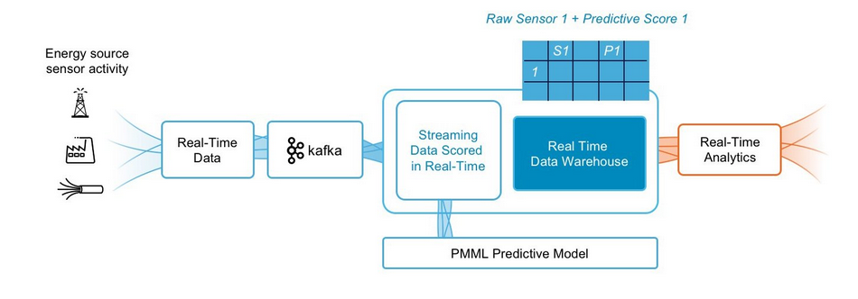

* Allows businesses to get insights and act on data immediately
* Used in financial databases to inform trading decisions.
* Analytics can be on-demand or continuous. On-demand delivers results when the user requests it. Continuous updates users as events happen and can be programmed to respond automatically to certain events. 

### How Do Real Time Analytics Work?

* Real-time data analytics tools can either push or pull data.
* When streaming takes too many resources and isn’t practical, data can be pulled at intervals that can range from seconds to hours. 
* The components of real-time data analytics include:

  Aggregator — Combines from many different data sources. Broker — message passing. Analytics Engine — analyzing the data. Stream Processor — Executes real time app analytics and logic by receiving and sending data streams.

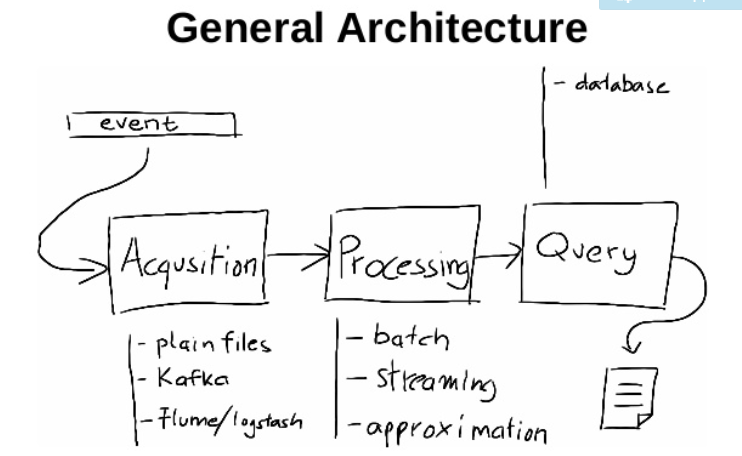  
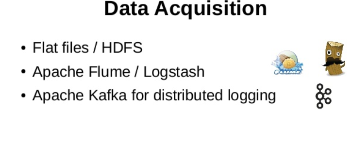  
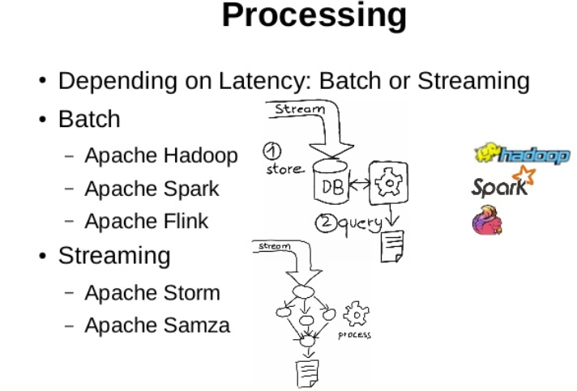  
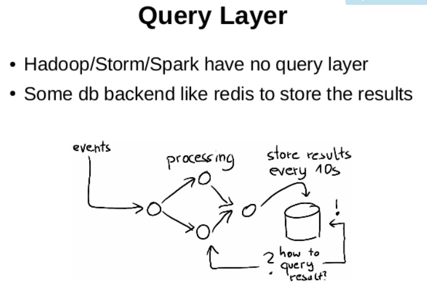  
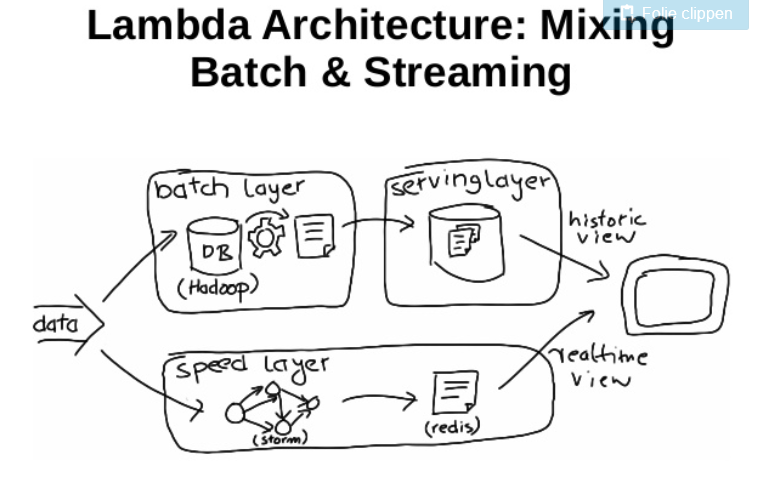  
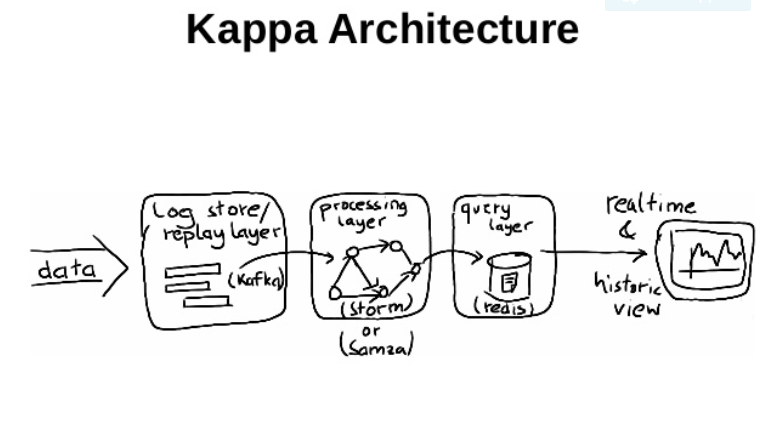  
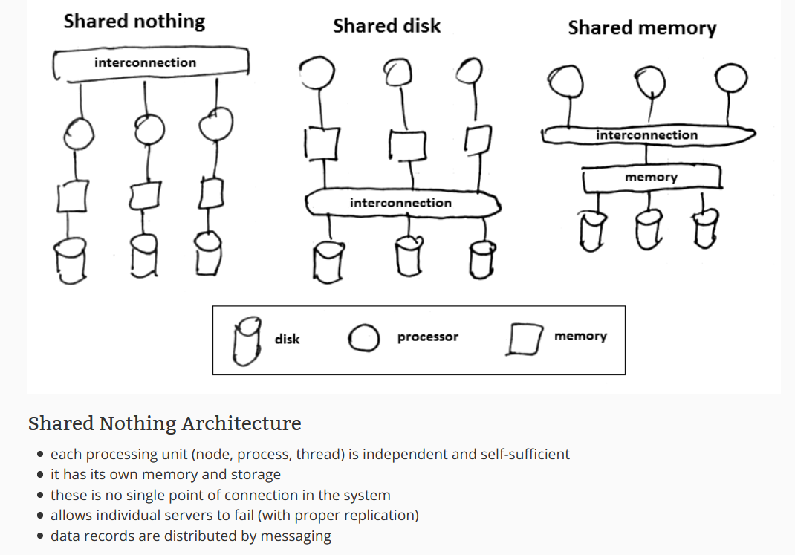

### Event driven architecture

* An event-driven architecture uses events to trigger and communicate between decoupled services and is common in modern applications built with microservices. - An event is a change in state, or an update, like an item being placed in a shopping cart on an e-commerce website.
* Event-driven architectures have three key components: event producers, event routers, and event consumers. A producer publishes an event to the router, which filters and pushes the events to consumers. Producer services and consumer services are decoupled, which allows them to be scaled, updated, and deployed independently.

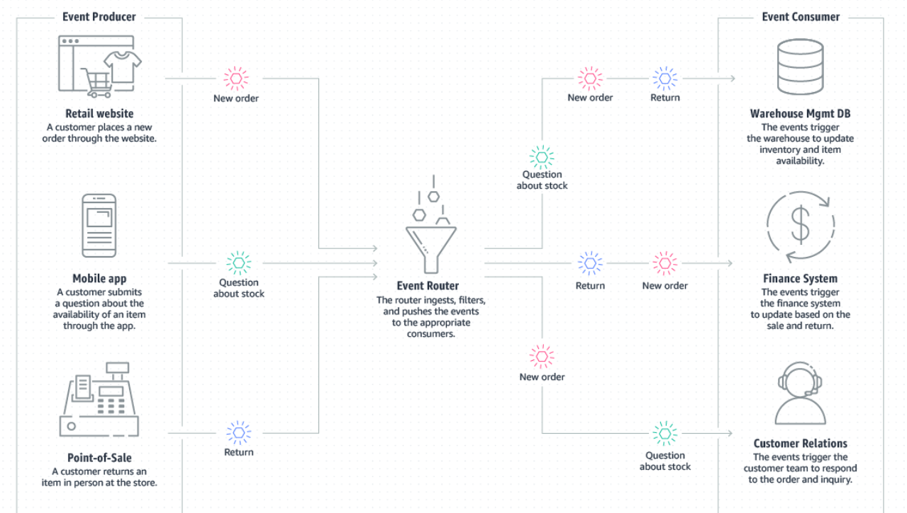

#### Amazon SNS

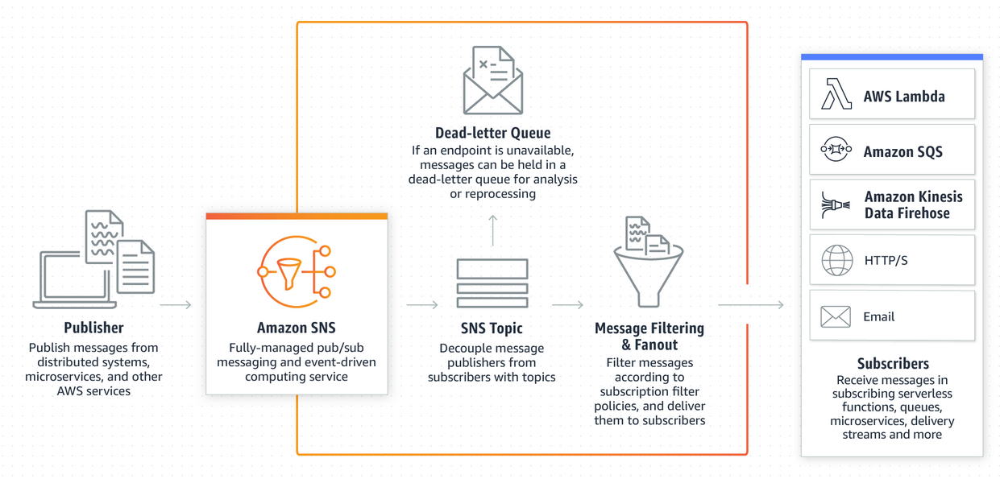  
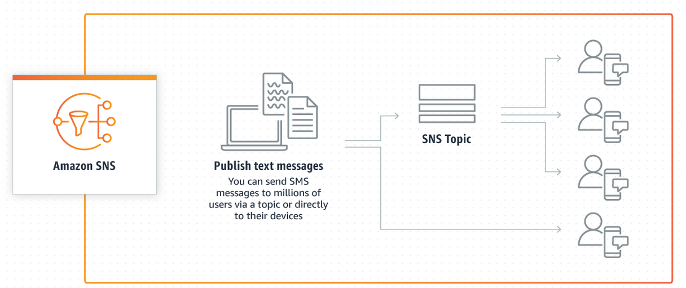

### Hexagonal architecture

### Peer to peer

### Decentralized architecture

