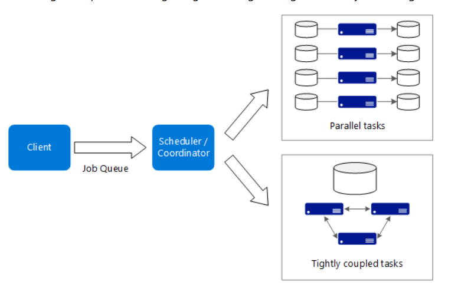

  

**Description:**
- The work can be split into discrete tasks and can run across.
- A common pattern is to provision a large number of cores in a burst, and then spin down to zero once the application completes.

## Usage

- Computationally intensive operations 
- Long-running computations
## Benefits
High performance with "embarrassingly parallel" processing.