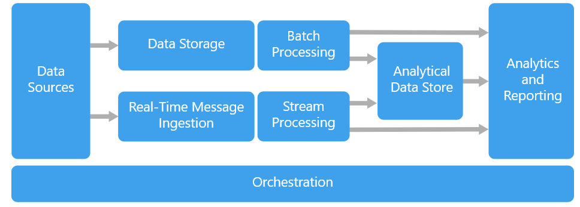

  

Big data solutions typically involve one or more of the following types of workload:

    Batch processing of big data sources at rest.
    Real-time processing of big data in motion.
    Interactive exploration of big data.
    Predictive analytics and machine learning.

Most big data architectures include some or all of the following components:

    Data sources: All big data solutions start with one or more data sources. Examples include:
        Application data stores, such as relational databases.
        Static files produced by applications, such as web server log files.
        Real-time data sources, such as IoT devices.

    Data storage: Data for batch processing operations is typically stored in a distributed file store that can hold high volumes of large files in various formats. This kind of store is often called a data lake. Options for implementing this storage include Azure Data Lake Store or blob containers in Azure Storage.

    Batch processing: Because the data sets are so large, often a big data solution must process data files using long-running batch jobs to filter, aggregate, and otherwise prepare the data for analysis. Usually these jobs involve reading source files, processing them, and writing the output to new files. Options include running U-SQL jobs in Azure Data Lake Analytics, using Hive, Pig, or custom Map/Reduce jobs in an HDInsight Hadoop cluster, or using Java, Scala, or Python programs in an HDInsight Spark cluster.

    Real-time message ingestion: If the solution includes real-time sources, the architecture must include a way to capture and store real-time messages for stream processing. This might be a simple data store, where incoming messages are dropped into a folder for processing. However, many solutions need a message ingestion store to act as a buffer for messages, and to support scale-out processing, reliable delivery, and other message queuing semantics. Options include Azure Event Hubs, Azure IoT Hubs, and Kafka.

    Stream processing: After capturing real-time messages, the solution must process them by filtering, aggregating, and otherwise preparing the data for analysis. The processed stream data is then written to an output sink. Azure Stream Analytics provides a managed stream processing service based on perpetually running SQL queries that operate on unbounded streams. You can also use open source Apache streaming technologies like Storm and Spark Streaming in an HDInsight cluster.

    Analytical data store: Many big data solutions prepare data for analysis and then serve the processed data in a structured format that can be queried using analytical tools. The analytical data store used to serve these queries can be a Kimball-style relational data warehouse, as seen in most traditional business intelligence (BI) solutions. Alternatively, the data could be presented through a low-latency NoSQL technology such as HBase, or an interactive Hive database that provides a metadata abstraction over data files in the distributed data store. Azure Synapse Analytics provides a managed service for large-scale, cloud-based data warehousing. HDInsight supports Interactive Hive, HBase, and Spark SQL, which can also be used to serve data for analysis.

    Analysis and reporting: The goal of most big data solutions is to provide insights into the data through analysis and reporting. To empower users to analyze the data, the architecture may include a data modeling layer, such as a multidimensional OLAP cube or tabular data model in Azure Analysis Services. It might also support self-service BI, using the modeling and visualization technologies in Microsoft Power BI or Microsoft Excel. Analysis and reporting can also take the form of interactive data exploration by data scientists or data analysts. For these scenarios, many Azure services support analytical notebooks, such as Jupyter, enabling these users to leverage their existing skills with Python or R. For large-scale data exploration, you can use Microsoft R Server, either standalone or with Spark.

    Orchestration: Most big data solutions consist of repeated data processing operations, encapsulated in workflows, that transform source data, move data between multiple sources and sinks, load the processed data into an analytical data store, or push the results straight to a report or dashboard. To automate these workflows, you can use an orchestration technology such Azure Data Factory or Apache Oozie and Sqoop.

Azure includes many services that can be used in a big data architecture. They fall roughly into two categories:

    Managed services, including Azure Data Lake Store, Azure Data Lake Analytics, Azure Synapse Analytics, Azure Stream Analytics, Azure Event Hub, Azure IoT Hub, and Azure Data Factory.
    Open source technologies based on the Apache Hadoop platform, including HDFS, HBase, Hive, Pig, Spark, Storm, Oozie, Sqoop, and Kafka. These technologies are available on Azure in the Azure HDInsight service.

These options are not mutually exclusive, and many solutions combine open source technologies with Azure services.
When to use this architecture

Consider this architecture style when you need to:

    Store and process data in volumes too large for a traditional database.
    Transform unstructured data for analysis and reporting.
    Capture, process, and analyze unbounded streams of data in real time, or with low latency.
    Use Azure Machine Learning or Microsoft Cognitive Services.

Benefits

    Technology choices. You can mix and match Azure managed services and Apache technologies in HDInsight clusters, to capitalize on existing skills or technology investments.
    Performance through parallelism. Big data solutions take advantage of parallelism, enabling high-performance solutions that scale to large volumes of data.
    Elastic scale. All of the components in the big data architecture support scale-out provisioning, so that you can adjust your solution to small or large workloads, and pay only for the resources that you use.
    Interoperability with existing solutions. The components of the big data architecture are also used for IoT processing and enterprise BI solutions, enabling you to create an integrated solution across data workloads.

Challenges

    Complexity. Big data solutions can be extremely complex, with numerous components to handle data ingestion from multiple data sources. It can be challenging to build, test, and troubleshoot big data processes. Moreover, there may be a large number of configuration settings across multiple systems that must be used in order to optimize performance.
    Skillset. Many big data technologies are highly specialized, and use frameworks and languages that are not typical of more general application architectures. On the other hand, big data technologies are evolving new APIs that build on more established languages. For example, the U-SQL language in Azure Data Lake Analytics is based on a combination of Transact-SQL and C#. Similarly, SQL-based APIs are available for Hive, HBase, and Spark.
    Technology maturity. Many of the technologies used in big data are evolving. While core Hadoop technologies such as Hive and Pig have stabilized, emerging technologies such as Spark introduce extensive changes and enhancements with each new release. Managed services such as Azure Data Lake Analytics and Azure Data Factory are relatively young, compared with other Azure services, and will likely evolve over time.
    Security. Big data solutions usually rely on storing all static data in a centralized data lake. Securing access to this data can be challenging, especially when the data must be ingested and consumed by multiple applications and platforms.
