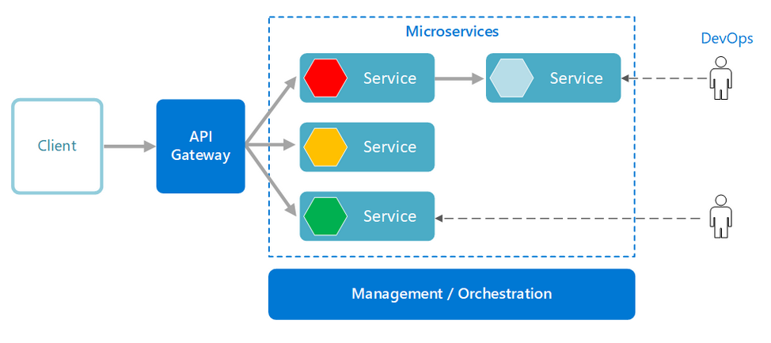

A microservices architecture consists of a collection of small, autonomous services. Each service is self-contained and should implement a single business functionality.

  

1. Services can be deployed independently.
2. Services are responsible for persisting their own data or external state. 
3. Services communicate with each other by using well-defined APIs. 
4.  API Gateway. The API gateway is the entry point for clients. Instead of calling services directly, clients call the API gateway, which forwards the call to the appropriate services on the back end.

Advantages of using an API gateway include:

It decouples clients from services. Services can be versioned or refactored without needing to update all of the clients.

Services can use messaging protocols that are not web friendly, such as AMQP.

The API Gateway can perform other cross-cutting functions such as authentication, logging, SSL termination, and load balancing.

Out-of-the-box policies, like for throttling, caching, transformation, or validation.

## Benefits
- Scalability.
- Fault isolation.