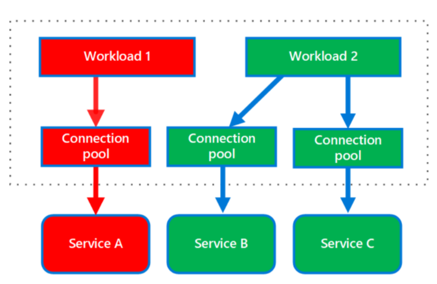

# What
In a bulkhead architecture, elements of an application are isolated into pools so that if one fails, the others will continue to function.
# When to use
- Isolate resources used to consume a set of backend services, especially if the application can provide some level of functionality even when one of the services is not responding.
- Protect the application from cascading failures.
# How
Partition service instances into different groups, based on consumer load and availability requirements. This design helps to isolate failures, and allows you to sustain service functionality for some consumers, even during a failure.

  

  