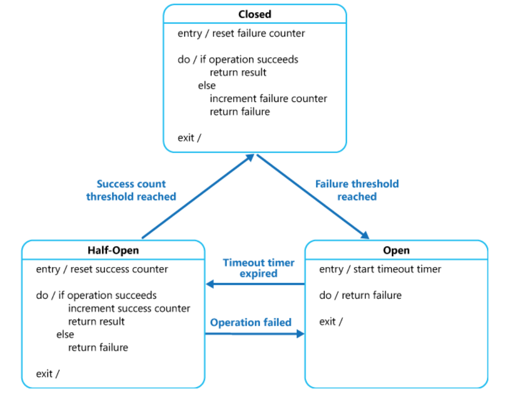

# What
Handle faults that might take a variable amount of time to recover from, when connecting to a remote service or resource

# Why
 calls to remote resources and services can fail due to transient faults, such as slow network connections, timeouts, or the resources being overcommitted or temporarily unavailable. These faults typically correct themselves after a short period of time, and a robust cloud application should be prepared to handle them by using a strategy such as the Retry pattern.
# How
can prevent an application from repeatedly trying to execute an operation that's likely to fail. Allowing it to continue without waiting for the fault to be fixed or wasting CPU cycles while it determines that the fault is long lasting. The Circuit Breaker pattern also enables an application to detect whether the fault has been resolved. If the problem appears to have been fixed, the application can try to invoke the operation.

A circuit breaker acts as a proxy for operations that might fail. The proxy should monitor the number of recent failures that have occurred, and use this information to decide whether to allow the operation to proceed,

The proxy can be implemented as a state machine with the following states that mimic the functionality of an electrical circuit breaker:

    Closed: The request from the application is routed to the operation. The proxy maintains a count of the number of recent failures, and if the call to the operation is unsuccessful the proxy increments this count. If the number of recent failures exceeds a specified threshold within a given time period, the proxy is placed into the Open state. At this point the proxy starts a timeout timer, and when this timer expires the proxy is placed into the Half-Open state.

        The purpose of the timeout timer is to give the system time to fix the problem that caused the failure before allowing the application to try to perform the operation again.

    Open: The request from the application fails immediately and an exception is returned to the application.

    Half-Open: A limited number of requests from the application are allowed to pass through and invoke the operation. If these requests are successful, it's assumed that the fault that was previously causing the failure has been fixed and the circuit breaker switches to the Closed state (the failure counter is reset). If any request fails, the circuit breaker assumes that the fault is still present so it reverts back to the Open state and restarts the timeout timer to give the system a further period of time to recover from the failure.

      

# When to use
Use this pattern:

    To prevent an application from trying to invoke a remote service or access a shared resource if this operation is highly likely to fail.

This pattern isn't recommended:

    For handling access to local private resources in an application, such as in-memory data structure. In this environment, using a circuit breaker would add overhead to your system.
    As a substitute for handling exceptions in the business logic of your applications.

  
# Example