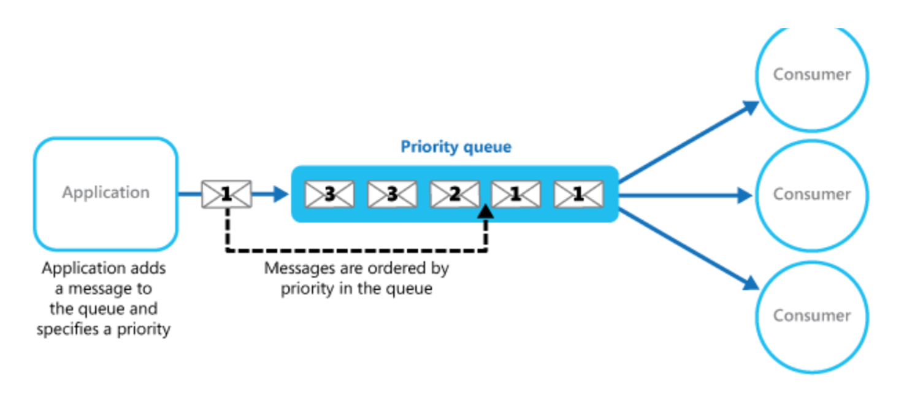
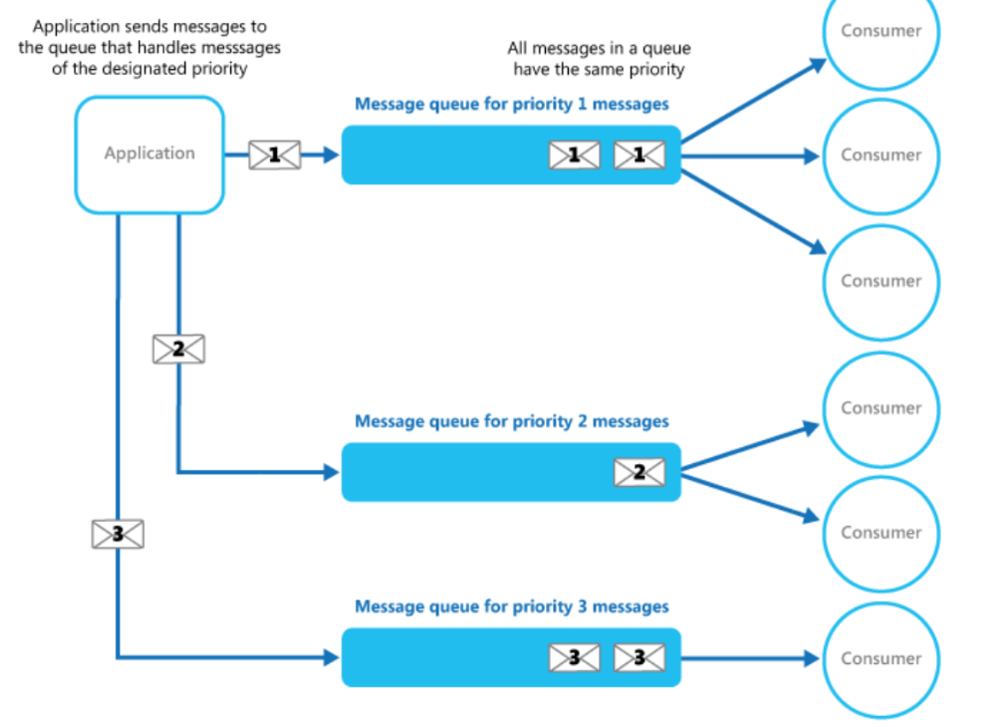

# What
Prioritize requests sent to services so that requests with a higher priority are received and processed more quickly than those with a lower priority.

# When to use
- The system must handle multiple tasks that have different priorities.
- Different users or tenants should be served with different priority.

# How
   

- some message queues support priority messaging. The application posting a message can assign a priority and the messages in the queue are automatically reordered so that those with a higher priority will be received before those with a lower priority.
- an alternative solution is to maintain a separate queue for each priority. The application is responsible for posting messages to the appropriate queue. Each queue can have a separate pool of consumers.

  

**Advantages:**
- It allows applications to meet business requirements that require prioritization of availability or performance.
- It can help to minimize operational costs. In the single queue approach, you can scale back the number of consumers if necessary

