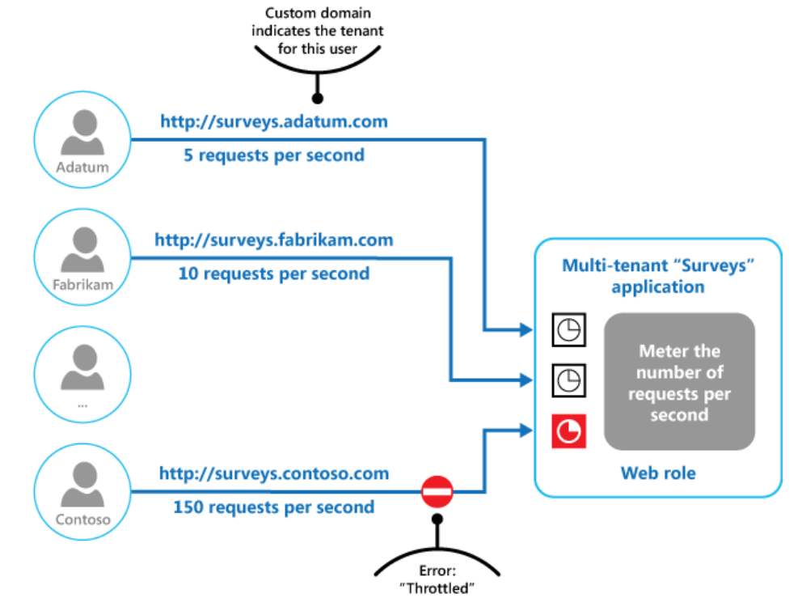

# What
Control the consumption of resources used by an instance of an application, an individual tenant, or an entire service. This can allow the system to continue to function and meet service level agreements,

# Why
The load on a cloud application typically varies over time based on the number of active users or the types of activities they are performing.
One strategy is to use autoscaling to match the provisioned resources to the user needs at any given time. This has the potential to consistently meet user demand, while optimizing running costs. However, while autoscaling can trigger the provisioning of additional resources, this provisioning isn't immediate. If demand grows quickly, there can be a window of time where there's a resource deficit.
# How
several throttling strategies, including:

    Rejecting requests from an individual user who's already accessed system APIs more than n times per second over a given period of time. This requires the system to meter the use of resources for each tenant or user running an application. For more information, see the Service Metering Guidance.

    Disabling or degrading the functionality of selected nonessential services so that essential services can run unimpeded with sufficient resources. For example, if the application is streaming video output, it could switch to a lower resolution.

    Using load leveling to smooth the volume of activity (this approach is covered in more detail by the Queue-based Load Leveling pattern). In a multi-tenant environment, this approach will reduce the performance for every tenant. If the system must support a mix of tenants with different SLAs, the work for high-value tenants might be performed immediately. Requests for other tenants can be held back, and handled when the backlog has eased. The Priority Queue pattern could be used to help implement this approach.

    Deferring operations being performed on behalf of lower priority applications or tenants. These operations can be suspended or limited, with an exception generated to inform the tenant that the system is busy and that the operation should be retried later.

# When to use

    To ensure that a system continues to meet service level agreements.

    To prevent a single tenant from monopolizing the resources provided by an application.

    To handle bursts in activity.

    To help cost-optimize a system by limiting the maximum resource levels needed to keep it functioning.

  
# Example

  
