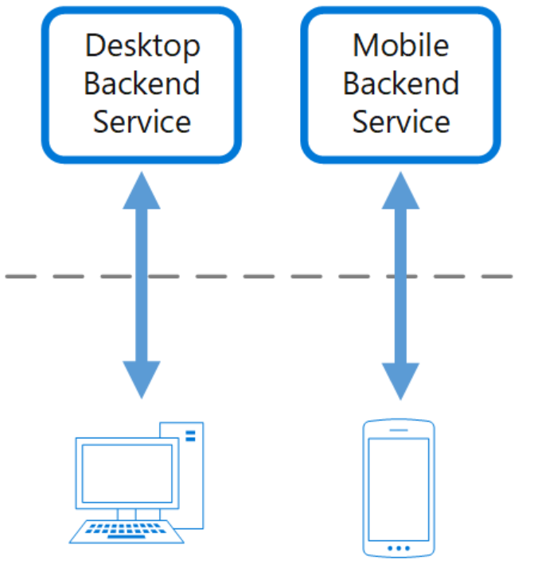

# What
Create separate backend services to be consumed by specific frontend applications or interfaces. This pattern is useful when you want to avoid customizing a single backend for multiple interfaces.

# Why
- An application may initially be targeted at a desktop web UI. Typically, a backend service is developed in parallel that provides the features needed for that UI. As the application's user base grows, a mobile application is developed that must interact with the same backend. 
- capabilities of a mobile device differ significantly from a desktop browser, in terms of screen size, performance, and display limitations. As a result, the requirements for a mobile application backend differ from the desktop web UI.
  
# How
Create one backend per user interface. Fine-tune the behavior and performance of each backend to best match the needs of the frontend environment

  

# When to use
Use this pattern when:

    - A shared or general purpose backend service must be maintained with significant development overhead.
    - You want to optimize the backend for the requirements of specific client interfaces.
    - Customizations are made to a general-purpose backend to accommodate multiple interfaces.
    - An alternative language is better suited for the backend of a different user interface.

This pattern may not be suitable:

    - When interfaces make the same or similar requests to the backend.
    - When only one interface is used to interact with the backend.

  
# Example