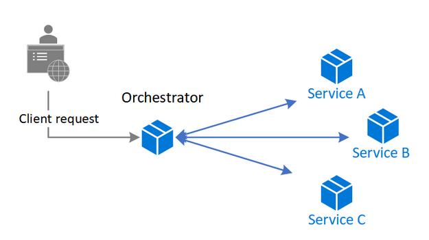
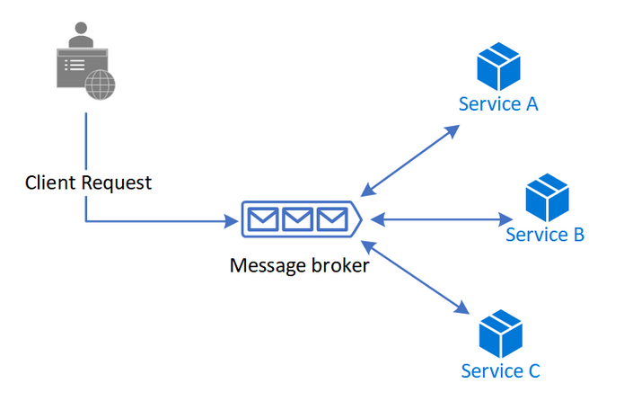

A common pattern for communication is to use a centralized service that acts as the orchestrator for microservices. it also manages the workflow of the entire business transaction.
- tight coupling between the orchestrator and other services that participate in processing of the business transaction. 
- To execute tasks in a sequence, the orchestrator needs to have some domain knowledge about the responsibilities of those services. 
- If you want to add or remove services, existing logic will break, and you'll need to rewire portions of the communication path. 

  

# How
- A client request publishes messages to a message queue. As messages arrive, they are pushed to services, interested in that message. 
- Each subscribed service does their operation as indicated by the message and responds to the message queue with success or failure of the operation. 
- In case of success, the service can push a message back to the same queue or a different message queue so that another service can continue the workflow if needed
- this pattern helps reduce coupling between services

  

# When to use
-  if you expect to update, remove, or add new services frequently. The entire app can be modified with lesser effort
-  if you experience performance bottlenecks in the central orchestrator.
