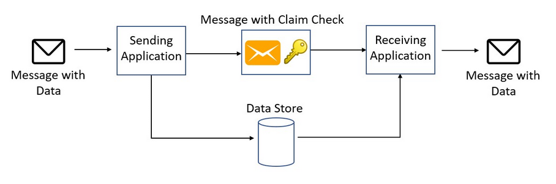

# What
- Split a large message into a claim check and a payload. 
- Send the claim check to the messaging platform and store the payload to an external service. 
- This pattern allows large messages to be processed, while protecting the message bus and the client from being overwhelmed or slowed down. 
- This pattern also helps to reduce costs, as storage is usually cheaper than resource units used by the messaging platform.

# Why
messages may contain anything, including images (for example, MRI scans), sound files (for example, call-center calls), text documents, or any kind of binary data of arbitrary size.

# How
Store the entire message payload into an external service, such as a database. Get the reference to the stored payload, and send just that reference to the message bus. The reference acts like a claim check used to retrieve.
  

# When to use
- This pattern should be used whenever a message cannot fit the supported message limit of the chosen message bus technology. 
- The pattern can also be used if the payload should be accessed only by services that are authorized to see it. 
  
# Example
Kafka client writes the payload to Azure Blob Storage. Then it sends a notification message using Kafka-enabled Event Hubs.
