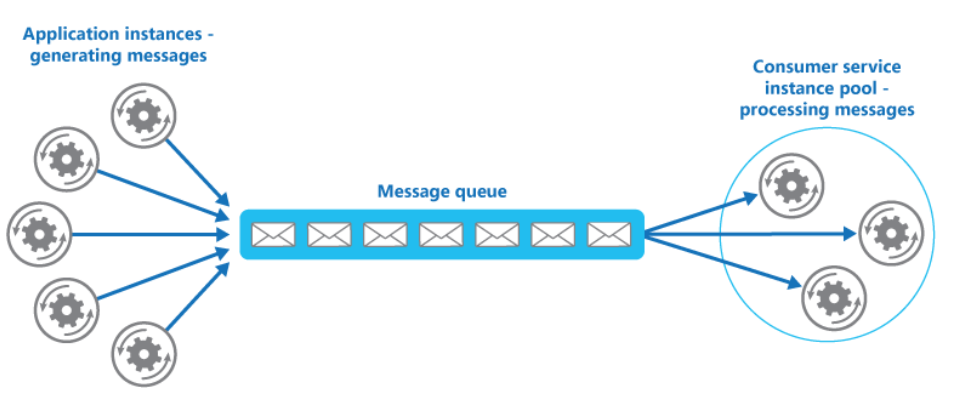

# What
- Enable multiple concurrent consumers to process messages received on the same messaging channel. 
- This enables a system to process multiple messages concurrently to optimize throughput, to improve scalability and availability, 
- At peak hours a system might need to process many hundreds of requests per second, while at other times the number could be very small. Additionally, the nature of the work performed to handle these requests might be highly variable. Using a single instance of the consumer service can cause that instance to become flooded with requests, or the messaging system might be overloaded by an influx of messages coming from the application. 
- To handle this fluctuating workload, the system can run multiple instances of the consumer service. However, these consumers must be coordinated to ensure that each message is only delivered to a single consumer. The workload also needs to be load balanced across consumers to prevent an instance from becoming a bottleneck.

# When to use
- The workload for an application is divided into tasks that can run asynchronously.
- Tasks are independent and can run in parallel.
- The volume of work is highly variable, requiring a scalable solution.
- Tasks must be performed synchronously, and the application logic must wait for a task to complete before continuing.
# How
Use a message queue to implement the communication channel between the application and the instances of the consumer service. The application posts requests in the form of messages to the queue, and the consumer service instances receive messages from the queue and process them. 
  

