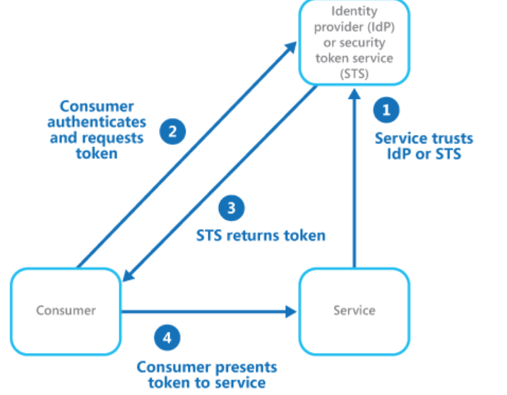

# What
Delegate authentication to an external identity provider. This can simplify development, minimize the requirement for user administration, and improve the user experience of the application.

# How
Implement an authentication mechanism that can use federated identity. Separate user authentication from the application code, and delegate authentication to a trusted identity provider.

The figure illustrates the Federated Identity pattern when a client application needs to access a service that requires authentication. The authentication is performed by an IdP that works in concert with an STS. The IdP issues security tokens that provide information about the authenticated user. 

  

Federated authentication provides a standards-based solution to the issue of trusting identities across diverse domains
