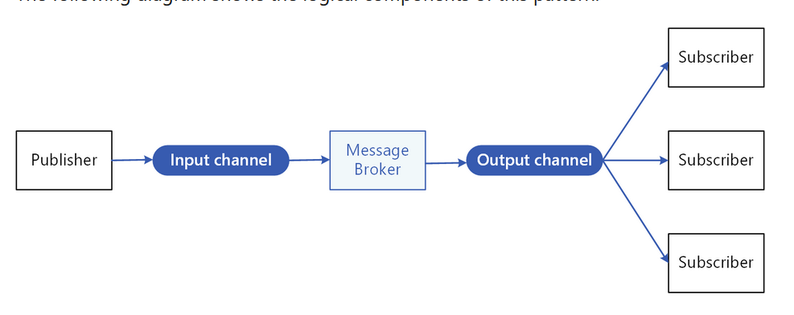

# What
Enable an application to push events to multiple consumers asynchronously.

# Why
Asynchronous messaging is an effective way to decouple senders from consumers, and avoid blocking the sender to wait for a response.

# How
- An input messaging channel used by the sender. The sender packages events into messages, using a known message format, and sends these messages via the input channel. The sender in this pattern is also called the publisher.
- One output messaging channel per consumer. The consumers are known as subscribers.
- A mechanism for copying each message from the input channel to the output channels, typically handled by an intermediary such as a message broker or event bus.

  

**benefits:**

- even if one or more receivers are offline, and messages can be properly managed.
- improves responsiveness of the sender. The sender can quickly send a single message to the input channel, then return to its core processing responsibilities.
- Asynchronous messaging helps applications continue to run smoothly under increased loads and handle intermittent failures.
- It allows for deferred or scheduled processing. 
- It facilitates asynchronous workflows across an enterprise.
- It improves testability. Channels can be monitored and messages can be inspected or logged as part of an overall integration test strategy.
- It provides separation of concerns for your applications. 

# When to use
Use this pattern when:
- An application needs to broadcast information to a significant number of consumers.
- An application needs to communicate with one or more independently-developed applications or services, which may use different platforms, programming languages, and communication protocols.
- An application can send information to consumers without requiring real-time responses from the consumers.
- systems being integrated are designed to support an eventual consistency model.
- An application needs to communicate information to multiple consumers, which may have different availability requirements or uptime schedules than the sender.

might not be useful:
- An application has only a few consumers who need significantly different information from the producing application.
- An application requires near real-time interaction with consumers.

