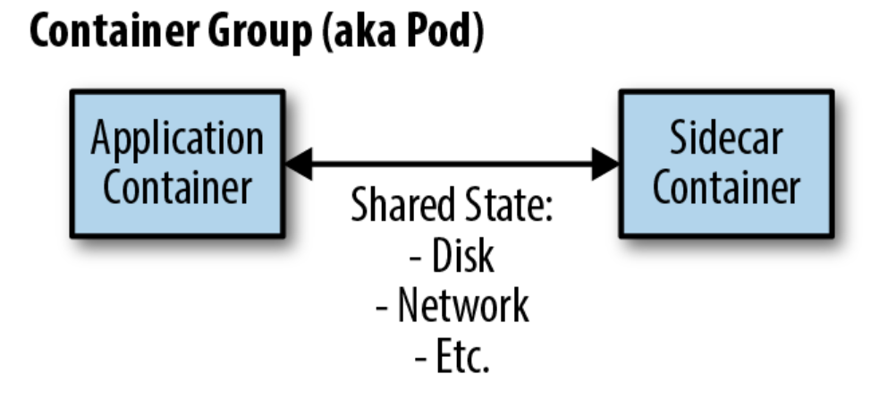
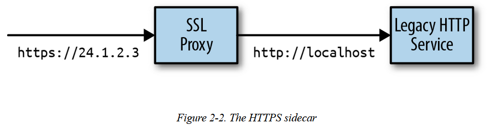
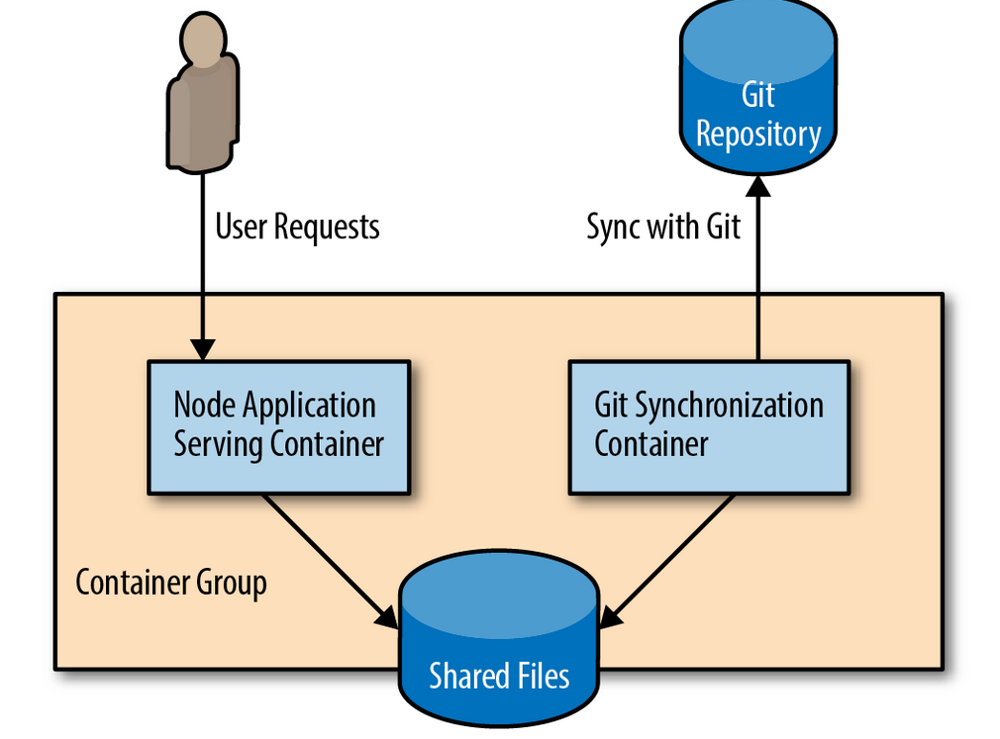

# sidecar pattern
- single-node pattern made up of two containers. 
- The first is the application container. It contains the core logic for the application.
- In addition to the application container, there is a sidecar container. The role of the sidecar is to augment and improve the application container. 

  

Example use case: 
- Adding HTTPS to a Legacy Service
  

- Dynamic Configuration with Sidecars
  When the legacy application starts, it loads its configuration from the filesystem, as expected. When the configuration manager starts, it examines the configuration API and looks for differences between the local filesystem and the configuration stored in the API. If there are differences, the configuration manager downloads the new configuration to the local filesystem and signals to the legacy application that it should reconfigure itself with this new configuration.

   
- platform as a service (PaaS) built around the gitworkflow. Once you deploy this PaaS, simply pushing new code upto a Git
  repository results in that code being deployed to the runningserver 

    

