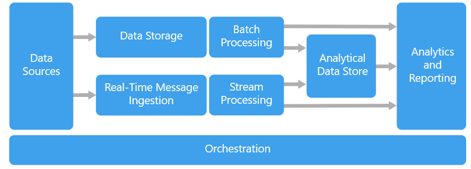

# Big data

Big data solutions typically involve one or more of the following types of workload:

* Batch processing of big data sources at rest.
* Real-time processing of big data in motion.
* Interactive exploration of big data.

Includes components:

* **Data sources**
* **Data storage:** Data for batch processing operations is typically stored in a distributed file store that can hold high volumes of large files in various formats. This kind of store is often called a data lake. 
* **Batch processing:** Because the data sets are so large, often a big data solution must process data files using long-running batch jobs to filter, aggregate, and otherwise prepare the data for analysis.
* **Real-time message ingestion:** If the solution includes real-time sources, the architecture must include a way to capture and store real-time messages for stream processing. 
* **Stream processing:** After capturing real-time messages, the solution must process them by filtering, aggregating, and otherwise preparing the data for analysis
* **Analytical data store:** Many big data solutions prepare data for analysis and then serve the processed data in a structured format that can be queried using analytical tools. 
* **Analysis and reporting**
* **Orchestration:** Most big data solutions consist of repeated data processing operations, encapsulated in workflows

## Usage

* Store and process data in volumes too large for a traditional database.
* Transform unstructured data for analysis and reporting.
* Capture, process, and analyze unbounded streams of data in real time, or with low latency.

## Benefits

Technology choices.

