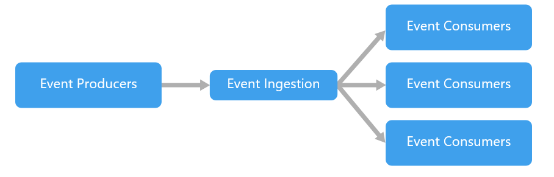

# Event-driven architecture

An event-driven architecture consists of event producers that generate a stream of events, and event consumers that listen for the events.

* Events are delivered in near real time, so consumers can respond immediately to events as they occur. 

  **An event driven architecture can be two types**

**Pub/sub:** The messaging infrastructure keeps track of subscriptions. When an event is published, it sends the event to each subscriber. After an event is received, it cannot be replayed, and new subscribers do not see the event.

**Event streaming:** Events are written to a log. Events are strictly ordered \(within a partition\) and durable. Clients don't subscribe to the stream, instead a client can read from any part of the stream. The client is responsible for advancing its position in the stream. That means a client can join at any time, and can replay events.

### On the consumer side, there are some common variations:

**Simple event processing.** An event immediately triggers an action in the consumer.

**Complex event processing.** A consumer processes a series of events, looking for patterns in the event data

## Event stream processing.

a pipeline to ingest events and feed them to stream processors. The stream processors act to process or transform the stream. There may be multiple stream processors for different subsystems of the application. This approach is a good fit for IoT workloads.

## Usage

* Multiple subsystems must process the same events.
* Real-time processing with minimum time lag.
* Complex event processing, such as pattern matching or aggregation over time windows.
* High volume and high velocity of data, such as IoT.

## Benefits

* Consumers can respond to events immediately as they arrive.
* Highly scalable and distributed.

