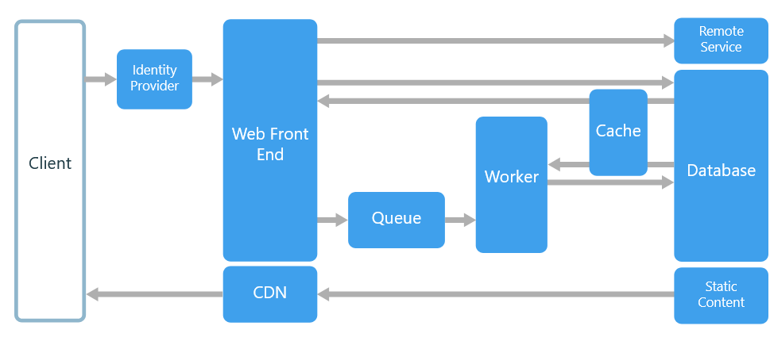

# Web-Queue-Worker

1. The core components of this architecture are a web front end that serves client requests
2. A worker that performs resource-intensive tasks, long-running workflows, or batch jobs. 

Components incorporated into this architecture include:

* One or more databases.
* A cache.
* CDN
* Identity provider for authentication.

## Usage

* Applications with a relatively simple domain.
* Applications with some long-running workflows or batch operations.

## Benefits

* Relatively simple architecture that is easy to understand.

