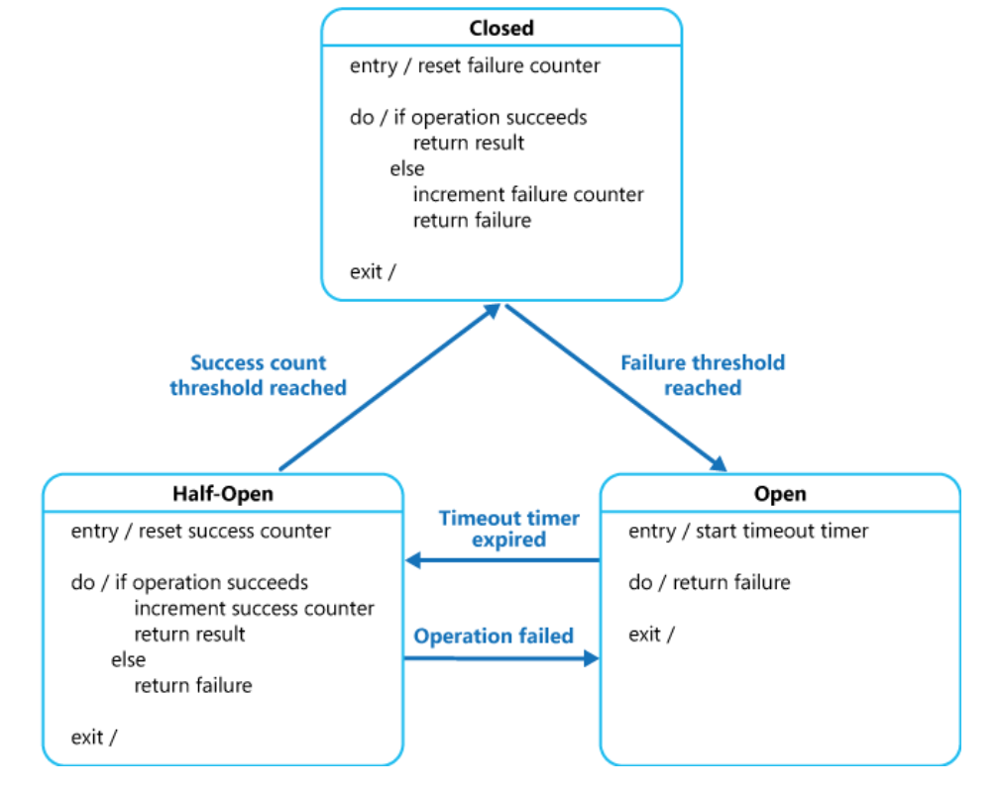

# Circuit Breaker

calls to remote resources and services can fail due to transient faults, such as slow network connections, timeouts, or the resources being overcommitted or temporarily unavailable. These faults typically correct themselves after a short period of time, and a robust cloud application should be prepared to handle them by using a strategy such as the **Retry pattern**.

## When to use

To prevent an application from trying to invoke a remote service or access a shared resource if this operation is highly likely to fail.

## How

can prevent an application from repeatedly trying to execute an operation that's likely to fail. Allowing it to continue without waiting for the fault to be fixed or wasting CPU cycles while it determines that the fault is long lasting. The Circuit Breaker pattern also enables an application to detect whether the fault has been resolved. If the problem appears to have been fixed, the application can try to invoke the operation.

It can be implemented as a state machine with the following states that mimic the functionality of an electrical circuit breaker:

**Closed:** The request from the application is routed to the operation. The proxy maintains a count of the number of recent failures, and if the call to the operation is unsuccessful the proxy increments this count.

**Open:** The request from the application fails immediately and an exception is returned to the application.

**Half-Open:** A limited number of requests from the application are allowed to pass through and invoke the operation. If these requests are successful, it's assumed that the fault that was previously causing the failure has been fixed and the circuit breaker switches to the Closed state \(the failure counter is reset\). If any request fails, the circuit breaker assumes that the fault is still present so it reverts back to the Open state and restarts the timeout timer to give the system a further period of time to recover from the failure.

