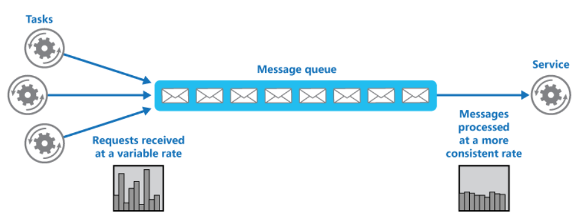

# Queue-Based Load Leveling

A service might experience peaks in demand that cause it to overload and be unable to respond to requests in a timely manner. Flooding a service with a large number of concurrent requests can also result in the service failing if it's unable to handle the contention these requests cause.

## When to use

* This pattern is useful to any application that uses services that are subject to overloading.
* This pattern isn't useful if the application expects a response from the service with minimal latency.

  **How**

  introduce a queue between the task and the service. The task and the service run asynchronously. The task posts a message containing the data required by the service to a queue. The queue acts as a buffer, storing the message until it's retrieved by the service. The service retrieves the messages from the queue and processes them.

