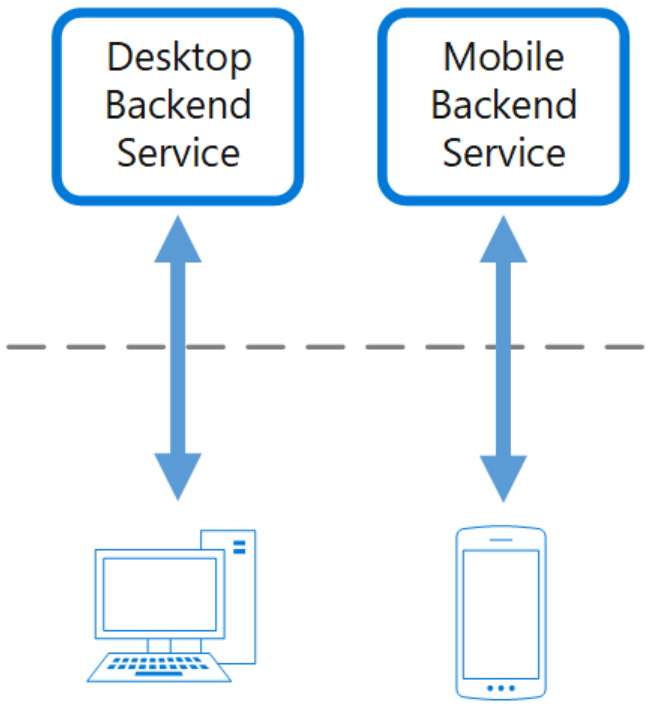

# Backends for Frontends

## What

Create separate backend services to be consumed by specific frontend applications or interfaces. This pattern is useful when you want to avoid customizing a single backend for multiple interfaces.

## How

Create one backend per user interface. Fine-tune the behavior and performance of each backend to best match the needs of the frontend environment

## When to use

* A shared or general purpose backend service must be maintained with significant development overhead.
* You want to optimize the backend for the requirements of specific client interfaces.
* Customizations are made to a general-purpose backend to accommodate multiple interfaces.

