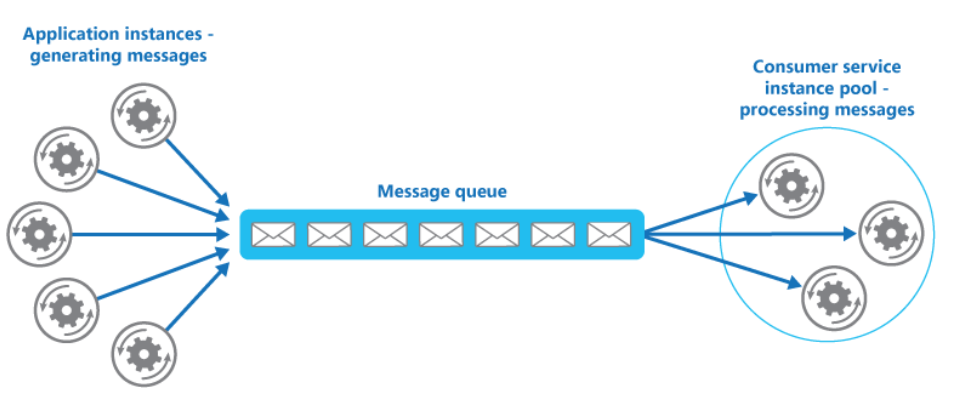

# Competing Consumers

#### When to use

* The workload for an application is divided into tasks that can run asynchronously.
* Tasks are independent and can run in parallel.
* At peak hours a system might need to process many hundreds of requests per second, while at other times the number could be very small.

**How**

Use a message queue to implement the communication channel between the application and the instances of the consumer service. The application posts requests in the form of messages to the queue and the consumer service instances receive messages from the queue and process them. 

  

