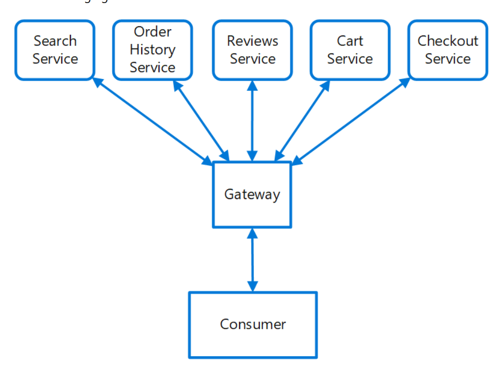

# Gateway Routing

## What

* Route requests to multiple services using a single endpoint. This pattern is useful when you wish to expose multiple services on a single endpoint
* When a client needs to consume multiple services, setting up a separate endpoint for each service and having the client manage each endpoint can be challenging.
* This pattern can also help with deployment, by allowing you to manage how updates are rolled out to users. When a new version of your service is deployed, it can be deployed in parallel with the existing version.

## How

Place a gateway in front of a set of applications, services, or deployments. With this pattern, the client application only needs to know about and communicate with a single endpoint. If a service is consolidated or decomposed, the client does not necessarily require updating. 

