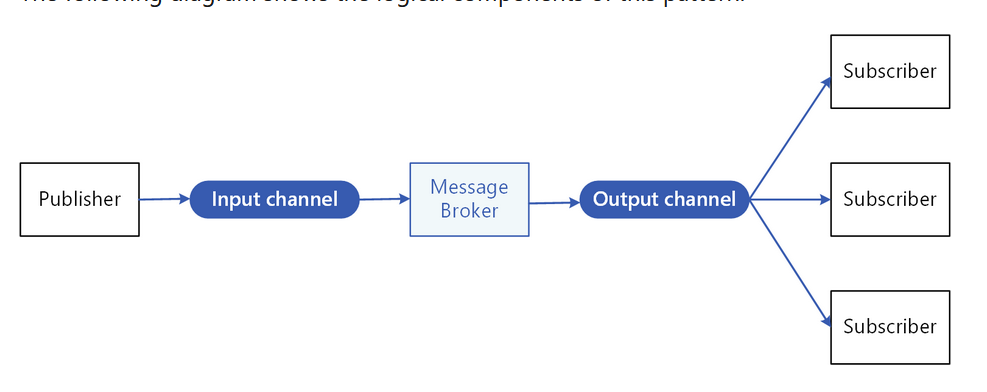

# Publisher-Subscriber

* Enable an application to push events to multiple consumers asynchronously.
* Asynchronous messaging is an effective way to decouple senders from consumers and avoid blocking the sender to wait for a response.
* Achieve the eventual consistency model.

## How

* An input messaging channel is used by the sender. The sender packages events into messages, using a known message format and sends these messages via the input channel. The sender in this pattern is also called the publisher.
* The consumers are known as subscribers.
* A mechanism for copying each message from the input channel to the output channels, typically handled by an intermediary such as a message broker or event bus.

