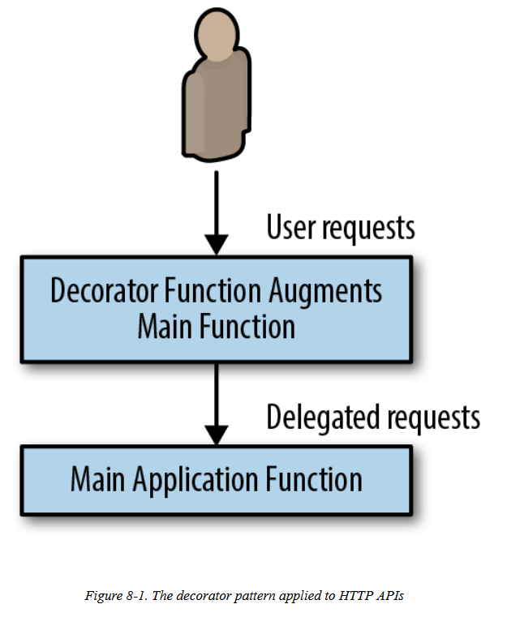

# FAAS

* Applications that might only need to temporarily come into existence to handle a single request, or simply need to respond to a specific event. 

**FaaS** is referred to as serverless computing.

## Benefits of FaaS

* Functions are granular building block for designing distributed systems. 
* Functions are stateless and thus any system you build on top of functions is inherently more modular and decoupled

## Challenges of FaaS

* functionA\(\) which calls functionB\(\)
* functionB\(\) which calls functionC\(\)
* functionC\(\) which calls back to functionA\(\)

it kicks off an infinite loop that only terminates when the original request times out.

## Need for Background processing

* FaaS isusually a poor fit for situations that require processing. Examples of such background processing might be transcoding a video, compressing log files, or other sorts of low-priority, long-running computations

## Need to hold data in memory

The function itself may be dynamically spun up in response to a user request while the user is waiting, the need to load a lot of detail may significantly impact the latency that the user perceives while interacting withyour service.

## Cost of sustained request processing

This approach is great if you only have a few requests per minute or hour. In such a situation, you are idle most of the time, and given a pay-per-request model, you are only paying for the time when your service is actively serving requests.

## Decorator pattern

* FaaS is ideal for deploying simple functions that can take an input, transform it into an output, and then pass it on to a different service. 
* FaaS decorator pattern to transform the request in between the user and the service implementation.
* experiment with a variety of different decorators before finally adopting one and pulling it more completely into the implementation of the service.

## Handling events Use cases

* Examples of events include a user signing up for a new service \(which might trigger a welcome email, someone uploading a file to a shared folder \(which might send notifications to everyone who has access to the folder\), or even a machine being about to reboot.
* Implementing two factor authentication: 

  register a FaaS to asynchronouslygenerate the random number, register it with the login service, and send the number to the user’s phone. In this way, the login server can simply fire an asynchronous web-hook request to a FaaS,and that FaaS can handle the somewhat slow and asynchronous task of registering the two-factor code and sending thetext message.

## Event driven pipelines

* An event-driven architecture is one in which a system reacts to events that are emitted by other systems
* We have the PaymentService which handles processing transactions. We also have the NotificationService which sends notifications to users. In an event-driven architecture, the NotificationService can listen for an event like purchase\_complete from the PaymentService and notify a user that the transaction is complete.
* Imagine a pipeline in which the original event is code being submitted into a source control system. This event then triggers a build. The build may take multiple minutes to complete, and when it does, it fires an event to a build analysis function. This function takes different actions if the build is successful or fails. If the build succeeded, a ticket is created for a human to approve it to be pushed to production. Once the ticket is closed, the act of closing is an event that triggers the actual push to production. If the build failed, a bug is filed on the failure, and the event pipeline terminates.
* Consider the task of implementing a new-user signup flow. When a newuser account is created, there are certain things that are always done,such as sending a welcome email. And there are some things thatare optionally done, such as registering a user to receive productupdates \(sometimes known as “spam”\) via their email

