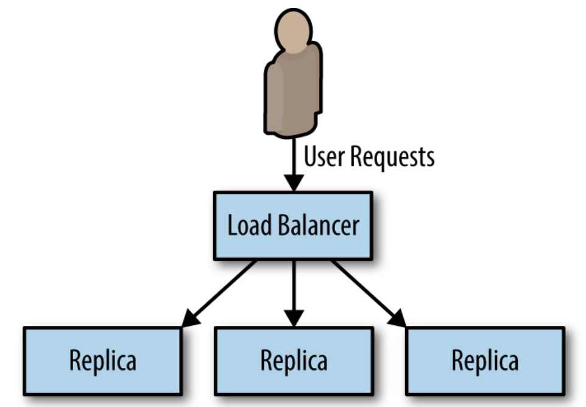
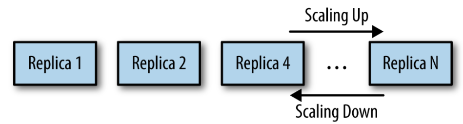
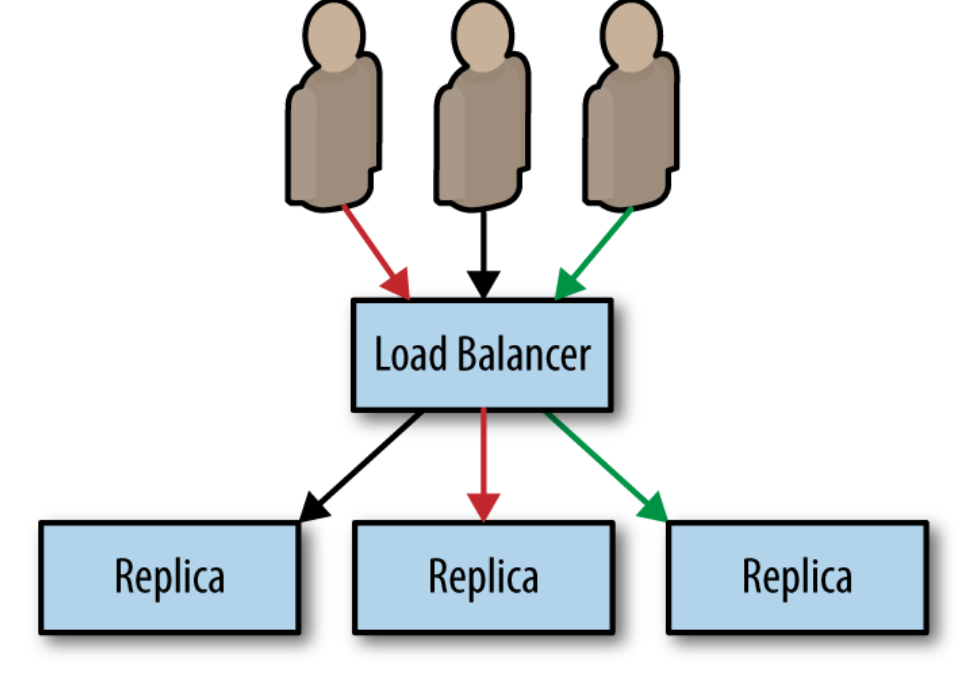
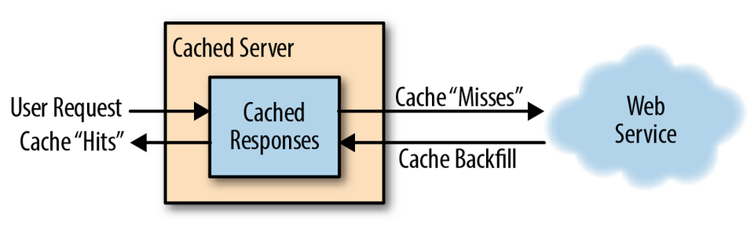
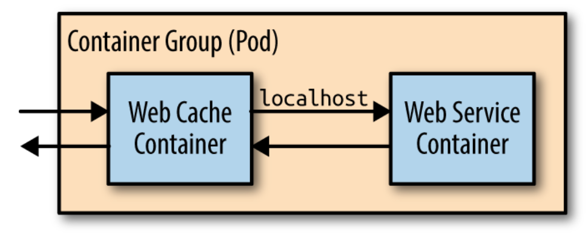
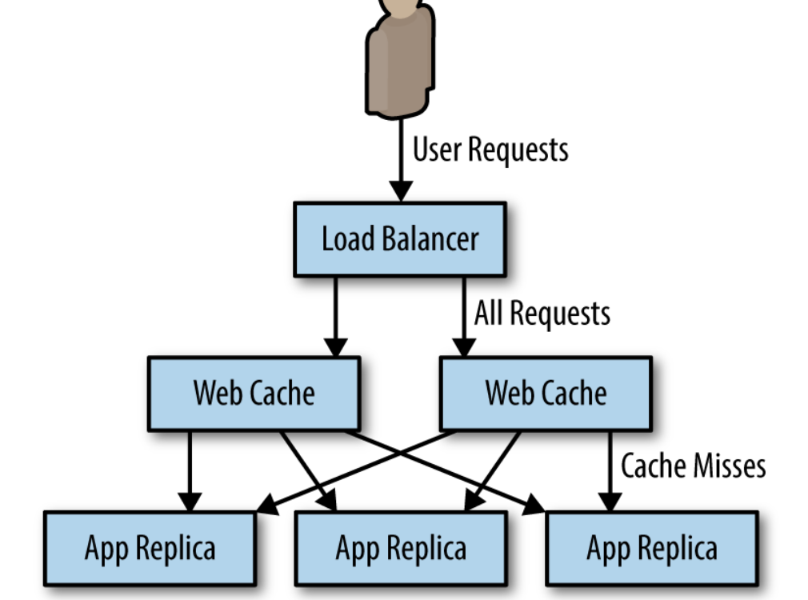
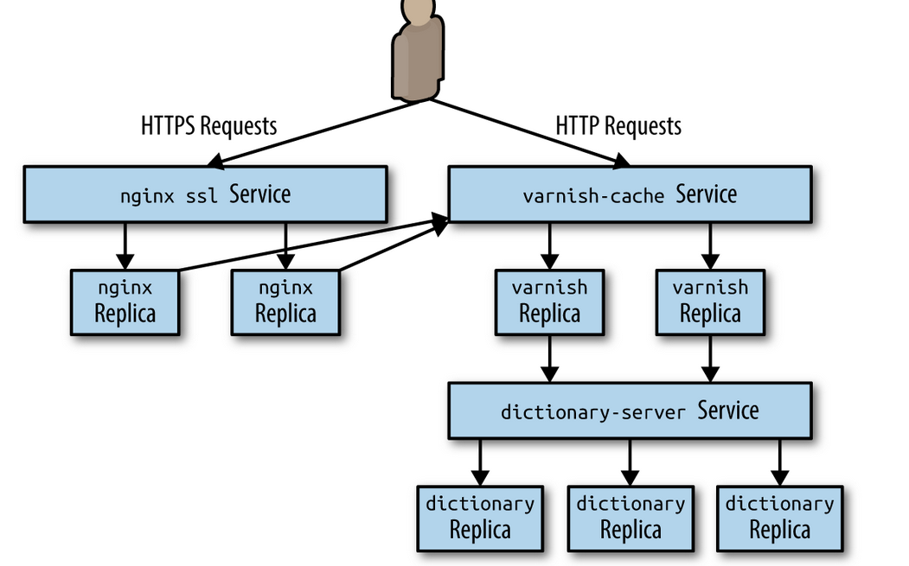

# replicated load-balanced service.

every server is identical to every other server and all are capable of supporting traffic. The pattern consists of a scalable number of servers with a load balancer in front of them

## Stateless Services

* They don’t require saved state to operate correctly. Even individual requests may be routed to separate instances of the service 
* Horizontally scalable systems handle more and more users by adding more replicas

## Readiness Probes for Load Balancing

* When designing a replicated service, it is equally important to 

  build and deploy a readiness probe to inform the load balancer.

* Readiness probe determines when an application is ready to serve user requests. The reason for the differentiationis 

  that  many applications require some time to become initialized before they are ready to serve. They may need to connect to databases,load plugins, or download serving files from the network. In all of thesecases, the containers are alive, but they are not ready. When building an application for a replicated service pattern, be sure toinclude a special URL that implements this readiness check.

## Session Tracked Services

* reasons for wanting to ensure that a particular user’s requests always end up on the same machine. Sometimes this is because you are caching that user’s data in memory, so landing on the same machine ensures a higher cache hit rate. Sometimes it is because the interaction is long-running in nature, so some amount of state is maintained between requests. 

Session tracking is accomplished via a consistent hashing function.

## Caching Layer

It might make queries to a database to service requestsor do a significant amount of rendering or data mixing toservice the request. In such a world, a caching layer can make a great deal of sense. A cache exists between your stateless application andthe end-user request.

Wrong method of deploying cache. Doesnt scale well. 

makes the most sense to configure your caching layer as a second stateless replicated serving tier 

### Expanding cache layer

* Varnishhas a throttle module that can be configured to provide throttlingbased on IP address and request path
* Add a third layer to our stateless application pattern,which will be a replicated layer of nginx servers that will handleSSL termination for HTTPS traffic and forward traffic on to ourVarnish cache. 

