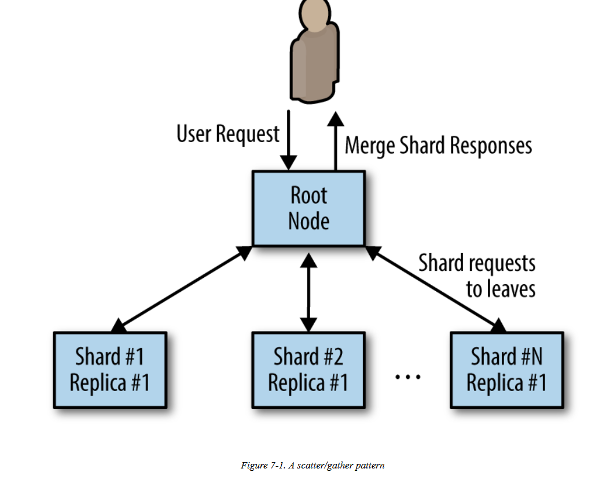
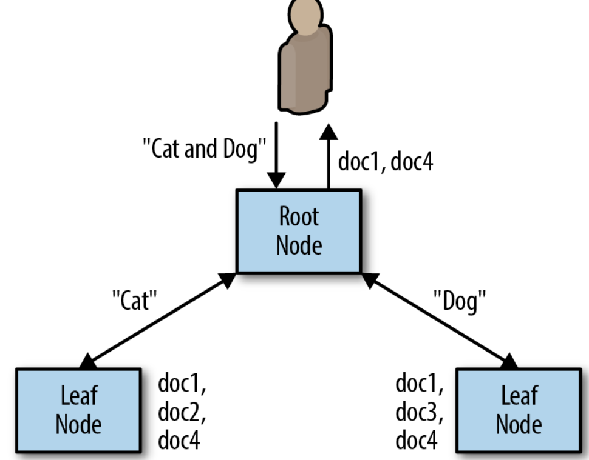
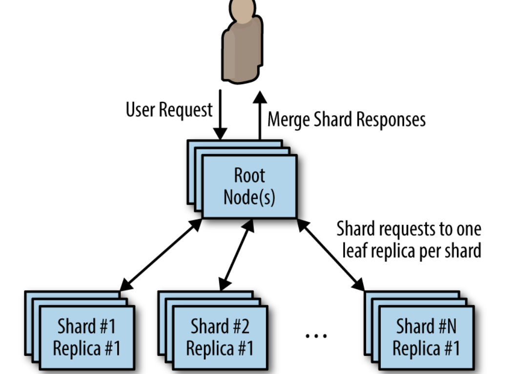

# Scatter/gather

* quite useful when you have a large amount of mostly independent processing that is needed to handle a particular request.
* Scatter/gather can be seen as sharding the computation 

## Scatter/Gather with Root Distribution

* The simplest form of scatter/gather is one in which each leaf is entirely homogenous but the work is distributed to a number of different leaves in order to improve the performance of the request.
* This pattern is equivalent to solving an **“embarassingly parallel”** problem.The problem can be broken up into many **different pieces and each piece can be put back together** with all of the other pieces to form a complete answer.

## Distributed Document Search

To see an example of scatter/gather in action,

* Task of searching across a large database of documents for all documents that contain the words “cat” and “dog.” 
* To make request processing faster, you can build an index. The index is effectively a hashtable, where the keys are individual words\(e.g., “cat”\) and the values are a list of documents containing that word.

### Straggler problem.

* In a scatter/gather system, the root node waits for requests from all of the leaf nodes to return before sending a response back to the end user. 
* Since data from every leaf node is required, the overall time it takes to process a user request is defined by the slowest leaf node that sends a response.

## Considerations for using scatter and gather

* Increased parallelism doesn’t always speed things up because of overhead on each node.
* Increased parallelism doesn’t always speed things up because of the straggler problem.
* The performance of the 99th percentile is more important than in other systems because each user request actually becomes numerous requests to the service.

