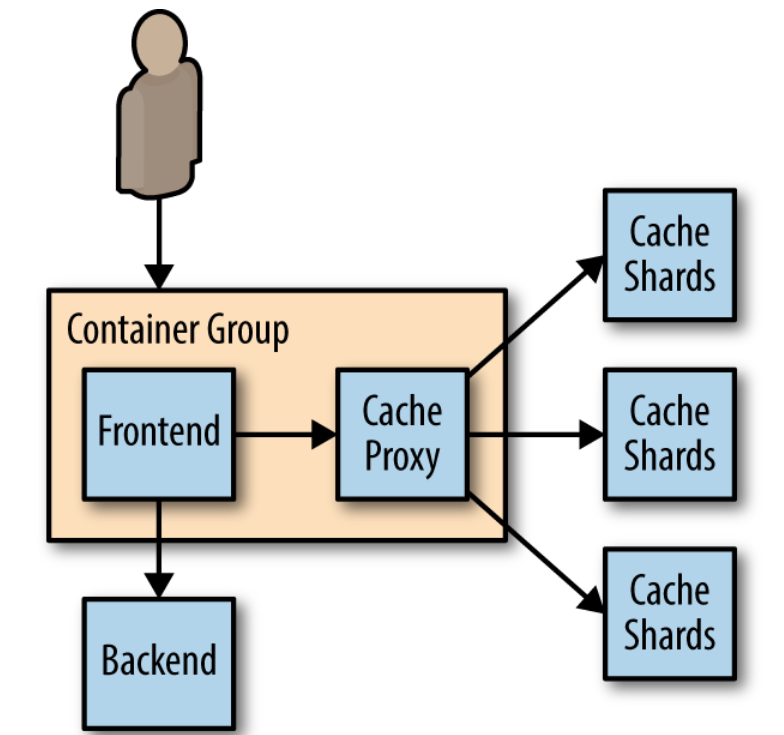

# Sharding Services

The primary reason for sharding the data is because the size of the state is too large to be served by a single machine

## sharded cache

* cache that sits between the user requests and the actually front end implementation
* There are a number of design aspects to consider:
  * Why you might need a sharded cache
  * The role of the cache in your architecture
  * Replicated, sharded caches
  * The sharding function

## why we need sharded cache

* Each cache has 10 GB of RAM available to store results, and can serve 100 requests per second \(RPS\). 

  Suppose then that our service has a total of 200 GB possible results that could be returned, and an expected 1,000 RPS. 

* Clearly, we need 10 replicas of the cache in order to satisfy 1,000 RPS \(10 replicas × 100 requests per second per replica\). 
* The simplest way to deploy this service would be as a replicated service, as described in the previous chapter. But deployed

  this way, the distributed cache can only hold a maximum of 5% \(10 GB/200 GB\) of the total data set that we are serving. This is because each cache replica is independent, and thus each cache replica stores roughly the exact same data in the cache

* This is great for redundancy, but pretty terrible for maximizing memory utilization. If instead, we deploy a 10-way sharded

  cache, we can still serve the appropriate number of RPS \(10 × 100 is still 1,000\), but because each cache serves a completely unique set of data, we are able to store 50% \(10 × 10 GB/200 GB\) of the total data set. This tenfold increase in cache storage means that the memory for the cache is much better utilized, since each key exists only in a single cache.

## Role of system cache in system performance

### Hit rate

* The performance of your cache is defined in terms of its hit rate.
* The hit rate is the percentage of the time that your cache contains the data for a user request. 
* The hit rate determines the overall capacity of your distributed system and affects the overall capacity and performance of your system

## Sharding Function

* The mapping is the responsibility of the sharding function. determine which shard the request should contact

  **The hash function has two important characteristics**

  **Determinism**

  ensures that a particular request R always goes to the same shard in the service.

  **Uniformity**

  ensures that load is evenly spread between the different shards.

Shard = hash\(Req\) % 10

