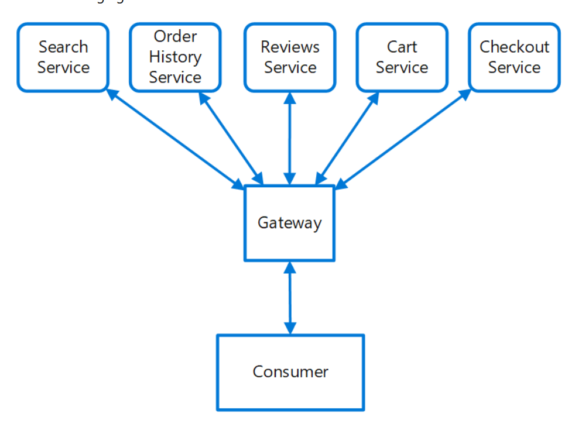

# Gateway Routing

## What

Route requests to multiple services using a single endpoint. This pattern is useful when you wish to expose multiple services on a single endpoint

## Why

When a client needs to consume multiple services, setting up a separate endpoint for each service and having the client manage each endpoint can be challenging. For example, an e-commerce application might provide services such as search, reviews, cart, checkout, and order history. Each service has a different API that the client must interact with, and the client must know about each endpoint in order to connect to the services.

## How

Place a gateway in front of a set of applications, services, or deployments. With this pattern, the client application only needs to know about and communicate with a single endpoint. If a service is consolidated or decomposed, the client does not necessarily require updating. 

This pattern can also help with deployment, by allowing you to manage how updates are rolled out to users. When a new version of your service is deployed, it can be deployed in parallel with the existing version. Routing lets you control what version of the service is presented to the clients, giving you the flexibility to use various release strategies, whether incremental, parallel, or complete rollouts of updates.

