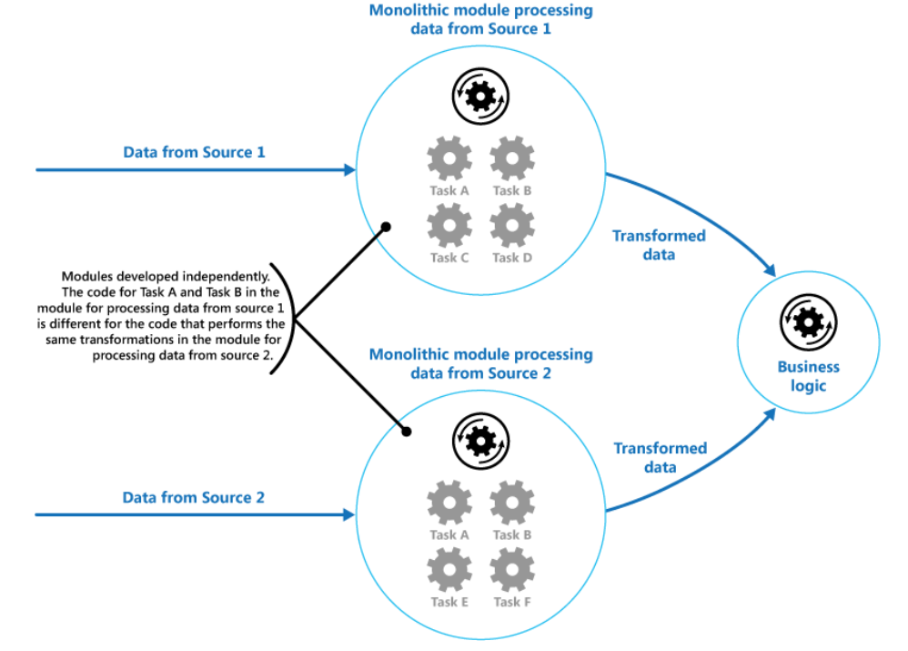
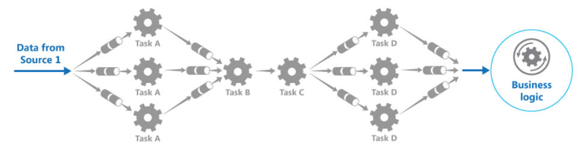

# Pipes and Filters

## What

Decompose a task that performs complex processing into a series of separate elements that can be reused.

## Why

* An application is required to perform a variety of tasks of varying complexity on the information that it processes. A straightforward but inflexible approach to implementing an application is to perform this processing as a monolithic module. 
* Some of the tasks that the monolithic modules perform are functionally very similar.No reuse
* Some tasks might be compute intensive and could benefit from running on powerful hardware. 

    

## How

* Break down the processing required for each stream into a set of separate components each performing a single task. 
* these filters can be combined together into a pipeline. 
* This helps to avoid duplicating code, and makes it easy to remove, replace, or integrate additional Components
* The filters that make up a pipeline can run on different machines, enabling them to be scaled independently and take advantage of the elasticity that many cloud environments provid
* If the input and output of a filter are structured as a stream, it's possible to perform the processing for each filter in parallel. 

## When to use

* The processing can be broken down into a set of independent steps.
* The processing steps performed by an application have different scalability requirements.
* Flexibility of reordering, adding processing steps performed by an application
* distributing the processing for steps across different servers.
* A reliable solution is required that minimizes the effects of failure in a step while data is being processed.

## Example

  
An initial message queue receives unprocessed messages. A component implemented as a filter task listens for a message on this queue, performs its work, and then posts the transformed message to the next queue in the sequence. Another filter task can listen for messages on this queue, process them, post the results to another queue, and so on until the fully transformed data appears in the final message in the queue.

