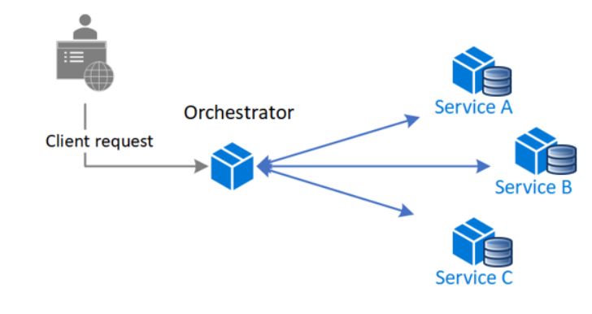
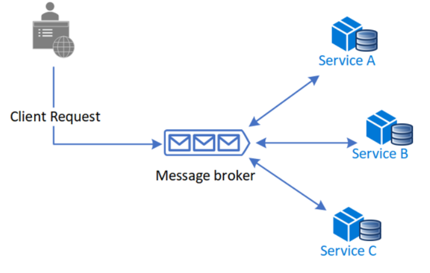

# Saga

## What

manage data consistency across microservices in distributed transaction scenarios. A saga is a sequence of transactions that updates each service and publishes a message or event to trigger the next transaction step. If a step fails, the saga executes compensating transactions that counteract the preceding transactions.

## When to use

Ensure data consistency in a distributed system without tight coupling. Roll back or compensate if one of the operations in the sequence fails.

## How

The saga pattern provides transaction management using a sequence of local transactions. A local transaction is the atomic work effort performed by a saga participant. Each local transaction updates the database and publishes a message or event to trigger the next local transaction in the saga. If a local transaction fails, the saga executes a series of compensating transactions that undo the changes that were made by the preceding local transactions.

saga patterns:

Compensable transactions are transactions that can potentially be reversed by processing another transaction with the opposite effect. A pivot transaction is the go/no-go point in a saga. If the pivot transaction commits, the saga runs until completion. A pivot transaction can be a transaction that is neither compensable nor retryable, or it can be the last compensable transaction or the first retryable transaction in the saga. Retryable transactions are transactions that follow the pivot transaction and are guaranteed to succeed.

two common saga implementation approaches, choreography and orchestration

  

