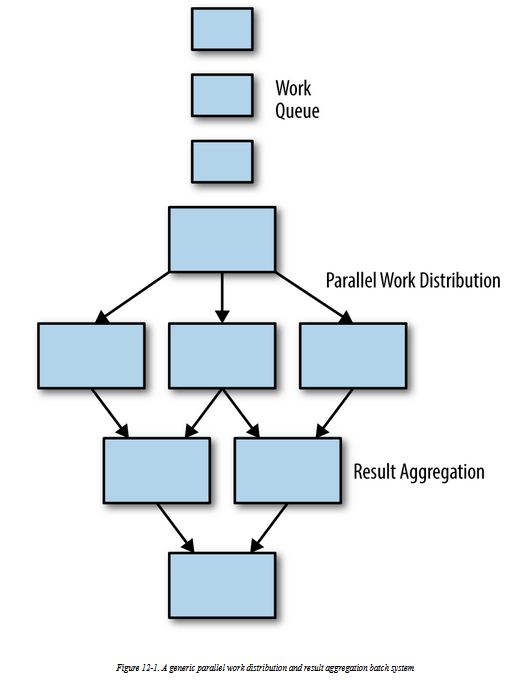
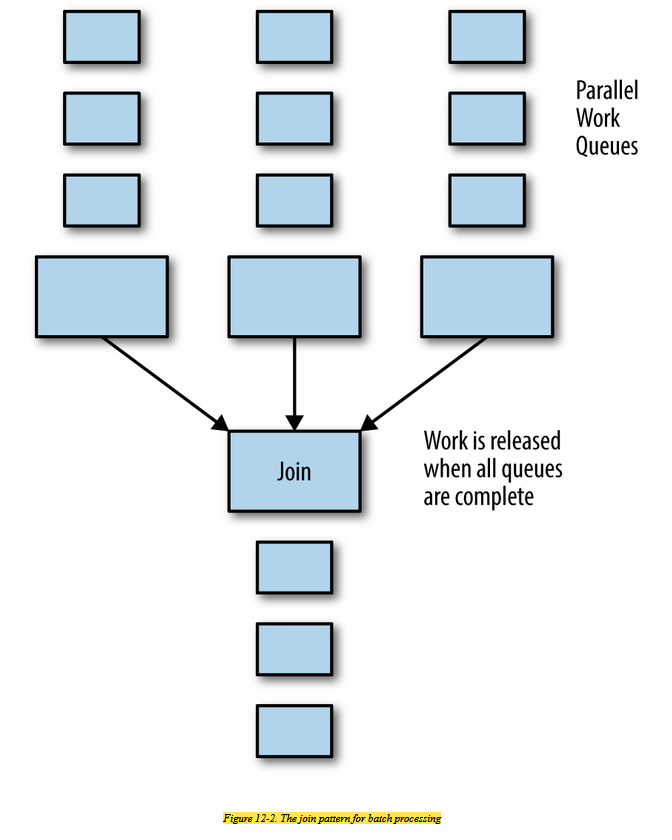
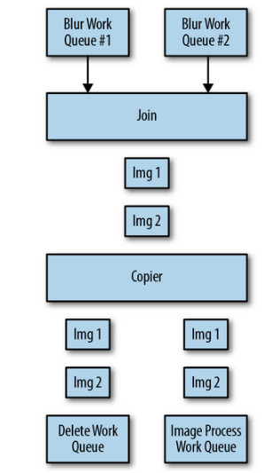

# Coordinated Batch Processing

sometimes it is equallyimportant to pull multiple outputs back together in order togenerate some sort of aggregate output

## Join

* Join is similar tojoining a thread. The basic idea is that all of the work is happening in parallel, but work items aren’t released out of the join until all ofthe work items that are processed in parallel are completed. This isalso generally known as barrier synchronization in concurrent programming
* Coordination through join ensures that no data is missing before some sort of aggregation phase is performed \(e.g., finding the sum of some value in a set\). The value of the join is that it ensures that all of the data in the set is present.
* The downside of the join pattern is that it requires that all data be processed by a previous stage before subsequent computation can begin. This reduces the parallelism that is possible in the batch workflow, and thus increases the overall latency of running the workflow.

## Reducer

* the goal of reduce is not to wait until all data has been processed, but rather to optimistically merge together all of the parallel data items into a single comprehensive representation of the full set.
* With the reduce pattern, each step in the reduce merges several different outputs into a single output. This stage is called “reduce” because it reduces the total number of outputs. 
* Because the reduce phase operates on a range of input, and produces a similar output, the reduce phase can berepeated as many or as few times as necessary in order to successfully reduce the output down to a single output for the entire data set.

## An Image Tagging and Processing Pipeline

job of tagging and processing a set of images.Let us assume that we have a large collection of images of highways atrush hour, and we want to count both the numbers of cars, trucks, and motorcycles, as well as distribution of the colors of each of the cars

**Use cases for Count, sum and histogram can be calculated**

