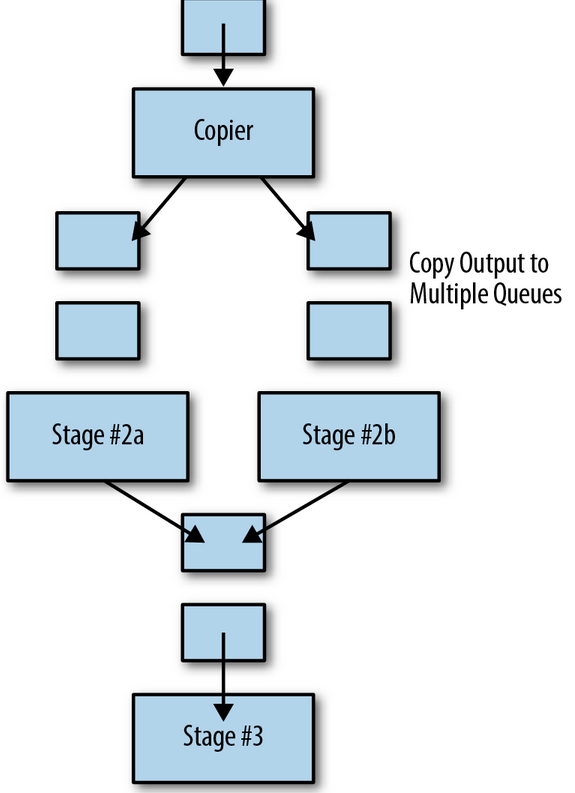
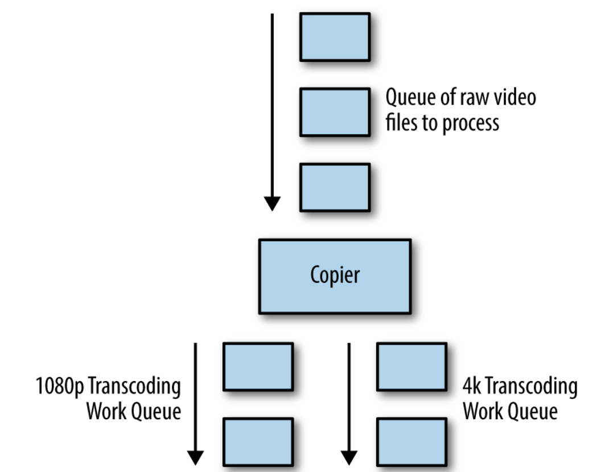
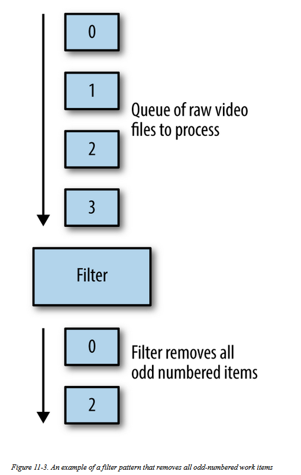
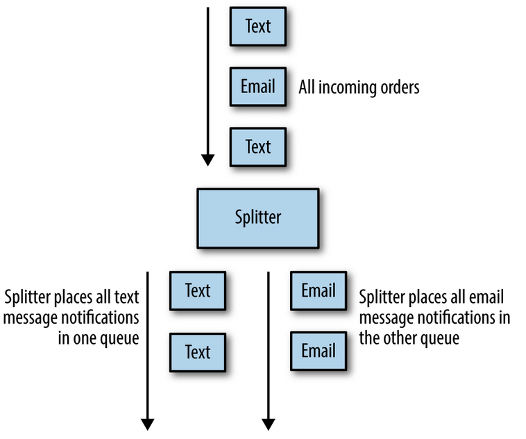
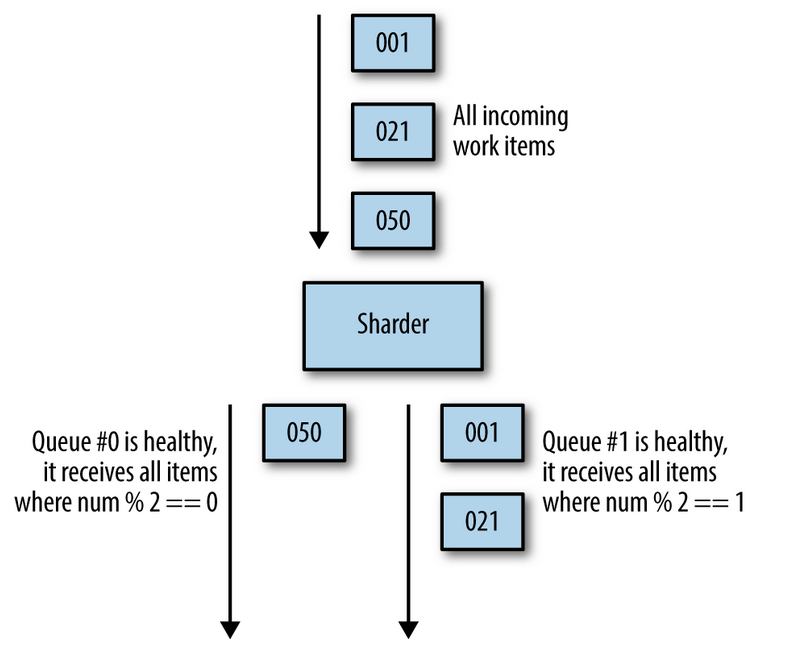
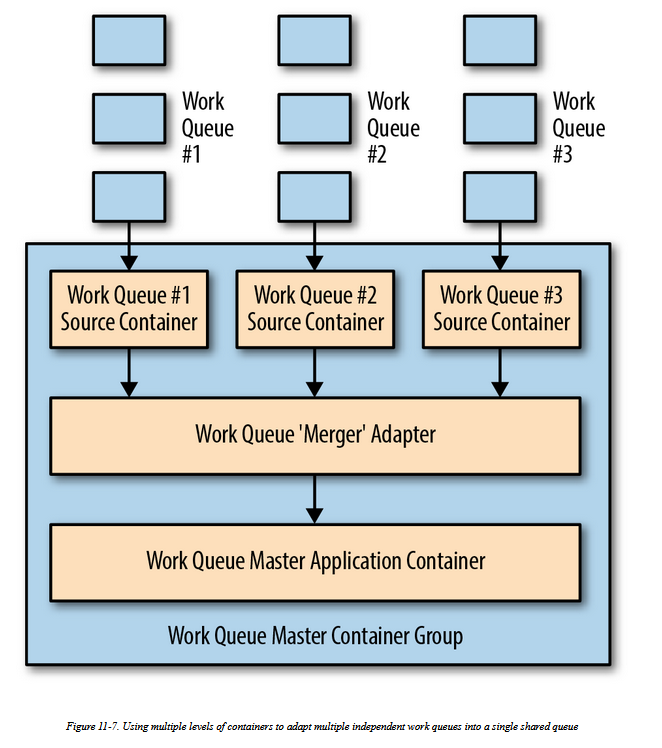
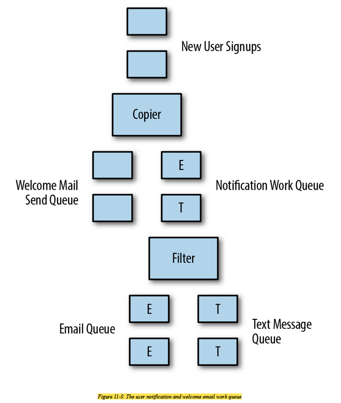

# Event driven batch processing

## Event driven batch processing

* there are a number of batch applications where you want to perform more than a single action, or you may need to generate multiple different outputs froma single data input. In these cases, you start to link work queuestogether so that the output of one work queue becomes the input toone or more other work queues, and so on. This forms a series ofprocessing steps that respond to events, with the events being the completion of the preceding step in the work queue that came before it.
* event-driven processing systems are often called workflow systems, since there is a flow of work through a directed, acyclic graph that describes the various stages and their coordination

## Patterns of Event-Driven Processing

### Copier

* The job of a copier is to take a single stream of work items and duplicate it out into two or more identical streams. This pattern is useful when there are multiple different pieces of work to be done on the same work item. 
* An example of this might be rendering a video. When rendering a video, there are a variety of different formats that are useful depending on where the video is intended to be shown. There might be a 4K high-resolution format for playing off of a hard drive, a 1080-pixel rendering for digital streaming, a low-resolution format for streaming to mobile users on slow networks, and an animated GIF thumbnail for displaying in a movie-picking user interface. 

### Filter

* The role of a filter is to reduce a stream of work items to a smaller stream of work items by filtering out work items that don’t meet particular criteria. 
* As an example of this, consider setting up a batch workflow that handles new users signing up for a service. Some set of those users will have ticked the checkbox that indicates that they wish to be contacted via email for promotions and other information. In such a workflow, you can filter the set of newly signed-up users to only be those who have explicitly opted into being contacted.

### Splitter

* Two different kinds of input present in your set of work items and you want to divide them into two separate work queues without dropping any of them.
* An example of an application of the splitter pattern is processing online orders where people can receive shipping notifications either by email or text message. Given a work queue of items that have been shipped, the splitter divides it into two different queues: one that is responsible for sending emails and another devoted to sending text messages. 

### Sharder

* The role of a sharder in a workflow is to divide up a single queue into an evenly divided collection of work items

   based upon some sort of sharding function. There are several different reasons why you might consider sharding your workflow. One of the first is for reliability. 

* An additional reason to shard your work queue is to more evenly distribute work across different resources

### Merger

* The job of a merger is to take two different work queues and turn them into a single work queue. 

#### use cases

* Suppose, for example, that you have a large number of different source repositories all adding new commits at the same time. You want to take each of these commits and perform a build-and-test for it. 
* It is not scalable to create a separate build infrastructure for each source repository.  
* We can model each of the different source repositories as a separate work queue source that provides a set of commits. We can transform all of these different work queue inputs into a single merged set of inputs using a merger adapter. 
* This merged stream of commits is then the single source to the build system that performs the actual build. 
* The merger is another great example of the adapter pattern, though in this case, the adapter is actually adapting multiple running source containers into a single merged source.

### Building an Event-Driven Flow for New User Sign-Up

* event-driven workflow is the generation of the verification email. 
* To achieve this reliably, we will use the shard pattern to shard users across multiple different geographic failure zones.
* This ensures that we will continue to process new user signups, even in the presence of partial failures.  
* Each work queue shard sends a verification email to the end user. At this point, this substage of the workflow is complete.

### Publish/Subscribe

* popular approach to building a workflow like this is to usea publisher/subscriber \(pub/sub\) API or service. 
* A pub/sub API allows a user to define a collection of queues \(sometimes called topics\). 
* One or more publishers publishes messages to these queues. Likewise, one ormore subscribers is listening to these queues for new messages.
* When a message is published, it is reliably stored by the queue and subsequently delivered to subscribers in a reliable manner.

