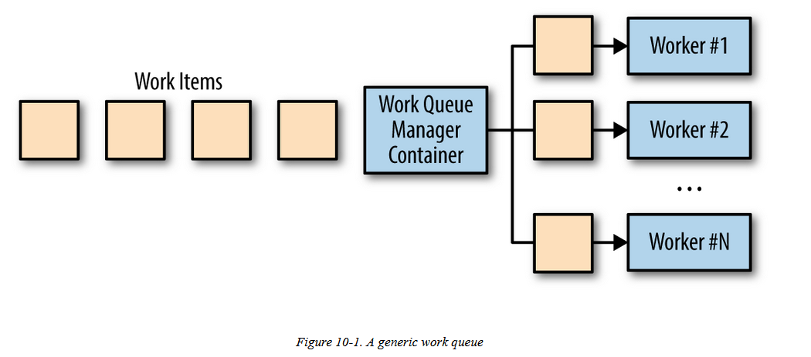

# Work Queues

* A batch of work to be performed. Each piece of work is wholly independent of the other and can be processed without anyinteractions. 
* The goals of the work queue system are to ensurethat each piece of work is processed within a certain amount of time
* Work queues are great for enabling individualtransformations of one input to one output

Use cases: Implementing a Video Thumbnailer

