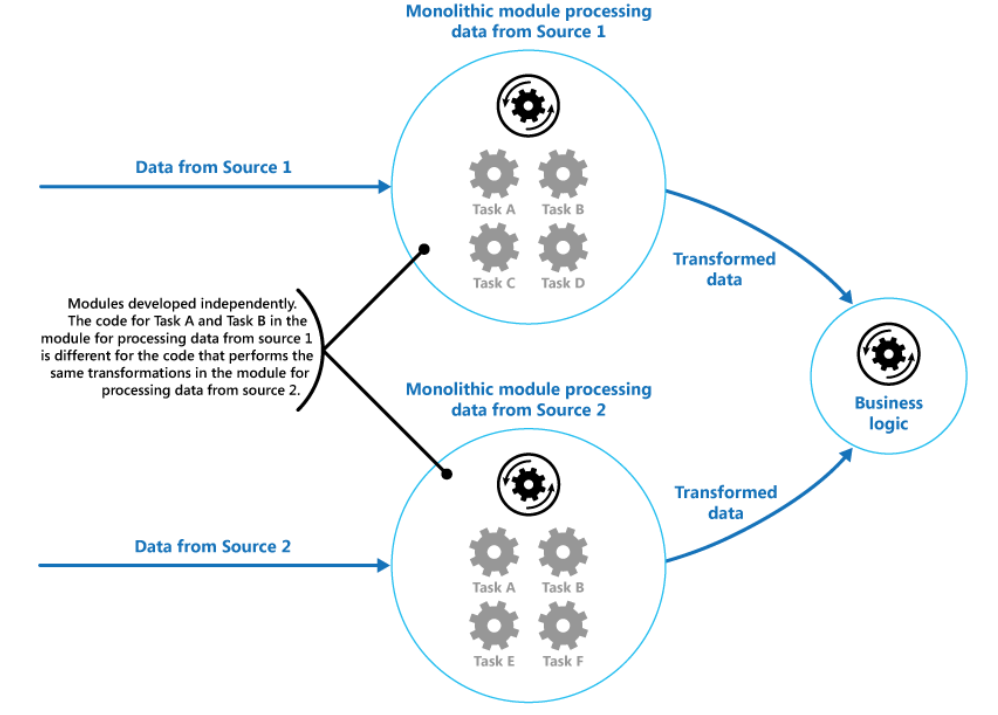
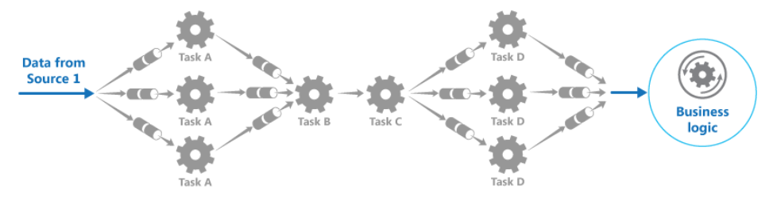

# Pipes and Filters

* An application is required to perform a variety of tasks of varying complexity on the information that it processes. A straightforward but inflexible approach to implementing an application is to perform this processing as a monolithic module. 
* Some of the tasks that the monolithic modules perform are functionally very similar.No reuse 

  

### When to use

* The processing can be broken down into a set of independent steps.
* The processing steps performed by an application have different scalability requirements.
* Flexibility of reordering, adding processing steps performed by an application
* distributing the processing for steps across different servers.

## How

* Break down the processing required for each stream into a set of separate components each performing a single task. 
* these filters can be combined together into a pipeline. 
* The filters that make up a pipeline can run on different machines, enabling them to be scaled independently and take advantage of the elasticity that many cloud environments provid
* If the input and output of a filter are structured as a stream, it's possible to perform the processing for each filter in parallel. 

