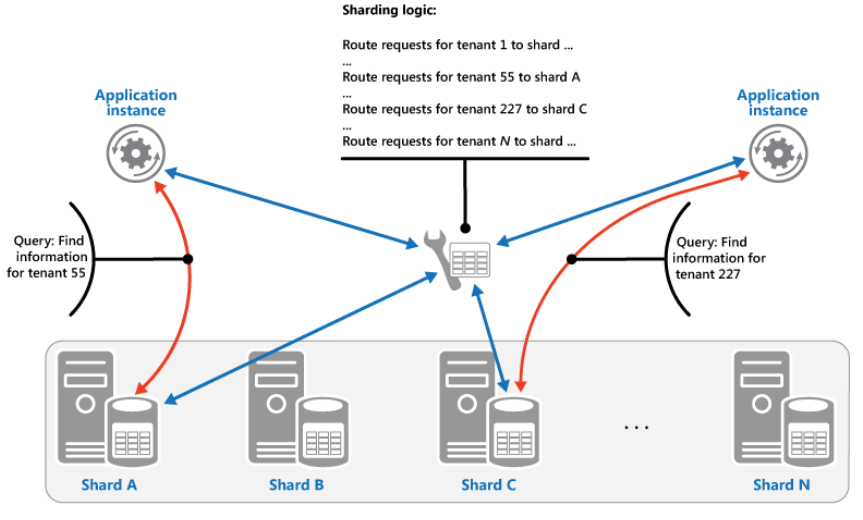
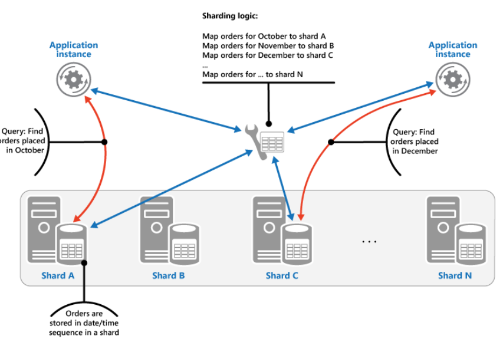
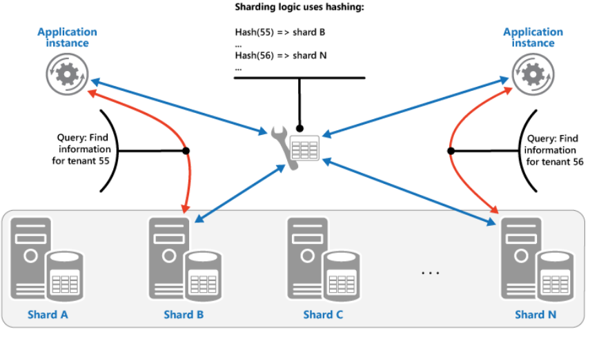

# Sharding

Divide a data store into a set of horizontal partitions or shards. This can improve scalability when storing and accessing large volumes of data.

**Sharding strategies**

* **The Lookup strategy.** In this strategy the sharding logic implements a map that routes a request for data to the shard that contains that data using the shard key.
* a more flexible technique for rebalancing shards is virtual partitioning, where shard keys map to the same number of virtual shards, which in turn map to fewer physical partitions. 
* an application locates data using a shard key that refers to a virtual shard, and the system transparently maps virtual shards to physical partitions. The mapping between a virtual shard and a physical partition can change without requiring the application code be modified to use a different set of shard keys.

**The Range strategy.** This strategy groups related items together in the same shard, and orders them by shard key—the shard keys are sequential. It's useful for applications that frequently retrieve sets of items using range queries. For example, if an application regularly needs to find all orders placed in a given month, this data can be retrieved more quickly if all orders for a month are stored in date and time order in the same shard. If each order was stored in a different shard, they'd have to be fetched individually by performing a large number of point queries 

**The Hash strategy.** The purpose of this strategy is to reduce the chance of hotspots \(shards that receive a disproportionate amount of load\). It distributes the data across the shards in a way that achieves a balance between the size of each shard and the average load that each shard will encounter. The sharding logic computes the shard to store an item in based on a hash of one or more attributes of the data. The chosen hashing function should distribute data evenly across the shards, possibly by introducing some random element into the computation. 

three sharding strategies have the following advantages and considerations:

Lookup. This offers more control over the way that shards are configured and used. Using virtual shards reduces the impact when rebalancing data because new physical partitions can be added to even out the workload. The mapping between a virtual shard and the physical partitions that implement the shard can be modified without affecting application code that uses a shard key to store and retrieve data. Looking up shard locations can impose an additional overhead.

Range. This is easy to implement and works well with range queries because they can often fetch multiple data items from a single shard in a single operation. This strategy offers easier data management. For example, if users in the same region are in the same shard, updates can be scheduled in each time zone based on the local load and demand pattern. However, this strategy doesn't provide optimal balancing between shards. Rebalancing shards is difficult and might not resolve the problem of uneven load if the majority of activity is for adjacent shard keys.

Hash. This strategy offers a better chance of more even data and load distribution. Request routing can be accomplished directly by using the hash function. There's no need to maintain a map. Note that computing the hash might impose an additional overhead. Also, rebalancing shards is difficult.

You can shard data based on workload. You could segregate the data for highly volatile tenants in separate shards. The speed of data access for other tenants might be improved as a result.

You can shard data based on the location of tenants. You can take the data for tenants in a specific geographic region offline for backup and maintenance during off-peak hours in that region, while the data for tenants in other regions remains online and accessible during their business hours.

High-value tenants could be assigned their own private, high performing, lightly loaded shards, whereas lower-value tenants might be expected to share more densely-packed, busy shards.

