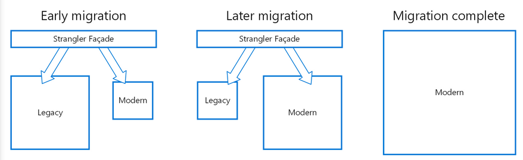

# Strangler Fig

## What

Incrementally migrate a legacy system by gradually replacing specific pieces of functionality with new applications and services. As features from the legacy system are replaced, the new system eventually replaces all of the old system's features,

## How

Create a façade that intercepts requests going to the backend legacy system. The façade routes these requests either to the legacy application or the new services. Existing features can be migrated to the new system gradually, 

