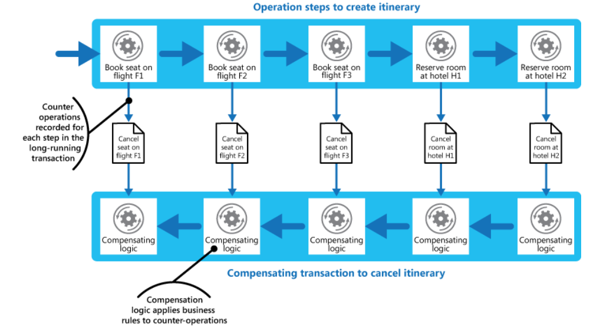

# Compensating Transaction

* Undo the work performed by a series of steps, which together define an eventually consistent operation, if one or more of the steps fail
* In a service oriented architecture \(SOA\) environment an operation could invoke an action in a service, and cause a change in the state held by that service. To undo the operation, this state change must also be undone.

#### How

* The solution is to implement a compensating transaction. The steps in a compensating transaction must undo the effects of the steps in the original operation. 
* use a workflow to implement an eventually consistent operation that requires compensation. As the original operation proceeds, the system records information about each step and how the work performed by that step can be undone. If the operation fails at any point, the workflow rewinds back through the steps it's completed and performs the work that reverses each step

