- [Use cases](#use-cases)
- [common terms](#common-terms)
- [High-level architecture](#high-level-architecture)
  - [Data partitioning](#data-partitioning)
  - [Cassandra keys](#cassandra-keys)
  - [Clustering keys](#clustering-keys)
- [Partitioner](#partitioner)
  - [Example:](#example)
  - [Coordinator node](#coordinator-node)
- [Replication](#replication)
  - [Replication factor](#replication-factor)
  - [Replication strategy](#replication-strategy)
    - [Simple replication strategy](#simple-replication-strategy)
    - [Network topology strategy](#network-topology-strategy)
- [Cassandra’s consistency levels?](#cassandras-consistency-levels)
  - [Write consistency levels](#write-consistency-levels)
  - [Read consistency levels](#read-consistency-levels)
  - [Snitch](#snitch)
- [Cassandra use gossip protocol?](#cassandra-use-gossip-protocol)
- [Node failure detection](#node-failure-detection)
- [Anatomy of Cassandra's Write Operation](#anatomy-of-cassandras-write-operation)
  - [Commit log](#commit-log)
  - [MemTable](#memtable)
  - [SStable](#sstable)
- [Anatomy of Cassandra's Read Operation](#anatomy-of-cassandras-read-operation)
  - [Caching](#caching)
  - [Reading from MemTable](#reading-from-memtable)
  - [Reading from SSTable](#reading-from-sstable)
    - [Bloom filters](#bloom-filters)
  - [How are SSTables stored on the disk?](#how-are-sstables-stored-on-the-disk)
    - [Partition index summary file](#partition-index-summary-file)
  - [Reading SSTable through key cache](#reading-sstable-through-key-cache)
- [Compaction](#compaction)
  - [How does compaction work in Cassandra?](#how-does-compaction-work-in-cassandra)
  - [Compaction strategies](#compaction-strategies)
  - [Sequential writes](#sequential-writes)
- [What are Tombstones?](#what-are-tombstones)
  - [Common problems associated with Tombstones](#common-problems-associated-with-tombstones)
- [Summary](#summary)

Cassandra is an open-source Apache project.  
AP (i.e., available and partition tolerant) system which means that availability and partition tolerance are generally considered more important than the consistency. 
Cassandra is optimized for high throughput and faster writes

## Use cases
used for collecting big data for performing real-time analysis
Storing key-value data with high availability.
Write-heavy applications - Cassandra is especially suited for write-intensive applications such as time-series streaming services, sensor logs, and Internet of Things (IoT) applications.

## common terms

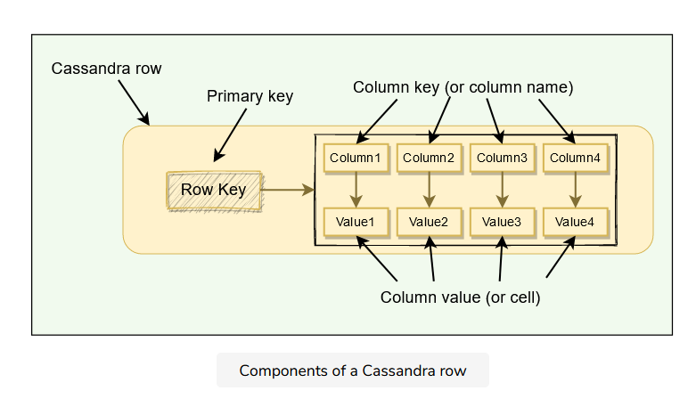  

- Column: A column is a key-value pair and is the most basic unit of data structure.

    Column key: Uniquely identifies a column in a row.
    Column value: Stores one value or a collection of values.

- Row: A row is a container for columns referenced by primary key. Cassandra does not store a column that has a null value; this saves a lot of space.
- Table: A table is a container of rows.
- Keyspace: Keyspace is a container for tables.
- Cluster: Container of Keyspaces is called a cluster.
- Node: Node refers to a computer system running an instance of Cassandra.

## High-level architecture
### Data partitioning
Cassandra uses consistent hashing for data partitioning.

### Cassandra keys
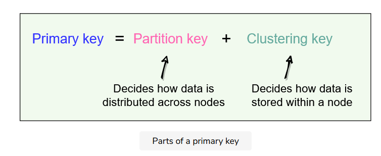  

### Clustering keys
clustering keys define how the data is stored within a node. We can have multiple clustering keys; all columns listed after the partition key are called clustering columns. Clustering columns specify the order that the data is arranged on a node.
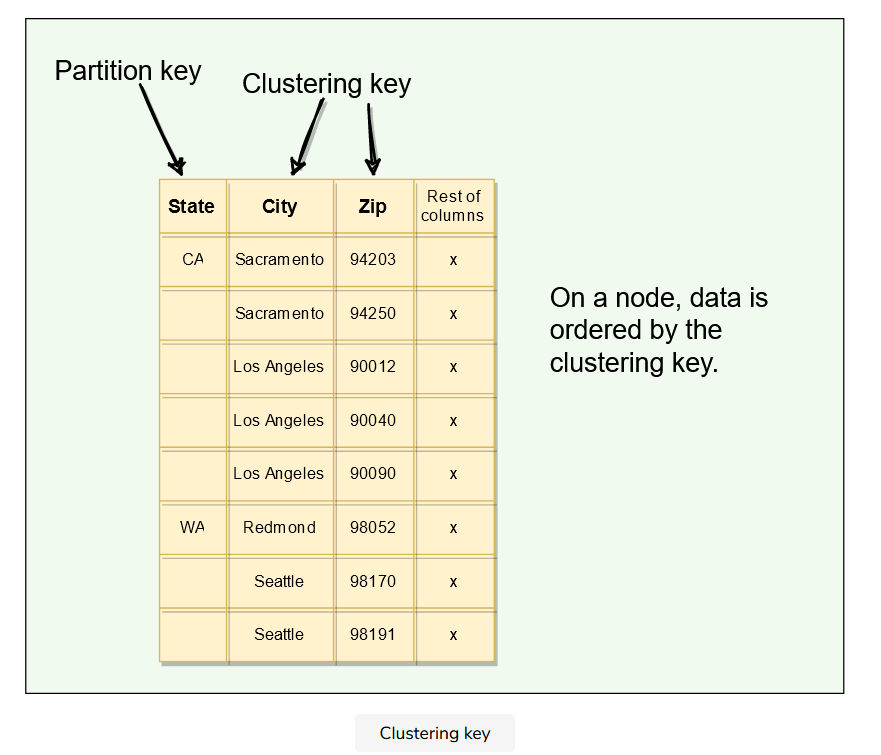  

## Partitioner

Partitioner is the component responsible for determining how data is distributed on the Consistent Hash ring.
When Cassandra inserts some data into a cluster, the partitioner performs the first step, which is to apply a hashing algorithm to the partition key. The output of this hashing algorithm determines within which range the data lies and hence, on which node the data will be stored.
Cassandra uses the Murmur3 hashing function. Murmur3 will always produce the same hash for a given partition key. This means that we can always find the node where a specific row is stored. 
In Cassandra’s default configuration, a token is a 64-bit integer. This gives a possible range for tokens from -2^{63}to 2^{63}-1.

All Cassandra nodes learn about the token assignments of other nodes through gossip. 
This means any node can handle a request for any other node’s range. 
The node receiving the request is called the coordinator, and any node can act in this role. 
If a key does not belong to the coordinator’s range, it forwards the request to the replicas responsible for that range.

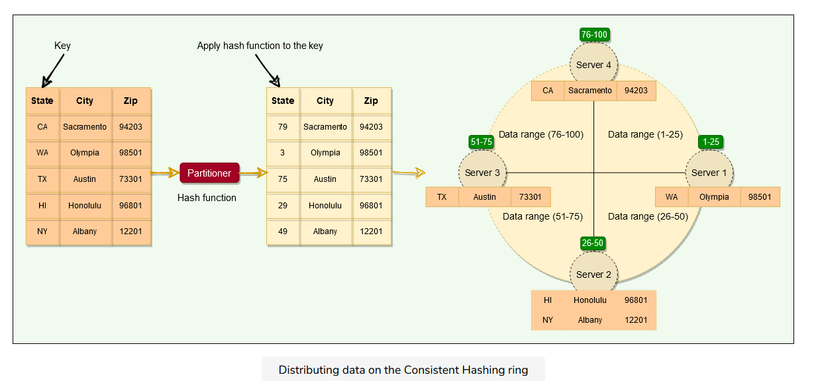  

### Example:
The Primary key uniquely identifies each row of a table. 
In Cassandra primary key has two parts:
The partition key decides which node stores the data, and the clustering key decides how the data is stored within a node. Let’s take the example of a table with PRIMARY KEY (city_id, employee_id). This primary key has two parts represented by the two columns:
- city_id is the partition key. This means that the data will be partitioned by the city_id field, that is, all rows with the same city_id will reside on the same node.
- employee_id is the clustering key. This means that within each node, the data is stored in sorted order according to the employee_id column.

### Coordinator node
- A client may connect to any node in the cluster to initiate a read or write query. This node is known as the coordinator node. 
- The coordinator identifies the nodes responsible for the data that is being written or read and forwards the queries to them.

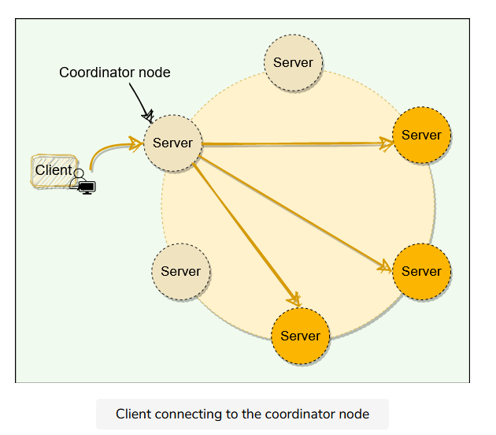  

## Replication
- Each node in Cassandra serves as a replica for a different range of data. 
- Cassandra stores multiple copies of data and spreads them across various replicas. 
- This process of replicating the data on to different nodes depends upon two factors:

    Replication factor
    Replication strategy

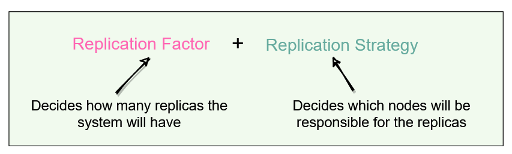  

### Replication factor
The replication factor is the number of nodes that will receive the copy of the same data. Each keyspace in Cassandra can have a different replication factor.

### Replication strategy
There are two replication strategies in Cassandra:
#### Simple replication strategy
This strategy is used only for a single data center cluster. Under this strategy, Cassandra places the first replica on a node determined by the partitioner and the subsequent replicas on the next node in a clockwise manner.

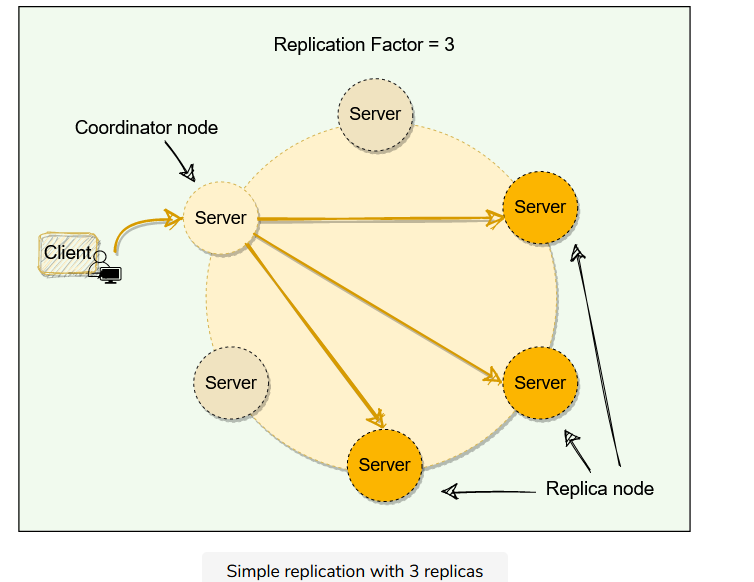  

#### Network topology strategy

This strategy is used for multiple data-centers. Under this strategy, we can specify different replication factors for different data-centers. This enables us to specify how many replicas will be placed in each data center.

Additional replicas, in the same data-center, are placed by walking the ring clockwise until reaching the first node in another rack. This is done to guard against a complete rack failure, as nodes in the same rack tend to fail together due to power, cooling, or network issues.

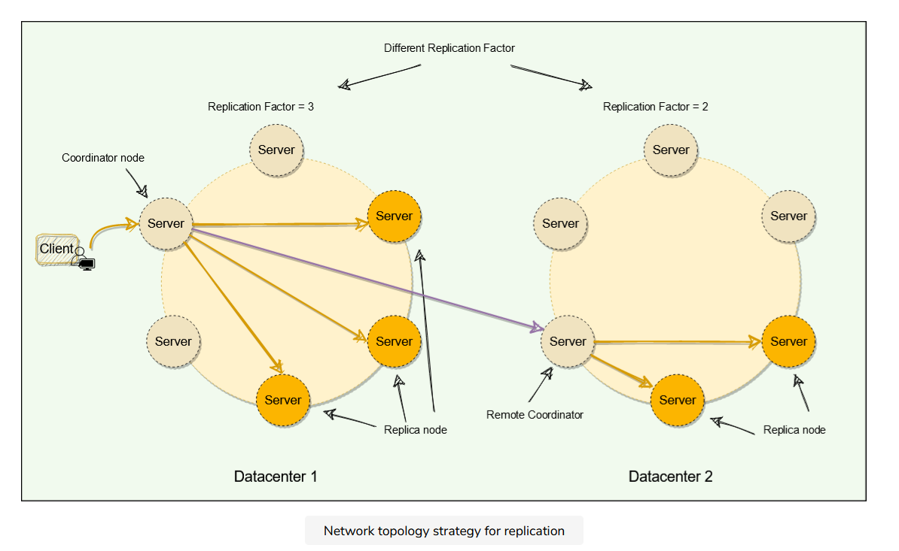  

## Cassandra’s consistency levels?

- Cassandra’s consistency level is defined as the minimum number of Cassandra nodes that must fulfill a read or write operation before the operation can be considered successful. 
- Cassandra allows us to specify different consistency levels for read and write operations.
- There is always a tradeoff between consistency and performance. 

### Write consistency levels

- For write operations, the consistency level specifies how many replica nodes must respond for the write to be reported as successful to the client. 
- Because Cassandra is eventually consistent, updates to other replica nodes may continue in the background. Here are different write consistency levels that Cassandra offers:

    - One or Two or Three: The data must be written to at least the specified number of replica nodes before a write is considered successful.
    - Quorum: The data must be written to at least a quorum (or majority) of replica nodes. 
    - All: Ensures that the data is written to all replica nodes. This consistency level provides the highest consistency but lowest availability as writes will fail if any replica is down.
    - Local_Quorum: Ensures that the data is written to a quorum of nodes in the same datacenter as the coordinator. It does not wait for the response from the other data-centers.
    - Each_Quorum: Ensures that the data is written to a quorum of nodes in each datacenter.
    - Any: The data must be written to at least one node. In the extreme case, when all replica nodes for the given partition key are down, the write can still succeed after a hinted handoff (discussed below) has been written. ‘Any’ consistency level provides the lowest latency and highest availability, however, it comes with the lowest consistency. 
    
**How does Cassandra perform a write operation?** 
For a write, the coordinator node contacts all replicas, as determined by the replication factor, and considers the write successful when a number of replicas equal to the consistency level acknowledge the write.

**Hinted handoff**
Cassandra can still serve write requests even when nodes are down. For example, if we have the replication factor of three and the client is writing with a quorum consistency level. This means that if one of the nodes is down, Cassandra can still write on the remaining two nodes to fulfill the consistency level, hence, making the write successful.

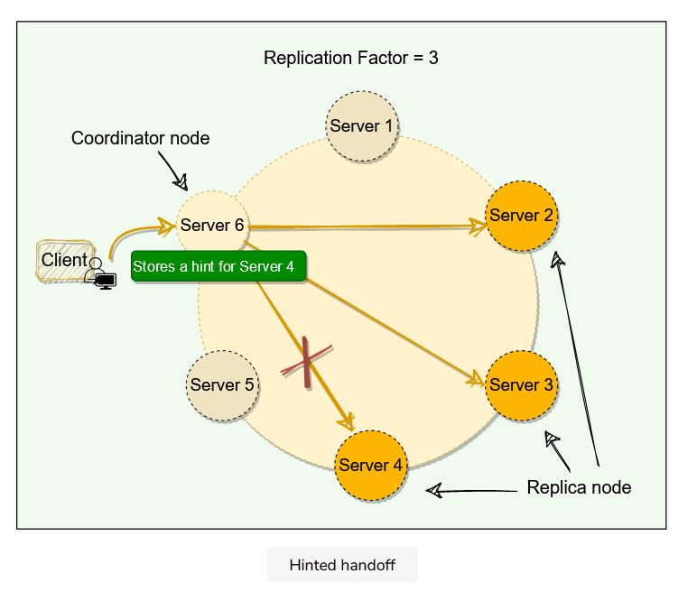  

Now when the node which was down comes online again, Cassandra does a hinted handoff.

- When a node is down or does not respond to a write request, the coordinator node writes a hint in a text file on the local disk. 
- This hint contains the data itself along with information about which node the data belongs to.
-  When the coordinator node discovers from the Gossiper that a node for which it holds hints has recovered, it forwards the write requests for each hint to the target. Furthermore, each node every ten minutes checks to see if the failing node, for which it is holding any hints, has recovered.
- With consistency level ‘Any,’ if all the replica nodes are down, the coordinator node will write the hints for all the nodes and report success to the client. However, this data will not reappear in any subsequent reads until one of the replica nodes comes back online, and the coordinator node successfully forwards the write requests to it. For this reason, we should avoid using the ‘Any’ consistency level.

**Flooding hinted**
- If a node is offline for some time, the hints can build up considerably on other nodes. Now, when the failed node comes back online, other nodes tend to flood that node with write requests. This can cause issues on the node, as it is already trying to come back after a failure. 
- To address this problem, Cassandra limits the storage of hints to a configurable time window. It is also possible to disable hinted handoff entirely.

One thing to remember: When the cluster cannot meet the consistency level specified by the client, Cassandra fails the write request and does not store a hint.

### Read consistency levels

The consistency level for read queries specifies how many replica nodes must respond to a read request before returning the data. 
For example, for a read request with a consistency level of quorum and replication factor of three, the coordinator waits for successful replies from at least two nodes.
Cassandra has the same consistency levels for read operations as that of write operations except for Each_Quorum (because it is very expensive).

Snitch: The Snitch is an application that determines the proximity of nodes within the ring and also tells which nodes are faster. Cassandra nodes use this information to route read/write requests efficiently.

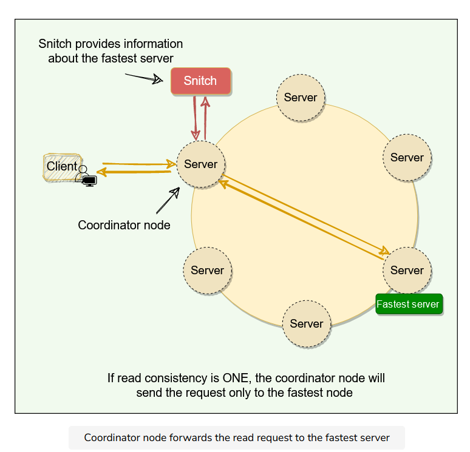  

**How does Cassandra perform a read operation? (Read-Repair)** 
- The coordinator always sends the read request to the fastest node. For example, for Quorum=2, the coordinator sends the request to the fastest node and the digest of the data from the second-fastest node. The digest is a checksum of the data and is used to save network bandwidth.
- If the digest does not match, it means some replicas do not have the latest version of the data. In this case, the coordinator reads the data from all the replicas to determine the latest data. The coordinator then returns the latest data to the client and initiates a read repair request. The read repair operation pushes the newer version of data to nodes with the older version.

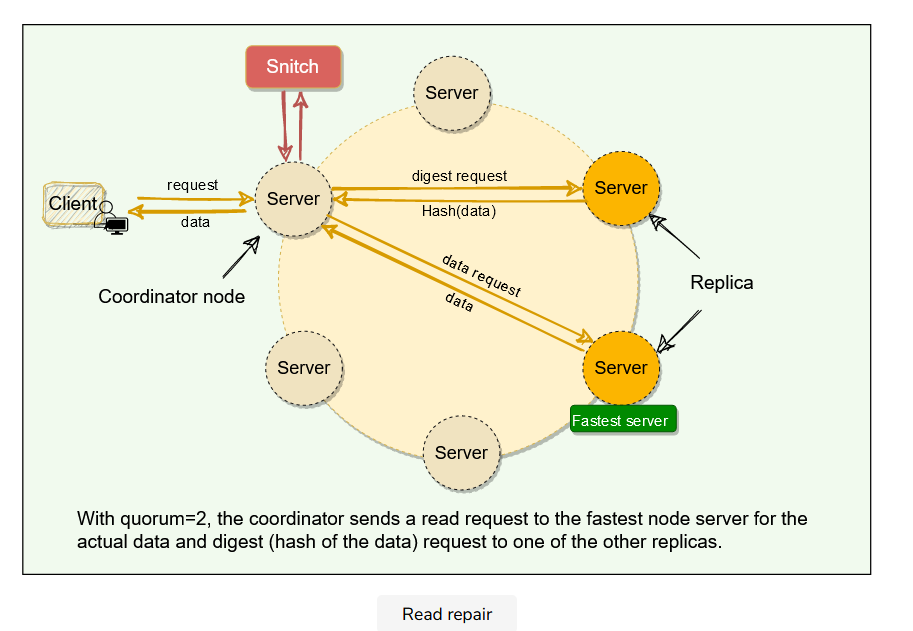  

While discussing Cassandra’s write path, we saw that the nodes could become out of sync due to network issues, node failures, corrupted disks, etc. 
The read repair operation helps nodes to resync with the latest data. Read operation is used as an opportunity to repair inconsistent data across replicas. 
The latest write-timestamp is used as a marker for the correct version of data.
The read repair operation is performed only in a portion of the total reads to avoid performance degradation. 
Read repairs are opportunistic operations and not a primary operation for anti-entropy.

Read Repair Chance: When the read consistency level is less than ‘All,’ Cassandra performs a read repair probabilistically. By default, Cassandra tries to read repair 10% of all requests with DC local read repair. 
In this case, Cassandra immediately sends a response when the consistency level is met and performs the read repair asynchronously in the background.

### Snitch

Snitch keeps track of the network topology of Cassandra nodes. It determines which data-centers and racks nodes belong to. Cassandra uses this information to route requests efficiently. Here are the two main functions of a snitch in Cassandra:

- Snitch determines the proximity of nodes within the ring and also monitors the read latencies to avoid reading from nodes that have slowed down. 
- Cassandra’s replication strategy uses the information provided by the Snitch to spread the replicas across the cluster intelligently. 

## Cassandra use gossip protocol?

- Cassandra uses gossip protocol that allows each node to keep track of state information about the other nodes in the cluster. 
- Nodes share state information with each other to stay in sync. 
- Gossip protocol is a peer-to-peer communication mechanism in which nodes periodically exchange state information about themselves and other nodes they know about. 
- Each node initiates a gossip round every second to exchange state information about themselves (and other nodes) with one to three other random nodes. This way, all nodes quickly learn about all other nodes in a cluster.

- Each gossip message has a version associated with it, so that during a gossip exchange, older information is overwritten with the most current state for a particular node.

**Generation number:** In Cassandra, each node stores a generation number which is incremented every time a node restarts. This generation number is included in each gossip message exchanged between nodes and is used to distinguish the current state of a node from its state before a restart. The generation number remains the same while the node is alive and is incremented each time the node restarts. The node receiving the gossip message can compare the generation number it knows and the gossip message’s generation number. If the generation number in the gossip message is higher, it knows that the node was restarted.

**Seed nodes:** To prevent problems in gossip communications, Cassandra designates a list of nodes as the seeds in a cluster. This is critical for a node starting up for the first time. By default, a node remembers other nodes it has gossiped with between subsequent restarts. The seed node designation has no purpose other than bootstrapping the gossip process for new nodes joining the cluster.

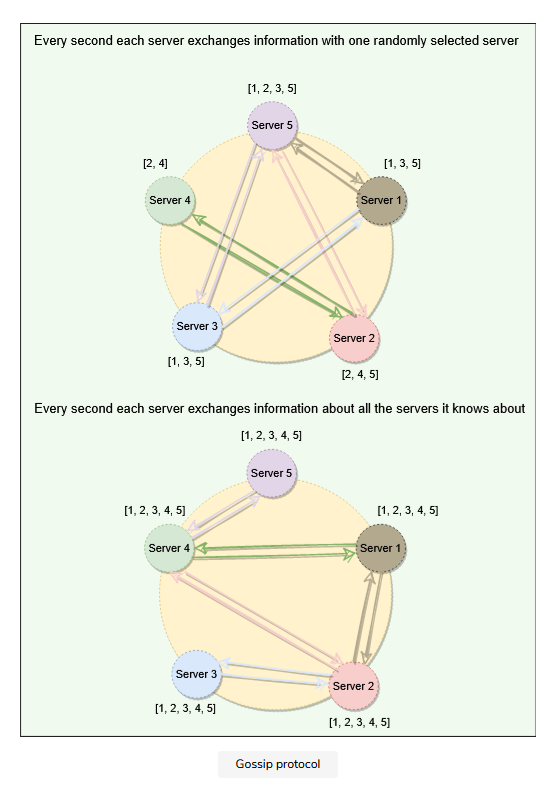  

## Node failure detection
- Heartbeating uses a fixed timeout, and if there is no heartbeat from a server, the system, after the timeout, assumes that the server has crashed. 
- The value of the timeout is critical. If we keep the timeout short, the system will be able to detect failures quickly but with many false positives due to slow machines or faulty networks. On the other hand, if we keep the timeout long, the false positives will be reduced, but the system will not perform efficiently for being slow in detecting failures.
- Cassandra uses an adaptive failure detection mechanism as described by Phi Accrual Failure Detector. 
- This algorithm uses historical heartbeat information to make the threshold adaptive. 
- A generic Accrual Failure Detector, instead of telling that the server is alive or not, outputs the suspicion level about a server; a higher suspicion level means there are higher chances that the server is down. Using Phi Accrual Failure Detector, if a node does not respond, its suspicion level is increased and could be declared dead later. As a node’s suspicion level increases, the system can gradually decide to stop sending new requests to it.
-  Phi Accrual Failure Detector makes a distributed system efficient as it takes into account fluctuations in the network environment and other intermittent server issues before declaring a system completely dead.

## Anatomy of Cassandra's Write Operation
Cassandra stores data both in memory and on disk to provide both high performance and durability. 
Every write includes a timestamp. 
- Each write is appended to a commit log, which is stored on disk.
- Then it is written to MemTable in memory.
- Periodically, MemTables are flushed to SSTables on the disk.
- Periodically, compaction runs to merge SSTables.
### Commit log
- When a node receives a write request, it immediately writes the data to a commit log. The commit log is a write-ahead log and is stored on disk. 
- A write will not be considered successful on the node until it’s written to the commit log; this ensures that if a write operation does not make it to the in-memory store, it will still be possible to recover the data. 
- If we shut down the node or it crashes unexpectedly, the commit log can ensure that data is not lost. That’s because if the node restarts, the commit log gets replayed.

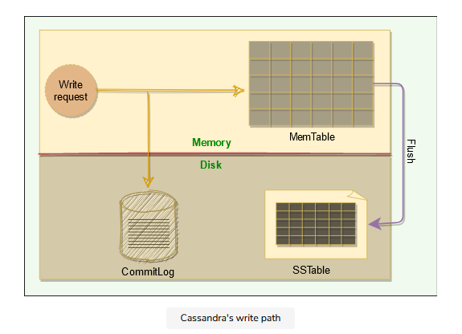  
### MemTable

After it is written to the commit log, the data is written to a memory-resident data structure called the MemTable.

- Each node has a MemTable in memory for each Cassandra table.
- Each MemTable contains data for a specific Cassandra table, and it resembles that table in memory.
- Each MemTable accrues writes and provides reads for data not yet flushed to disk.
- MemTable stores data in the sorted order of partition key and clustering columns.
- After writing data to the Commit Log and MemTable, the node sends an acknowledgment to the coordinator that the data has been successfully written.

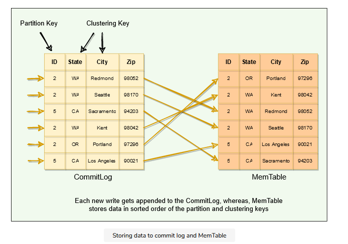  

### SStable

- When the number of objects stored in the MemTable reaches a threshold, the contents of the MemTable are flushed to disk in a file called SSTable. 
- new MemTable is created to store subsequent data. 
This flushing is a non-blocking operation; 
- multiple MemTables may exist for a single table, one current, and the rest waiting to be flushed. Each SStable contains data for a specific table.
- When the MemTable is flushed to SStables, corresponding entries in the Commit Log are removed.

**Why are they called ‘SSTables’?** 
‘Sorted String Table’ 
- Once a MemTable is flushed to disk as an SSTable, it is immutable and cannot be changed by the application.
- In Cassandra, each delete or update is considered a new write operation. 
- Generation number is an index number that is incremented every time a new SSTable is created for a table and is used to uniquely identify SSTables. 

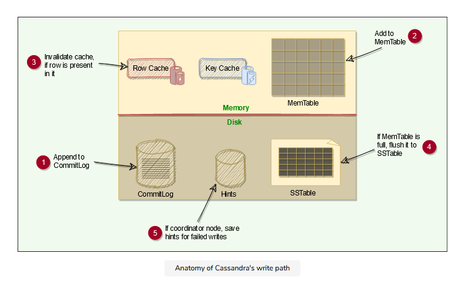  

## Anatomy of Cassandra's Read Operation

### Caching

To boost read performance, Cassandra has 3 forms of caching:

- Row cache: The row cache, caches frequently read rows. It stores a complete data row, which can be returned directly to the client if requested by a read operation. - Key cache: Key cache stores a map of recently read partition keys to their SSTable offsets. This facilitates faster read access into SSTables stored on disk and improves the read performance. 
- Chunk cache: Chunk cache is used to store uncompressed chunks of data read from SSTable files that are accessed frequently.

### Reading from MemTable
data is sorted by the partition key and the clustering columns. 
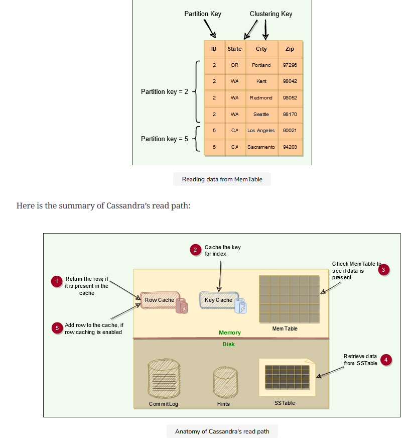  

### Reading from SSTable
#### Bloom filters
- Each SStable has a Bloom filter associated with it, which tells if a particular key is present in it or not. 
Bloom filters are used to boost the performance of read operations. 
- Bloom filters are very fast, non-deterministic algorithms for testing whether an element is a member of a set. They are non-deterministic because it is possible to get a false-positive read from a Bloom filter, but false-negative is not possible. 
Bloom filters work by mapping the values in a data set into a bit array and condensing a larger data set into a digest string using a hash function. 
- The digest, by definition, uses a much smaller amount of memory than the original data would. The filters are stored in memory and are used to improve performance by reducing the need for disk access on key lookups. 

### How are SSTables stored on the disk?

Each SSTable consists of two files:

- Data File: Actual data is stored in a data file. It has partitions and rows associated with those partitions. The partitions are in sorted order.
- Partition Index file: Stored on disk, partition index file stores the sorted partition keys mapped to their SSTable offsets. It enables locating a partition exactly in an SSTable rather than scanning data.

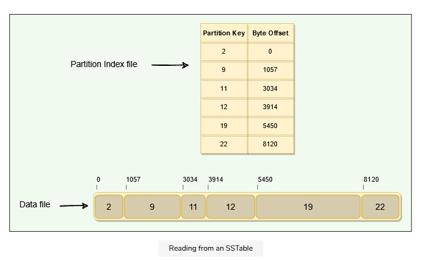  

#### Partition index summary file
Stored in memory, the Partition Index Summary file stores the summary of the Partition Index file. This is done for performance improvement.

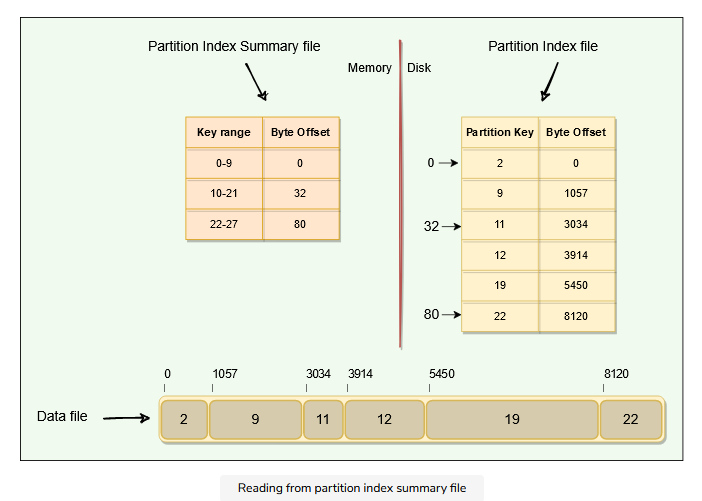  

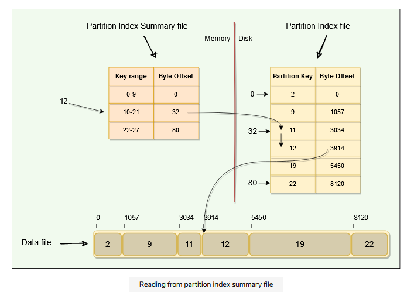  

### Reading SSTable through key cache

As the Key Cache stores a map of recently read partition keys to their SSTable offsets, it is the fastest way to find the required row in the SSTable.

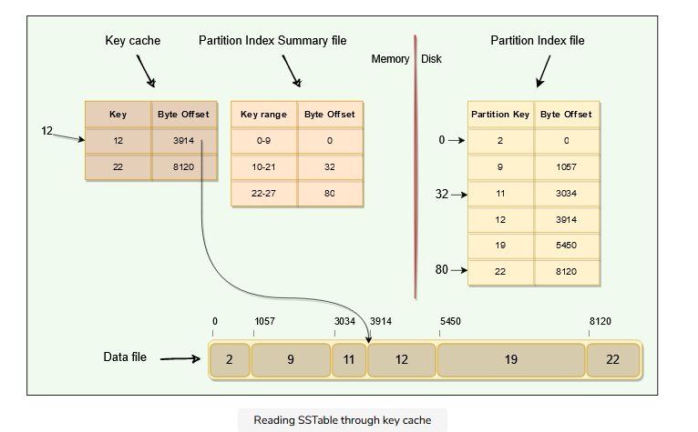  

summary of Cassandra’s read operation:

- First, Cassandra checks if the row is present in the Row Cache. If present, the data is returned, and the request ends.
- If the row is not present in the Row Cache, bloom filters are checked. If a bloom filter indicates that the data is present in an SSTable, Cassandra looks for the required partition in that SSTable.
- The key cache is checked for the partition key presence. A cache hit provides an offset for the partition in SSTable. This offset is then used to retrieve the partition, and the request completes.
- Cassandra continues to seek the partition in the partition summary and partition index. These structures also provide the partition offset in an SSTable which is then used to retrieve the partition and return. The caches are updated if present with the latest data read.

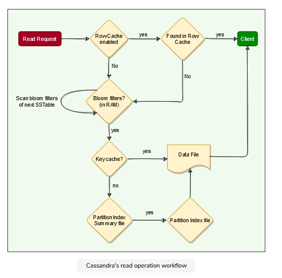  

## Compaction

### How does compaction work in Cassandra?
- This means we can have a large number of SStables lying on the disk. 
- While reading, it is tedious to scan all these SStables. 
- So, to improve the read performance, we need compaction. 
- Compaction refers to the operation of merging multiple related SSTables into a single new one. 
- During compaction, the data in SSTables is merged: the keys are merged, columns are combined, obsolete values are discarded, and a new index is created.
- On compaction, the merged data is sorted, a new index is created over the sorted data, and this freshly merged, sorted, and indexed data is written to a single new SSTable.

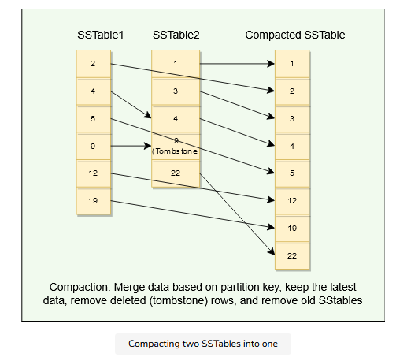  

- Compaction will reduce the number of SSTables to consult and therefore improve read performance.
- Compaction will also reclaim space taken by obsolete data in SSTable.

### Compaction strategies
**SizeTiered Compaction Strategy:** This compaction strategy is suitable for insert-heavy and general workloads. This is the default compaction strategy and is triggered when multiple SSTables of a similar size are present.

**Leveled Compaction Strategy:** This strategy is used to optimize read performance. This strategy groups SSTables into levels, each of which has a fixed size limit which is ten times larger than the previous level.

**Time Window Compaction Strategy:** The Time Window Compaction Strategy is designed to work on time series data. It compacts SSTables within a configured time window. 

### Sequential writes 
Sequential writes are the primary reason that writes perform so well in Cassandra. No reads or seeks of any kind are required for writing a value to Cassandra because all writes are ‘append’ operations. This makes the speed of the disk one key limitation on performance. Compaction is intended to amortize the reorganization of data, but it uses sequential I/O to do so, which makes it efficient.

## What are Tombstones?
- Cassandra can be when we delete some data for a node that is down or unreachable, that node could miss a delete. 
- Cassandra uses a concept called a tombstone. A tombstone is similar to the idea of a “soft delete” from the relational database world. 
- When we delete data, Cassandra does not delete it right away, instead associates a tombstone with it, with a time to expiry. 
- a tombstone is a marker that is kept to indicate data that has been deleted. When we execute a delete operation, the data is not immediately deleted. 
Instead, it’s treated as an update operation that places a tombstone on the value.
- Each tombstone has an expiry time associated with it, representing the amount of time that nodes will wait before removing the data permanently. 
- By default, each tombstone has an expiry of ten days. The purpose of this delay is to give a node that is unavailable time to recover. 
- Tombstones are removed as part of compaction. 
- During compaction, any row with an expired tombstone will not be propagated further.

### Common problems associated with Tombstones
- Tombstones make Cassandra writes actions efficient because the data is not removed right away when deleted. 
Instead, it is removed later during compaction. 
following problems:
- As a tombstone itself is a record, it takes storage space. Hence, it should be kept in mind that upon deletion, the application will end up increasing the data size instead of shrinking it. 
- When a table accumulates many tombstones, read queries on that table could become slow and can cause serious performance problems like timeouts. This is because we have to read much more data until the actual compaction happens and removes the tombstones.

## Summary
- Cassandra is a distributed, decentralized, scalable, and highly available NoSQL database.
- Cassandra is fault tolerant.
- Cassandra is a peer-to-peer distributed system, i.e., it does not have any leader or follower nodes. All nodes are equal, and there is no single point of failure.
- Data, in Cassandra, is automatically distributed across nodes.
- Data is replicated across the nodes for fault tolerance and redundancy.
- Cassandra uses the Consistent Hashing algorithm to distribute the data among nodes in the cluster. Cassandra cluster has a ring-type architecture, where its nodes are logically distributed like a ring.
- Cassandra utilizes SSTables and MemTables.
- Cassandra offers Tunable consistency for both read and write operations to adjust the tradeoff between availability and consistency of data.
- Cassandra uses the gossip protocol for inter-node communication.