Chubby is a service that provides a distributed locking mechanism and also stores small files. Internally, it is implemented as a key/value store that also provides a locking mechanism on each object stored in it. It is extensively used in various systems inside Google to provide storage and coordination services for systems like GFS and BigTable. Apache ZooKeeper is the open-source alternative to Chubby.

Chubby use cases #

Primarily Chubby was developed to provide a reliable locking service. Over time, some interesting uses of Chubby have evolved. Following are the top use cases where Chubby is practically being used:

    Leader/master election
    Naming service (like DNS)
    Storage (small objects that rarely change)
    Distributed locking mechanism

Let’s look into these use cases in detail.
Leader/master election #

Any lock service can be seen as a consensus service, as it converts the problem of reaching consensus to handing out locks. Basically, a set of distributed applications compete to acquire a lock, and whoever gets the lock first gets the resource. Similarly, an application can have multiple replicas running and wants one of them to be chosen as the leader. Chubby can be used for leader election among a set of replicas, e.g., the leader/master for GFS and BigTable.

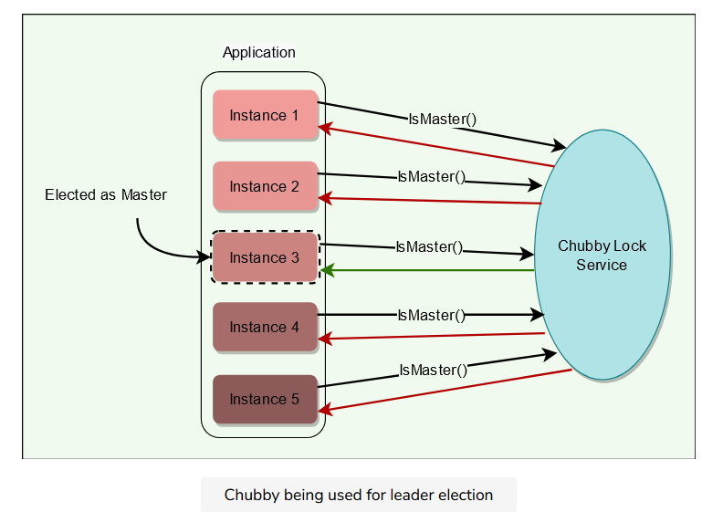  

Naming service (like DNS) #

It is hard to make faster updates to DNS due to its time-based caching nature, which means there is generally a potential delay before the latest DNS mapping is effective. As a result, chubby has replaced DNS inside Google as the main way to discover servers.

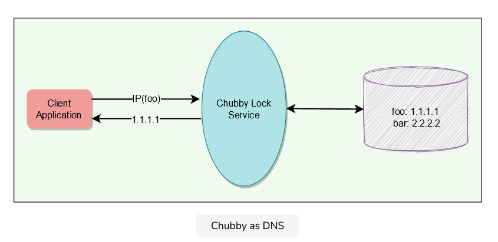  

Storage (small objects that rarely change) #

Chubby provides a Unix-style interface to reliably store small files that do not change frequently (complementing the service offered by GFS). Applications can then use these files for any usage like DNS, configs, etc. GFS and Bigtable store their metadata in Chubby. Some services use Chubby to store ACL files.

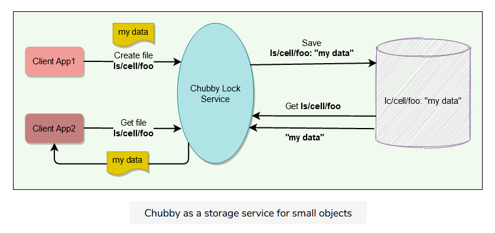  

Distributed locking mechanism #

Chubby provides a developer-friendly interface for coarse-grained distributed locks (as opposed to fine-grained locks) to synchronize distributed activities in a distributed environment. All an application needs is a few code lines, and Chubby service takes care of all the lock management so that developers can focus on application business logic. In other words, we can say that Chubby provides mechanisms like semaphores and mutexes for a distributed environment.

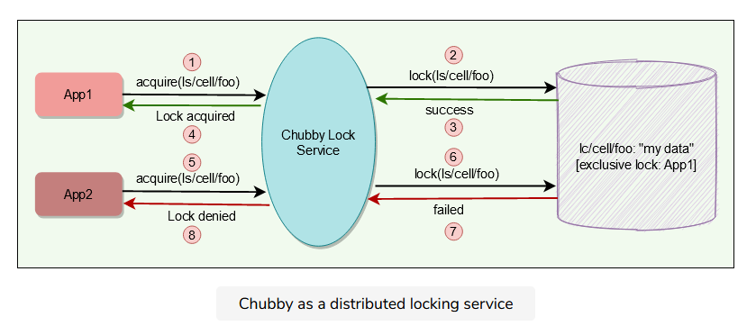  

At a high level, Chubby provides a framework for distributed consensus. All the above-mentioned use cases have emerged from this core service.
When not to use Chubby #

Because of its design choices and proposed usage, Chubby should not be used when:

    Bulk storage is needed.
    Data update rate is high.
    Locks are acquired/released frequently.
    Usage is more like a publish/subscribe model.

Background #

Chubby is neither really a research effort, nor does it claim to introduce any new algorithms. Instead, chubby describes a certain design and implementation done at Google in order to provide a way for its clients to synchronize their activities and agree on basic information about their environment. More precisely, at Google, it has become primary to implement the above-mentioned use cases.
Chubby and Paxos #

Paxos plays a major role inside Chubby. Readers familiar with Distributed Computing recognize that getting all nodes in a distributed system to agree on anything (e.g., election of primary among peers) is basically a kind of distributed consensus problem. Distributed consensus using Asynchronous Communication is already solved by Paxos protocol, and Chubby actually uses Paxos underneath to manage the state of the Chubby system at any point in time.

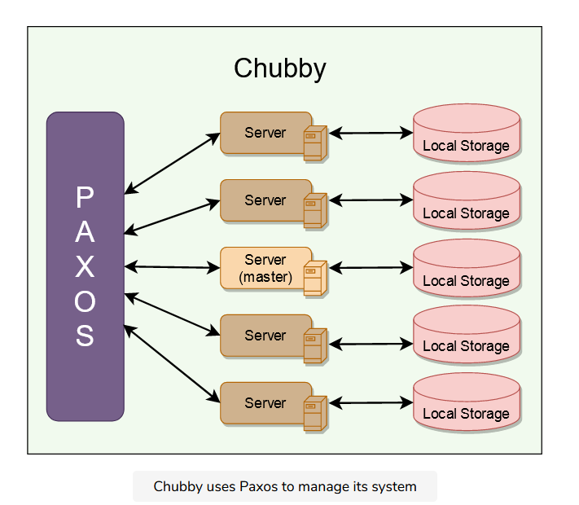  

High-level Architecture

Chubby common terms #

Before digging deep into Chubby’s architecture, let’s first go through some of its common terms:
Chubby cell #

A Chubby Cell basically refers to a Chubby cluster. Most Chubby cells are confined to a single data center or machine room, though there can be a Chubby cell whose replicas are separated by thousands of kilometers. A single Chubby cell has two main components, server and client, that communicate via remote procedure call (RPC).
Chubby servers #

    A chubby cell consists of a small set of servers (typically 5) known as replicas.
    Using Paxos, one of the servers is chosen as the master who handles all client requests. If the master fails, another server from replicas becomes the master.
    Each replica maintains a small database to store files/directories/locks. The master writes directly to its own local database, which gets synced asynchronously to all the replicas. That’s how Chubby ensures data reliability and a smooth experience for clients even if the master fails.
    For fault tolerance, Chubby replicas are placed on different racks.

Chubby client library #

Client applications use a Chubby library to communicate with the replicas in the chubby cell using RPC.

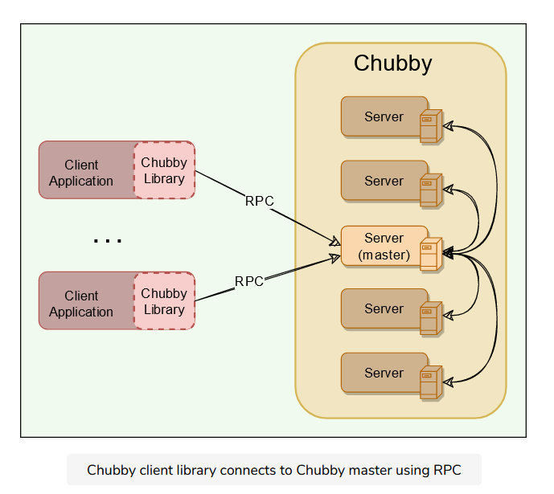  

Chubby APIs #

Chubby exports a file system interface similar to POSIX but simpler. It consists of a strict tree of files and directories in the usual way, with name components separated by slashes.

File format: /ls/chubby_cell/directory_name/.../file_name

Where /ls refers to the lock service, designating that this is part of the Chubby system, and chubby_cell is the name of a particular instance of a Chubby system (the term cell is used in Chubby to denote an instance of the system). This is followed by a series of directory names culminating in a file_name.

A special name, /ls/local, will be resolved to the most local cell relative to the calling application or service.

Chubby was originally designed as a lock service, such that every entity in it will be a lock. But later, its creators realized that it is useful to associate a small amount of data with each entity. Hence, each entity in Chubby can be used for locking or storing a small amount of data or both, i.e., storing small files with locks.

We can divide Chubby APIs into following groups:

    General
    File
    Locking
    Sequencer

General #

    Open(): Opens a given named file or directory and returns a handle.
    Close(): Closes an open handle.
    Poison(): Allows a client to cancel all Chubby calls made by other threads without fear of deallocating the memory being accessed by them.
    Delete(): Deletes the file or directory.

File #

    GetContentsAndStat(): Returns (atomically) the whole file contents and metadata associated with the file. This approach of reading the whole file is designed to discourage the creation of large files, as it is not the intended use of Chubby.
    GetStat(): Returns just the metadata.
    ReadDir(): Returns the contents of a directory – that is, names and metadata of all children.
    SetContents(): Writes the whole contents of a file (atomically).
    SetACL(): Writes new access control list information

Locking #

    Acquire(): Acquires a lock on a file.
    TryAquire(): Tries to acquire a lock on a file; it is a non-blocking variant of Acquire.
    Release(): Releases a lock.

Sequencer #

    GetSequencer(): Get the sequencer of a lock. A sequencer is a string representation of a lock.
    SetSequencer(): Associate a sequencer with a handle.
    CheckSequencer(): Check whether a sequencer is valid.

Chubby does not support operations like append, seek, move files between directories, or making symbolic or hard links. Files can only be completely read or completely written/overwritten. This makes it practical only for storing very small files.

Design Rationale

Before we jump into further details and working of Chubby, it is important to know the logic behind certain design decisions. These learnings can be applied to other problems of similar nature.
Why was Chubby built as a service? #

Let’s first understand the reason behind building a service instead of having a client library that only provides Paxos distributed consensus. A lock service has some clear advantages over a client library:

    Development becomes easy: Sometimes high availability is not planned in the early phases of development. Systems start as a prototype with little load and lose availability guarantees. As a service matures and gains more clients, availability becomes important; replication and primary election are then added to design. While this could be done with a library that provides distributed consensus, a lock server makes it easier to maintain the existing program structure and communication patterns. For example, electing a leader requires adding just a few lines of code. This technique is easier than making existing servers participate in a consensus protocol, especially if compatibility must be maintained during a transition period.

    Lock-based interface is developer-friendly: Programmers are generally familiar with locks. It is much easier to simply use a lock service in a distributed system than getting involved in managing Paxos protocol state locally, e.g., Acquire(), TryAcquire(), Release().

    Provide quorum & replica management: Distributed consensus algorithms need a quorum to make a decision, so several replicas are used for high availability. One can view the lock service as a way of providing a generic electorate that allows a client application to make decisions correctly when less than a majority of its own members are up. Without such support from a service, each application needs to have and manage its own quorum of servers.

    Broadcast functionality: Clients and replicas of a replicated service may wish to know when the service’s master changes; this requires an event notification mechanism. Such a mechanism is easy to build if there is a central service in the system.

The arguments above clearly show that building and maintaining a central locking service abstracts away and takes care of a lot of complex problems from client applications.
Why coarse-grained locks? #

Chubby locks usage is not expected to be fine-grained in which they might be held for only a short period (i.e., seconds or less). For example, electing a leader is not a frequent event. Following are some main reasons why Chubby decided to only support coarse-grained locks:

    Less load on lock server: Coarse-grained locks impose far less load on the server as the lock acquisition rate is a lot less than the client’s transaction rate.

    Survive server failures: As coarse-grained locks are acquired rarely, clients are not significantly delayed by the temporary unavailability of the lock server. With fine-grained locks, even a brief unavailability of a lock server would cause many clients to stall.

    Fewer lock servers are needed: Coarse-grained locks allow many clients to be adequately served by a modest number of lock servers with somewhat lower availability.

Why advisory locks? #

Chubby locks are advisory, which means it is up to the application to honor the lock. Chubby doesn’t make locked objects inaccessible to clients not holding their locks. It is more like record keeping and allows the lock requester to discover that lock is held. Holding a specific lock is neither necessary to access the file, nor prevents others from doing so.

Other types of locks are mandatory locks, which make objects inaccessible to clients not holding the lock. Chubby gave following reasons for not having mandatory locks:

    To enforce mandatory locking on resources implemented by other services would require more extensive modification of these services.
    Mandatory locks prevent users from accessing a locked file for debugging or administrative purposes. If a file must be accessed, an entire application would need to be shut down or rebooted to break the mandatory lock.
    Generally, a good developer practice is to write assertions such as assert("Lock X is held"), so mandatory locks bring only little benefit anyway.

Why Chubby needs storage? #

Chubby’s storage is important as client applications may need to advertise Chubby’s results with others. For example, an application needs to store some info to:

    Advertise its selected primary (leader election use case)
    Resolve aliases to absolute addresses (naming service use case)
    Announce the scheme after repartitioning of data.

Not having a separate service for sharing the results reduces the number of servers that clients depend on. Chubby’s storage requirements are really simple. i.e., store a small amount of data (KBs) and limited operation support (i.e., create/delete).
Why does Chubby export a Unix-like file system interface? #

Recall that Chubby exports a file system interface similar to Unix but simpler. It consists of a strict tree of files and directories in the usual way, with name components separated by slashes.

File format: /ls/cell/remainder-path

The main reason why Chubby’s naming structure resembles a file system to make it available to applications both with its own specialized API, and via interfaces used by our other file systems, such as the Google File System. This significantly reduced the effort needed to write basic browsing and namespace manipulation tools, and reduced the need to educate casual Chubby users. However, only a very limited number of operations can be performed on these files, e.g., Create, Delete, etc.

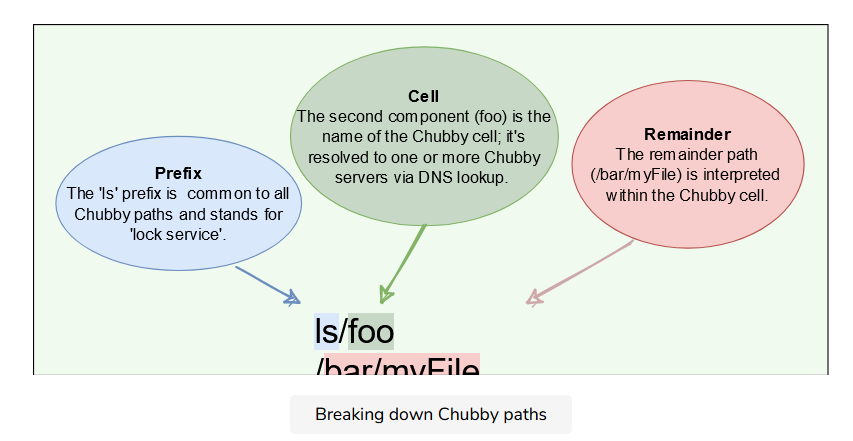  

Chubby in terms of CAP theorem #

As proved by CAP theorem, no application can be highly available, strongly consistent, and partition tolerant at the same time. Since Chubby guarantees strong consistency by ensuring that all read and write requests go through the master, technically, we can categories Chubby as a CP system.

Chubby’s architecture is based on a master-backup design which ensures strong consistency. If the master dies, Chubyy chooses a new master from the backup servers. Chubby continues to operate as long as no more than half of the servers fail, and it is guaranteed to make progress whenever the network is reliable. If the Chubby servers experience network partitioning, the service will become unavailable.

On the other hand, Chubby is optimized for the case where there is a stable master server, and there are no partitions. In this case, it delivers a very high degree of availability. So, overall, Chubby provides guaranteed consistency and a very high level of availability in the common case.

How Chubby Works

Service initialization #

Upon initialization, Chubby performs the following steps:

    A master is chosen among Chubby replicas using Paxos.
    Current master information is persisted in storage, and all replicas become aware of the master.

Client initialization #

Upon initialization, a Chubby client performs the following steps:

    Client contacts the DNS to know the listed Chubby replicas.
    Client calls any Chubby server directly via Remote Procedure Call (RPC).
    If that replica is not the master, it will return the address of the current master.
    Once the master is located, the client maintains a session with it and sends all requests to it until it indicates that it is not the master anymore or stops responding.

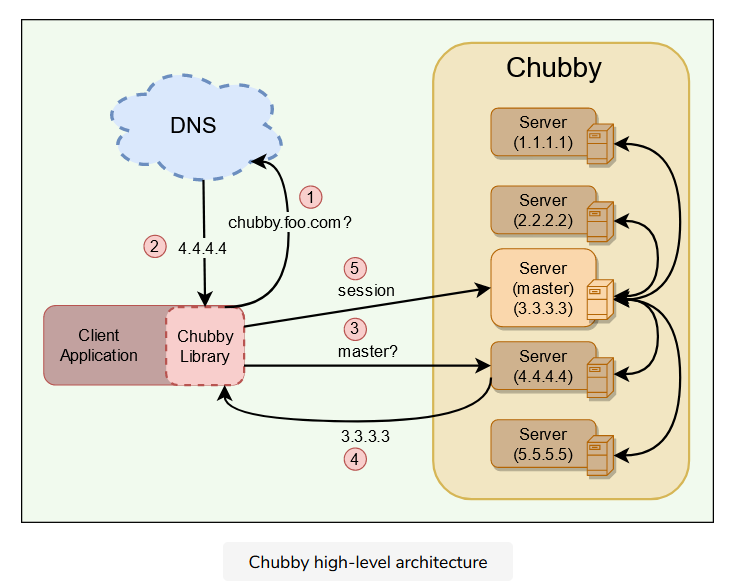  

Leader election example using Chubby #

Let’s take an example of an application that uses Chubby to elect a single master from a bunch of instances of the same application.

Once the master election starts, all candidates attempt to acquire a Chubby lock on a file associated with the election. Whoever acquires the lock first becomes the master. The master writes its identity on the file, so that other processes know who the current master is.

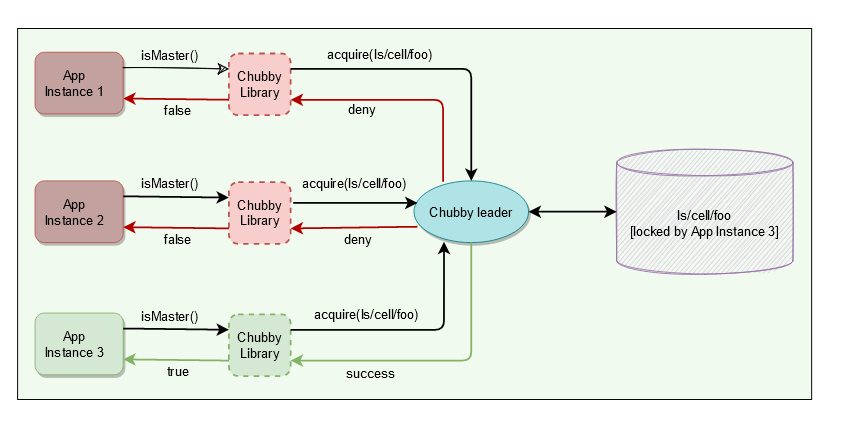  

Sample pseudocode for leader election 
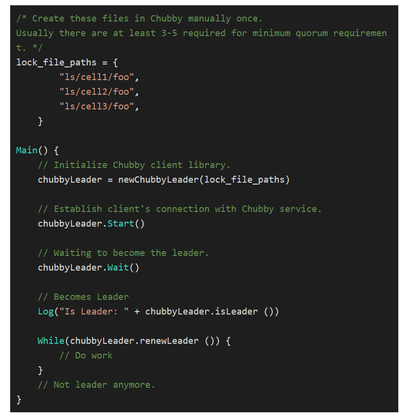  

File, Directories, and Handles
Chubby file system interface is basically a tree of files and directories, where each directory contains a list of child files and directories. Each file or directory is called a node.

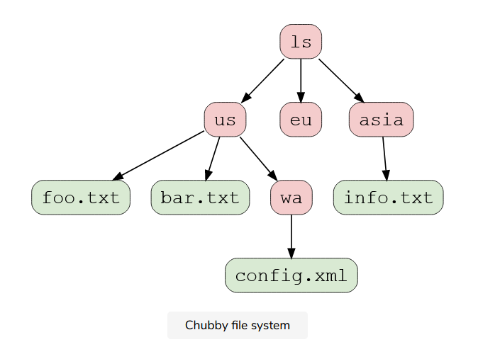  

Nodes #

    Any node can act as an advisory reader/writer lock.
    Nodes may either be ephemeral or permanent.
    Ephemeral files are used as temporary files, and act as an indicator to others that a client is alive.
    Ephemeral files are also deleted if no client has them open.
    Ephemeral directories are also deleted if they are empty.
    Any node can be explicitly deleted.

Metadata #

Metadata for each node includes Access Control Lists (ACLs), four monotonically increasing 64-bit numbers, and a checksum.

ACLs are used to control reading, writing, and changing the ACL names for the node.

    Node inherits the ACL names of its parent directory on creation.
    ACLs themselves are files located in an ACL directory, which is a well-known part of the cell’s local namespace.
    Users are authenticated by a mechanism built into the RPC system.

Monotonically increasing 64-bit numbers: These numbers allow clients to detect changes easily.

    An instance number: This is greater than the instance number of any previous node with the same name.
    A content generation number (files only): This is incremented every time a file’s contents are written.
    A lock generation number: This is incremented when the node’s lock transitions from free to held.
    An ACL generation number: This is incremented when the node’s ACL names are written.

Checksum: Chubby exposes a 64-bit file-content checksum so clients may tell whether files differ.

Handles #

Clients open nodes to obtain handles (that are analogous to UNIX file descriptors). Handles include:

    Check digits: Prevent clients from creating or guessing handles, so full access control checks are performed only when handles are created.
    A sequence number: Enables a master to tell whether a handle was generated by it or by a previous master.
    Mode information (provided at open time): Enables the master to recreate its state if an old handle is presented to a newly restarted leader.

Locks, Sequencers, and Lock-delays

Locks #

Each chubby node can act as a reader-writer lock in one of the following two ways:

    Exclusive: One client may hold the lock in exclusive (write) mode.
    Shared: Any number of clients may hold the lock in shared (reader) mode.

Sequencer #

With distributed systems, receiving messages out of order is a problem; Chubby uses sequence numbers to solve this problem. After acquiring a lock on a file, a client can immediately request a ‘Sequencer,’ which is an opaque byte string describing the state of the lock:

    Sequencer = Name of the lock + Lock mode (exclusive or shared) + Lock generation number

An application’s master server can generate a sequencer and send it with any internal order to other servers. Application servers that receive orders from a primary can check with Chubby if the sequencer is still good and does not belong to a stale primary (to handle the ‘Brain split’ scenario).

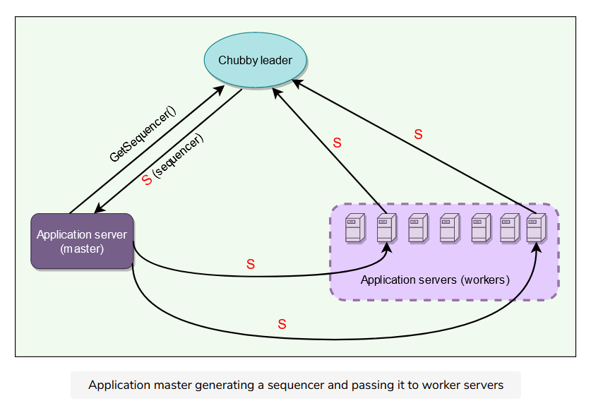  

Lock-delay #

For file servers that do not support sequencers, Chubby provides a lock-delay period to protect against message delays and server restarts.

If a client releases a lock in the normal way, it is immediately available for other clients to claim, as one would expect. However, if a lock becomes free because the holder has failed or become inaccessible, the lock server will prevent other clients from claiming the lock for a period called the lock-delay.

    Clients may specify any lock-delay up to some bound, defaults to one minute. This limit prevents a faulty client from making a lock (and thus some resource) unavailable for an arbitrarily long time.
    While imperfect, the lock-delay protects unmodified servers and clients from everyday problems caused by message delays and restarts.

Sessions and Events
What is a Chubby session? #

A Chubby session is a relationship between a Chubby cell and a Chubby client.

    It exists for some interval of time and is maintained by periodic handshakes called KeepAlives.
    Client’s handles, locks, and cached data only remain valid provided its session remains valid.

Session protocol #

    Client requests a new session on first contacting the master of Chubby cell.
    A session ends if the client ends it explicitly or it has been idle. A session is considered idle if there are no open handles and calls for a minute.
    Each session has an associate lease, which is a time interval during which the master guarantees to not terminate the session unilaterally. The end of this interval is called ‘session lease timeout.’
    The master advances the ‘session lease timeout’ in the following three circumstances:
        On session creation
        When a master failover occurs
        When the master responds to a KeepAlive RPC from the client

What is KeepAlive? #

KeepAlive is basically a way for a client to maintain a constant session with Chubby cell. Following are basic steps of responding to a KeepAlive:

    On receiving a KeepAlive (step “1” in the diagram below), the master typically blocks the RPC (does not allow it to return) until the client’s previous lease interval is close to expiring.
    The master later allows the RPC to return to the client (step “2”) and thus informs the client of the new lease timeout (lease M2).
    The master may extend the timeout by any amount. The default extension is 12s, but an overloaded master may use higher values to reduce the number of KeepAlive calls it must process. Note the difference between the lease timeout of the client and the master (M1 vs. C1 and M2 vs. C2).
    The client initiates a new KeepAlive immediately after receiving the previous reply. Thus, the client ensures that there is almost always a KeepAlive call blocked at the master.

In the diagram below, thick arrows represent lease sessions, upward arrows are KeepAlive requests, and downward arrows are KeepAlive responses. We will discuss this diagram in detail in the next two sections.

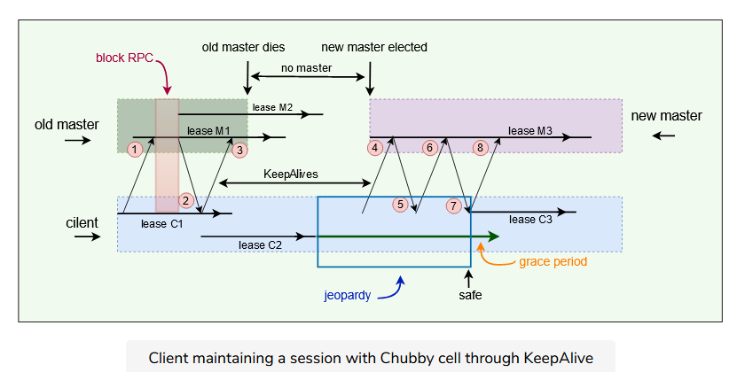  

Session optimization #

Piggybacking events: KeepAlive reply is used to transmit events and cache invalidations back to the client.

Local lease: The client maintains a local lease timeout that is a conservative approximation of the master’s lease timeout.

Jeopardy: If a client’s local lease timeout expires, it becomes unsure whether the master has terminated its session. The client empties and disables its cache, and we say that its session is in jeopardy.

Grace period: When a session is in jeopardy, the client waits for an extra time called the grace period - 45s by default. If the client and master manage to exchange a successful KeepAlive before the end of client’s grace period, the client enables its cache once more. Otherwise, the client assumes that the session has expired.
Failovers #

The failover scenario happens when a master fails or otherwise loses membership. Following is the summary of things that happen in case of a master failover:

    The failing master discards its in-memory state about sessions, handles, and locks.
    Session lease timer is stopped. This means no lease is expired during the time when the master failover is happening. This is equivalent to lease extension.
    If master election occurs quickly, the clients contact and continue with the new master before the client’s local lease expires.
    If the election is delayed, the clients flush their caches (= jeopardy) and wait for the “grace period” (45s) while trying to find the new master.

Let’s look at an example of failover in detail.
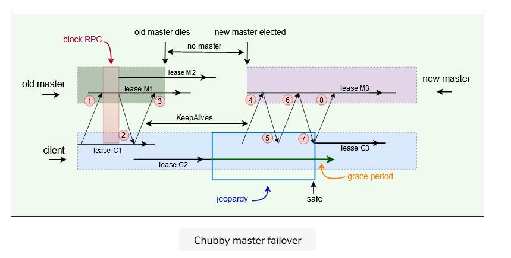  

    Client has lease M1 (& local lease C1) with master and pending KeepAlive request.
    Master starts lease M2 and replies to the KeepAlive request.
    Client extends the local lease to C2 and makes a new KeepAlive call. Master dies before replying to the next KeepAlive. So, no new leases can be assigned. Client’s C2 lease expires, and the client library flushes its cache and informs the application that it has entered jeopardy. The grace period starts on the client.
    Eventually, a new master is elected and initially uses a conservative approximation M3 of the session lease that its predecessor may have had for the client. Client sends KeepAlive to new master (4).
    The first KeepAlive request from the client to the new master is rejected (5) because it has the wrong master epoch number (described in the next section).
    Client retries with another KeepAlive request.
    Retried KeepAlive succeeds. Client extends its lease to C3 and optionally informs the application that its session is no longer in jeopardy (session is in the safe mode now).
    Client makes a new KeepAlive call, and the normal protocol works from this point onwards.
    Because the grace period was long enough to cover the interval between the end of lease C2 and the beginning of lease C3, the client saw nothing but a delay. If the grace period was less than that interval, the client would have abandoned the session and reported the failure to the application.

Master Election and Chubby Events

Initializing a newly elected master #

A newly elected master proceeds as follows:

    Picks epoch number: It first picks up a new client epoch number to differentiate itself from the previous master. Clients are required to present the epoch number on every call. The master rejects calls from clients using older epoch numbers. This ensures that the new master will not respond to a very old packet that was sent to the previous master.
    Responds to master-location requests but does not respond to session-related operations yet.
    Build in-memory data structures:
        It builds in-memory data structures for sessions and locks that are recorded in the database.
        Session leases are extended to the maximum that the previous master may have been using.
    Let clients perform KeepAlives but no other session-related operations at this point.
    Emits a failover event to each session: This causes clients to flush their caches (because they may have missed invalidations) and warn applications that other events may have been lost.
    Wait: The master waits until each session acknowledges the failover event or lets its session expire.
    Allow all operations to proceed.
    Honor older handles by clients: If a client uses a handle created prior to the failover, the master recreates the in-memory representation of the handle and honors the call.
    Deletes ephemeral files: After some interval (a minute), the master deletes ephemeral files that have no open file handles. Clients should refresh handles on ephemeral files during this interval after a failover.

Chubby events #

Chubby supports a simple event mechanism to let its clients subscribe to a variety of events. Events are delivered to the client asynchronously via callbacks from the Chubby library. Clients subscribe to a range of events while creating a handle. Here are examples of such events:

    File contents modified
    Child node added, removed, or modified
    Chubby master failed over
    A handle (and its lock) has become invalid.
    Lock acquired
    Conflicting lock request from another client

Additionally, the client sends the following session events to the application:

    Jeopardy: When session lease timeout and grace period begins.
    Safe: When a session is known to have survived a communication problem
    Expired: If the session times out

Chubby cache #

In Chubby, caching plays an important role, as read requests greatly outnumber write requests. To reduce read traffic, Chubby clients cache file contents, node metadata, and information on open handles in a consistent, write-through cache in the client’s memory. Because of this caching, Chubby must maintain consistency between a file and a cache as well as between the different replicas of the file. Chubby clients maintain their cache by a lease mechanism and flush the cache when the lease expires.
Cache invalidation #

Below is the protocol for invalidating the cache when file data or metadata is changed:

    Master receives a request to change file contents or node metadata.
    Master blocks modification and sends cache invalidations to all clients who have cached it. For this, the master must maintain a list of each client’s cache contents.
    For efficiency, the invalidation requests are piggybacked onto KeepAlive replies from the master.
    Clients receive the invalidation signal, flushes the cache, and sends an acknowledgment to the master with its next KeepAlive call.
    Once acknowledgments are received from each active client, the master proceeds with the modification. The master updates its local database and sends an update request to the replicas.
    After receiving acknowledgments from the majority of replicas in the cell, the master sends an acknowledgment to the client who initiated the write.

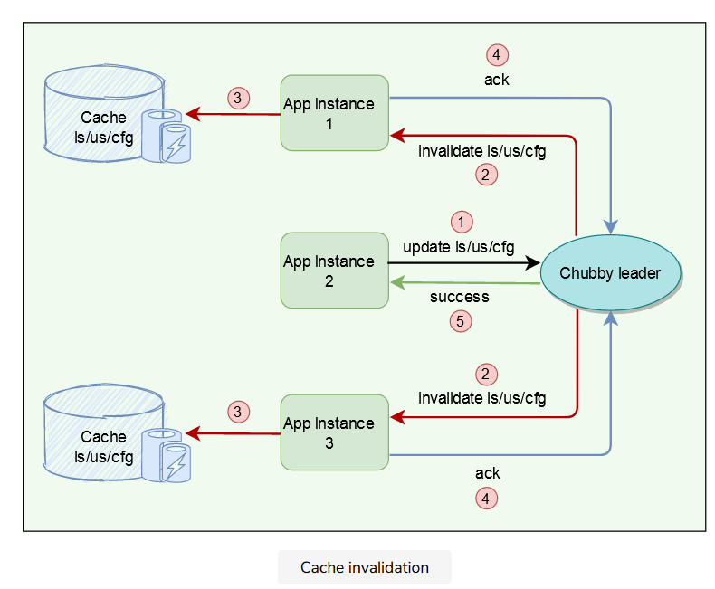  

Question: While the master is waiting for acknowledgments, are other clients allowed to read the file?

Answer: During the time the master is waiting for the acknowledgments from clients, the file is treated as ‘uncachable.’ This means that the clients can still read the file but will not cache it. This approach ensures that reads always get processed without any delay. This is useful because reads outnumber writes.

Question: Are clients allowed to cache locks? If yes, how is it used?

Answer: Chubby allows its clients to cache locks, which means the client can hold locks longer than necessary, hoping that they can be used again by the same client.

Question: Are clients allowed to cache open handles?

Answer: Chubby allows its clients to cache open handles. This way, if a client tries to open a file it has opened previously, only the first open() call goes to the master.

Database

Initially, Chubby used a replicated version of Berkeley DB to store its data. Later, the Chubby team felt that using Berkeley DB exposes Chubby to more risks, so they decided to write a simplified custom database with the following characteristics:

    Simple key/value database using write-ahead logging and snapshotting.
    Atomic operations only and no general transaction support.
    Database log is distributed among replicas using Paxos.

Backup #

For recovery in case of failure, all database transactions are stored in a transaction log (a write-ahead log). As this transaction log can become very large over time, every few hours, the master of each Chubby cell writes a snapshot of its database to a GFS server in a different building. The use of a separate building ensures both that the backup will survive building damage, and that the backups introduce no cyclic dependencies in the system; a GFS cell in the same building potentially might rely on the Chubby cell for electing its master.

    Once a snapshot is taken, the previous transaction log is deleted. Therefore, at any time, the complete state of the system is determined by the last snapshot together with the set of transactions from the transaction log.
    Backup databases are used for disaster recovery and to initialize the database of a newly replaced replica without placing a load on other replicas.

Mirroring #

Mirroring is a technique that allows a system to automatically maintain multiple copies.

    Chubby allows a collection of files to be mirrored from one cell to another.
    Mirroring is commonly used to copy configuration files to various computing clusters distributed around the world.
    Mirroring is fast because the files are small.
    Event mechanism informs immediately if a file is added, deleted, or modified.
    Usually, changes are reflected in dozens of mirrors worldwide under a second.
    Unreachable mirror remains unchanged until connectivity is restored. Updated files are then identified by comparing their checksums.
    A special “global” cell subtree /ls/global/master that is mirrored to the subtree /ls/cell/replica in every other Chubby cell.
    Global cell is special because its replicas are located in widely separated parts of the world. Global cell is used for:
        Chubby’s own access control lists (ACLs).
        Various files in which Chubby cells and other systems advertise their presence to monitoring services.
        Pointers to allow clients to locate large data sets such as Bigtable cells, and many configuration files for other systems.

Scaling Chubby
Chubby’s clients are individual processes, so Chubby handles more clients than expected. At Google, 90,000+ clients communicating with a single Chubby server is one such example. The following techniques have been used to reduce the communication with the master:

    Minimize Request Rate: Create more chubby cells so that clients almost always use a nearby cell (found with DNS) to avoid reliance on remote machines.
    Minimize KeepAlives load: KeepAlives are by far the dominant type of request; increasing the client lease time (from 12s to 60s) results in less load on KeepAlive.
    Caching: Chubby clients cache file data, metadata, handles, and any absences of files.
    Simplified protocol-conversions: Add servers that translate the Chubby protocol into a less complicated protocol. Proxies and partitioning are two such examples that help Chubby scale further and are discussed below.

Proxies #

A proxy is an additional server that can act on behalf of the actual server.
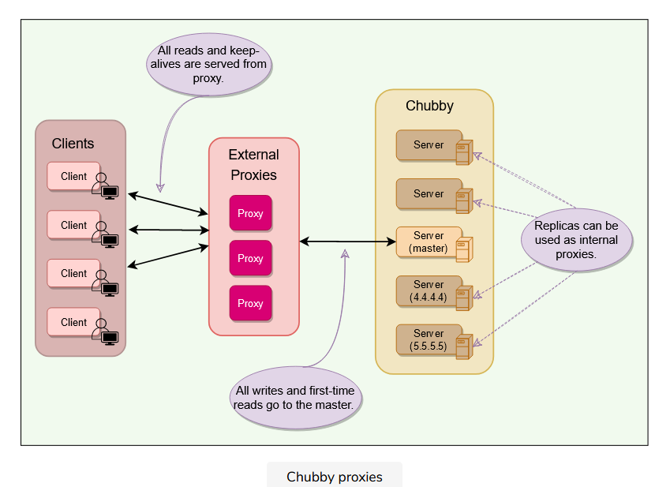  

A Chubby proxy can handle KeepAlives and read requests. If a proxy handles ‘NNN’ clients, KeepAlive traffic is reduced by a factor of ‘NNN.’ All writes and first-time reads pass through the cache to reach the master. This means that proxy adds an additional RPC for writes and first-time reads. This is acceptable as Chubby is a read-heavy service.
Partitioning #

Chubby’s interface (files & directories) was designed such that namespaces can easily be partitioned between multiple Chubby cells if needed. This would result in reduced read/write traffic for any partition, for example:

    ls/cell/foo and everything in it, can be served by one Chubby cell, and
    ls/cell/bar and everything in it, can be served by another Chubby cell

There are some scenarios in which partitioning does not improve:

    When a directory is deleted, a cross partition call might be required.
    Partition does not necessarily reduce the KeepAlive traffic.
    Since ACLs can be stored in one partition only, so a cross partition call might be required to check for ACLs.

Learnings #

Lack of aggressive caching: Initially, clients were not caching the absence of files or open file handles. An abusive client could write loops that retry indefinitely when a file is not present or poll a file by opening it and closing it repeatedly when one might expect they would open the file just once. Chubby educated its users to make use of aggressive caching for such scenarios.

Lack of quotas: Chubby was never intended to be used as a storage system for large amounts of data, so it has no storage quotas. In hindsight, this was naive. To handle this, Chubby later introduced a limit on file size (256kBytes).

Publish/subscribe: There have been several attempts to use Chubby’s event mechanism as a publish/subscribe system. Chubby is a strongly consistent system, and the way it maintains a consistent cache makes it a slow and inefficient choice for publish/subscribe. Chubby developers caught and stopped such uses early on.

Developers rarely consider availability: Developers generally fail to think about failure probabilities and wrongly assume that Chubby will always be available. Chubby educated its clients to plan for short Chubby outages so that it has little or no effect on their applications.

Summary #

    Chubby is a distributed lock service used inside Google systems.
    It provides coarse-grained locking (for hours or days) and is not recommended for fine-grained locking (for seconds) scenarios. Due to this nature, it is more suited for high-read and rare write scenarios.
    Chubby’s primary use cases include naming service, leader election, small files storage, and distributed locks.
    A Chubby Cell basically refers to a Chubby cluster. A chubby cell has more than one server (typically 3-5 at least) known as replicas.
    Using Paxos, one server is chosen as the master at any point and handles all the requests. If the master fails, another server from replicas becomes the master.
    Each replica maintains a small database to store files/directories/locks. Master directly writes to its own local database, which gets synced asynchronously to all the replicas for fault tolerance.
    Client applications use a Chubby library to communicate with the replicas in the chubby cell using RPC.
    Like Unix, Chubby file system interface is basically a tree of files & directories (collectively called nodes), where each directory contains a list of child files and directories.
    Locks: Each node can act as an advisory reader-writer lock in one of the following two ways:
        Exclusive: One client may hold the lock in exclusive (write) mode.
        Shared: Any number of clients may hold the lock in shared (reader) mode.
    Ephemeral nodes are used as temporary files, and act as an indicator to others that a client is alive. Ephemeral nodes are also deleted if no client has them open. Ephemeral directories are also deleted if they are empty.
    Metadata: Metadata for each node includes Access Control Lists (ACLs), monotonically increasing 64-bit numbers, and checksum.
    Events: Chubby supports a simple event mechanism to let its clients subscribe for a variety of events for files such as a lock being acquired or a file being edited.
    Caching: To reduce read traffic, Chubby clients cache file contents, node metadata, and information on open handles in a consistent, write-through cache in the client’s memory.
    Sessions: Clients maintain sessions by sending KeepAlive RPCs to Chubby. This constitutes about 93% of the example Chubby cluster’s requests.
    Backup: Every few hours, the master of each Chubby cell writes a snapshot of its database to a GFS file server in a different building.
    Mirroring: Chubby allows a collection of files to be mirrored from one cell to another. Mirroring is used most commonly to copy configuration files to various computing clusters distributed around the world.
