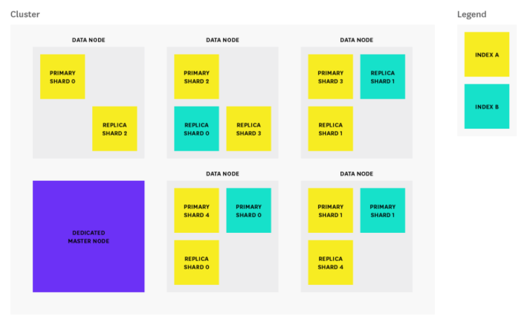
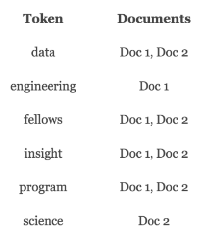
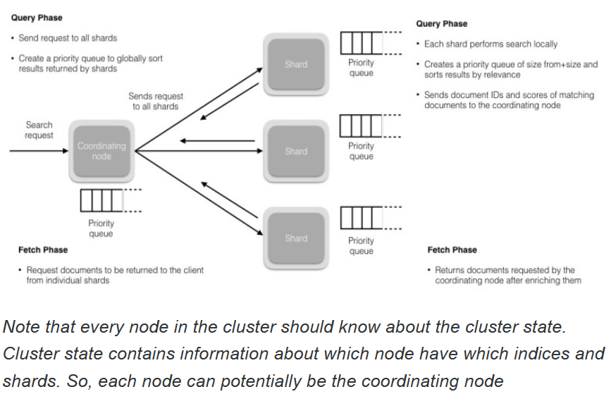
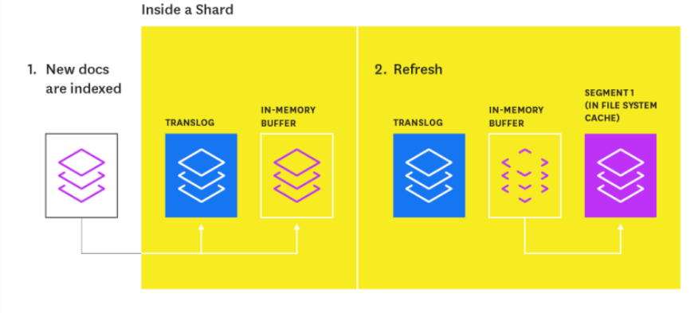
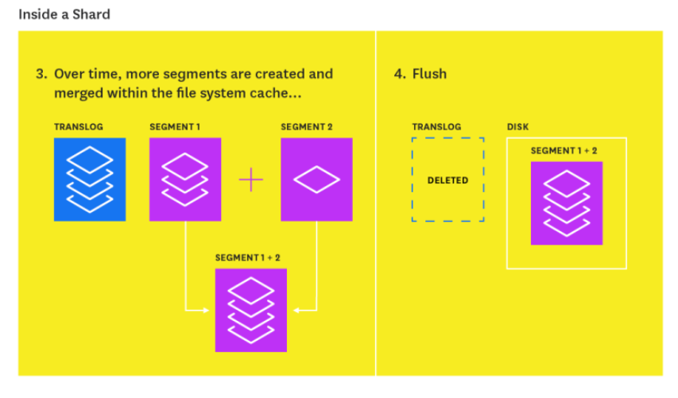

How Elasticsearch organizes data

An Elasticsearch index is a logical namespace to organize your data (like a database). 
data you put on it is a set of related Documents in JSON format. 
Elasticsearch  index also has types (like tables in a database) which allow you to logically partition your data in an index. All documents in a given “type” in an Elasticsearch index have the same properties (like schema for a table).

## Shards
### Non replaceable shards
An Elasticsearch index has one or more shards (default is 5) that lives in different nodes. The number of primary shards cannot be changed once an index has been created

### Replicas
Each shard can have zero or more replicas (default is 1). And Elasticsearch makes sure both primary and replica of same shard not colocated in a same node.

## Lucene Index
1. A shard is a Lucene index which actually stores the data and is a search engine in itself.
   A Lucene index is made up of multiple segments and a segment is a fully functional inverted index in itself.
2. Segments are immutable which allows Lucene to add new documents to the index incrementally without rebuilding the index from scratch.

## Search
For every search request, all the segments in an index are searched, and each segment consumes CPU cycles file handles and memory.  
### Performance
1. higher the number of segments, the lower the search performance.
2. Lucene works background to merge small segments together into a bigger segment, commits the new merged segment to the disk and deletes the old smaller segments. 

## High level Architecture
There are 3 common types of nodes: master, data and client nodes. 
1. Each cluster automatically elects a master node from all of the master-eligible nodes. 
2. The master node is responsible for coordinating cluster tasks like distributing shards across nodes, and creating and deleting indices. 
3. data node stores data in the form of shards and performs actions related to indexing, searching, and aggregating data. 
4. client node that has both node.master and node.data set to false and it acts as load balancer that helps route indexing and search requests. So, it may not be needed for a cluster.

  

## Storage Model

- Elasticsearch uses Apache Lucene, inverted index designed to serve low latency search results. 
- A document is the unit of data in Elasticsearch and an inverted index is created by tokenizing the terms in the document, creating a sorted list of all unique terms and associating a list of documents with where the word can be found. 

> Example: 
    Doc 1: Insight Data Engineering Fellows Program
    Doc 2: Insight Data Science Fellows Program
  

## Search
### Search Query Flow

**Search has 2 main phases:**

**Query Phase:** A search request first hits a coordinating node and it will forward the query to a copy (primary or replica) of every shard in the index. Each shard will execute the query locally and deliver Document IDs of the top relevant results (default to 10) back to the coordinating node that will in turn merge and sort to find the Document IDs of the top global relevant results.
**Fetch Phase:** After the coordinating node sorts all the results to generate a globally sorted list of documents, it then requests the original documents from all the shards. All the shards enrich the documents and return them to the coordinating node. Finally the final search result is sent back to the client.
  

### Search Relevance
- The relevance is determined by a score that Elasticsearch gives to each document returned in the search result. 
- The default algorithm used for scoring is tf/idf (term frequency/inverse document frequency). 

### Search Performance Metrics

#### Indexing

- The 2 most important mapping attributes for string fields are index and analyzer.
- For index, there are 3 options:
    analyzed: analyze the string then index it as full-text
    not_analyzed: index this field as it is and don’t analyze it
    no: don’t index this field at all. So, it is not searchable.

For analyzed string field, use the analyzer attribute to specify which analyzer to apply both at search time and at index time. By default, ElasticSearch uses standard analyzer, but you can change this by specifying one of the built-in ones like whitespace, simple or english.

#### Index Refresh
1. When an index request for document is submitted, it will append to translog and write to in-memory buffer. 
2. When next index refresh, which occurs once per second as default, the refresh process will create a new in-memory segment from the content of the in-memory buffer so document is now searchable. Then it will empty the in-memory buffer. 
3. Over time, a set of segments from refreshes are created. Subsequently, segments are merged together over time in the background to ensure efficient use of resources (each segment uses file handles, memory, and CPU).
Index refresh is an expensive operation and that is why it’s made at a regular interval (default)

  

#### Index Flush
translog has its own limit in size. Therefore, for every 30 minutes, or whenever the translog reaches a maximum size (by default, 512MB), a flush is triggered. During a flush, any documents in the in-memory buffer are refreshed (stored on new segments), all in-memory segments are committed to disk, and the translog is cleared.

  

## Distributed System Challenges

### Split Brain
1. Consensus is one of the fundamental challenges of a distributed system. It requires all the processes/nodes in the system to agree on a given data value/status. There are a lot of consensus algorithms like Raft, Paxos, etc. which are mathematically proven to work, however, 

2. Elasticsearch has implemented its own consensus system (zen discovery). The zen discovery module has two parts:

    Ping: The process nodes use to discover each other
    Unicast: The module that contains a list of hostnames to control which nodes to ping

3. It is a peer-to-peer system where all nodes communicate with each other and there is one active master which updates and controls the cluster wide state and operations. 
4. A new Elasticsearch cluster undergoes an election as part of the ping process where a node, out of all master eligible nodes, is elected as the master and other nodes join the master. 
5.  If the master fails, the nodes in the cluster start pinging again to start another election. 

### Concurrency
Create, update and delete requests hits primary shard that will in turn send parallel requests to all of its replica shards. 
it is possible that these request arrive out of order. 
To resolve it, Elasticsearch uses optimistic concurrency control that uses version number to make sure that newer version of document will not be overwritten by older ones. 
So, every document indexed has a version number which is incremented with every change applied to that document.

### Consistency
For writes, Elasticsearch supports consistency levels to allow a preliminary check to see how many shards are available for the write to be permissible. The available options are:

    quorum: write operation will be permitted if majority of shards are available.
    one: write operation will be permitted if one of shards are available.
    all: write operation will only be permitted if all of shards are available.

For reads, new documents are not available for search until after the refresh interval. To make sure that the search request returns results from the latest version of the document, replication can be set to sync (default) which returns the write request after the operation has been completed on both primary and replica shards. In this case, search request from any shard will return results from the latest version of the document.