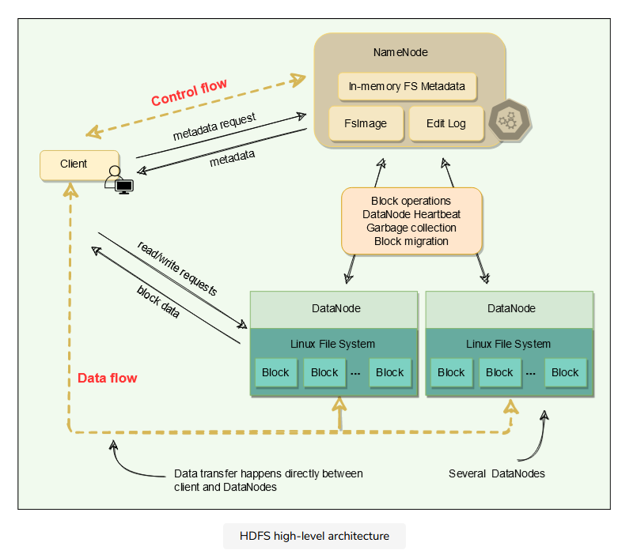
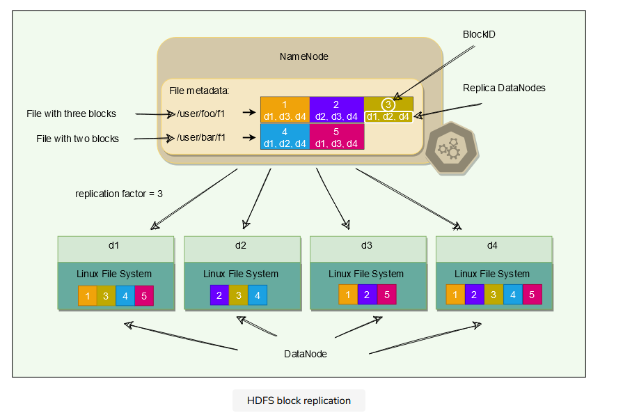
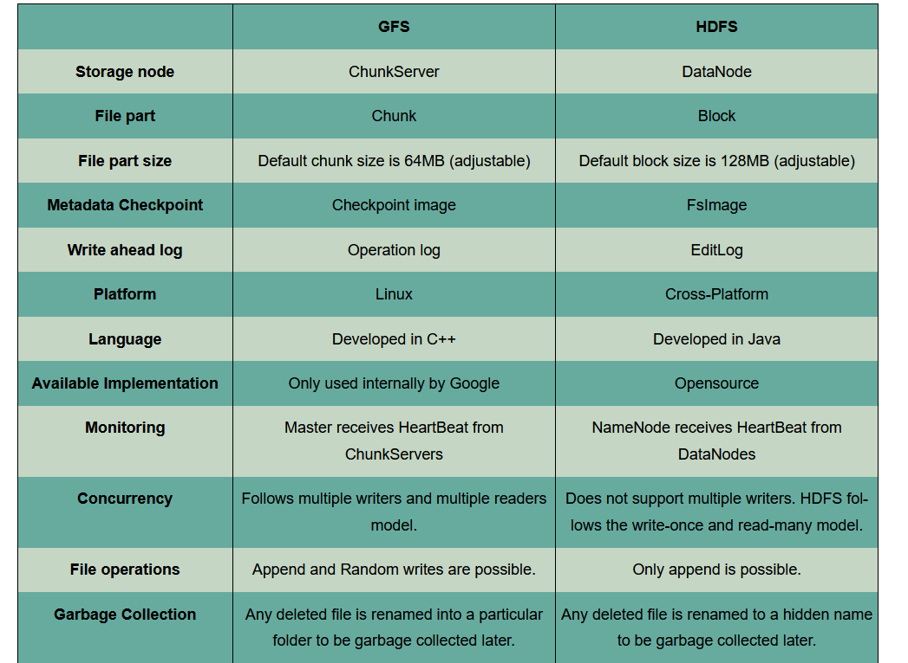
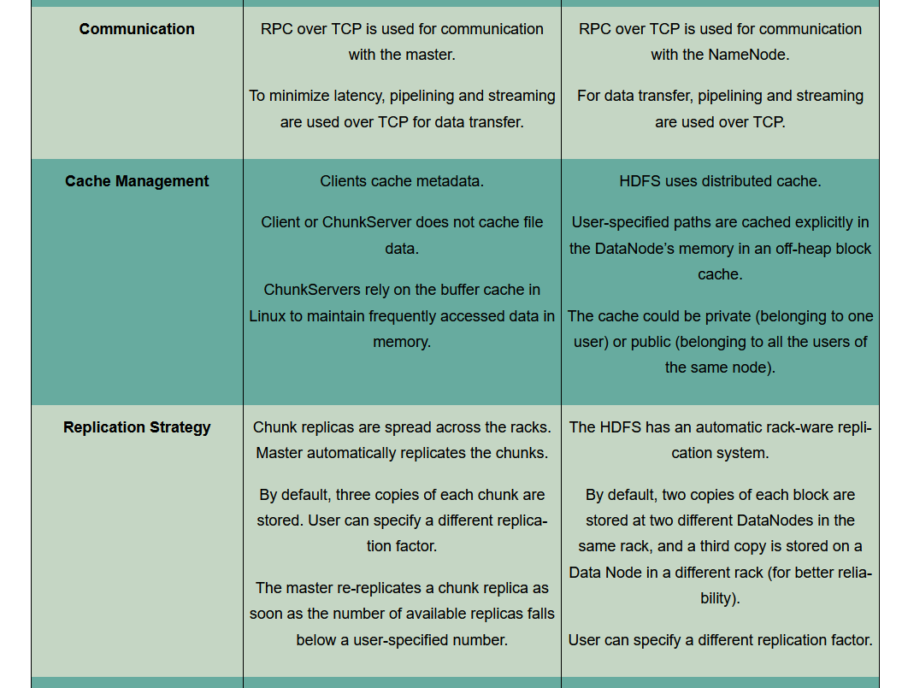
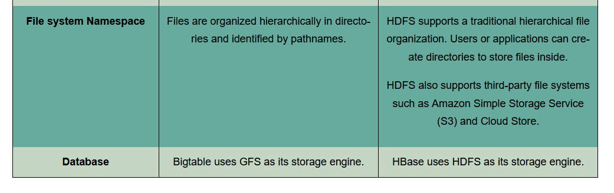
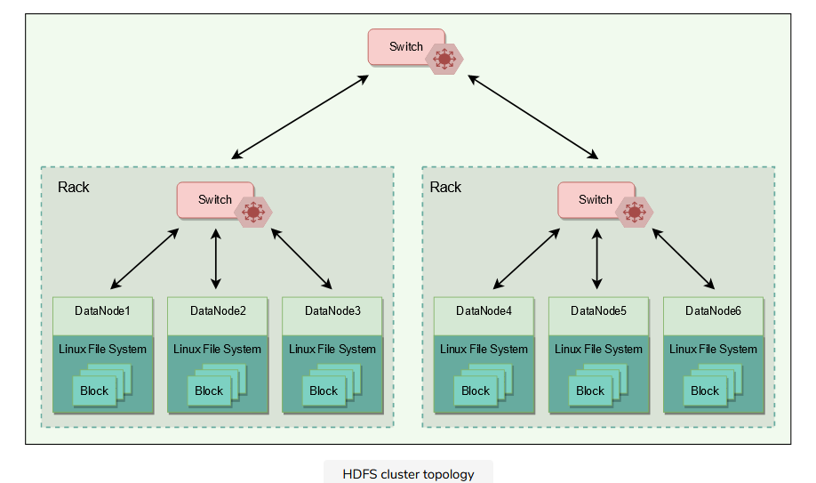
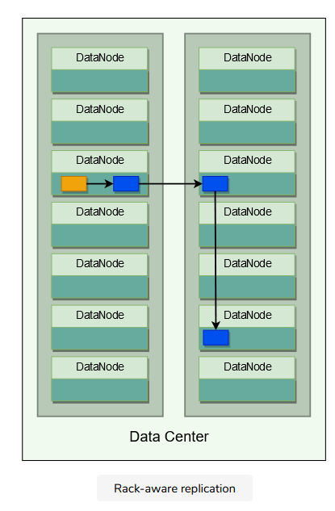
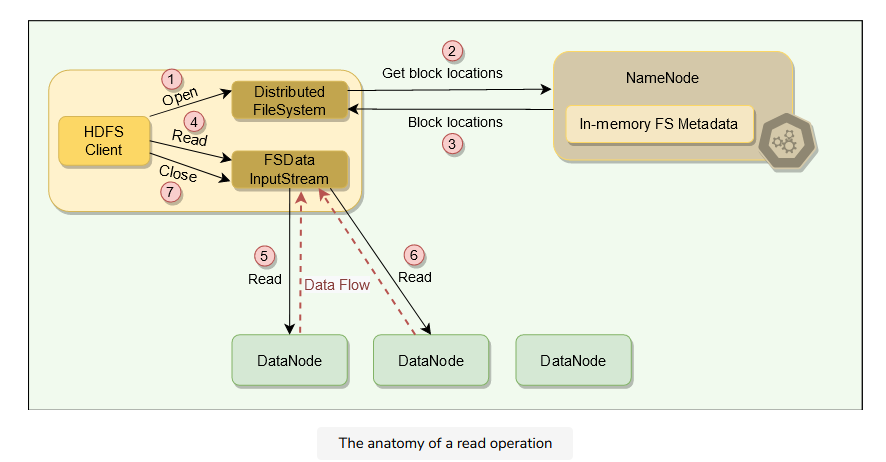
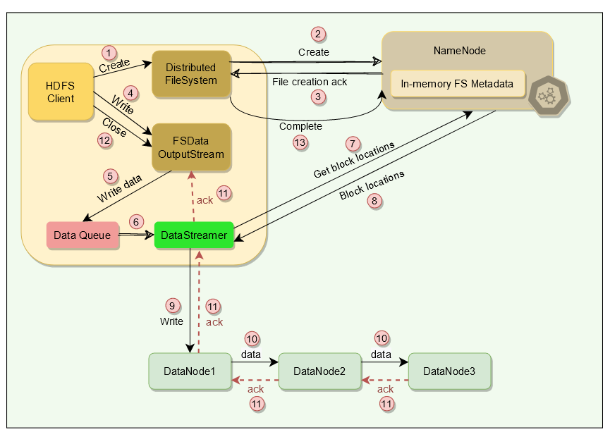
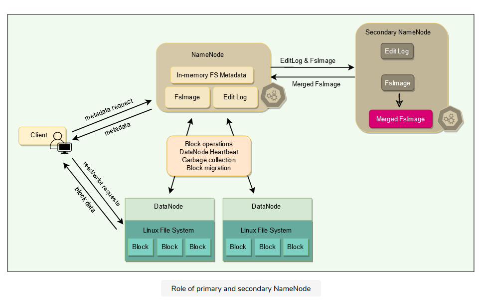

- [Hadoop Distributed File System](#hadoop-distributed-file-system)
  - [when not use HDFS:](#when-not-use-hdfs)
  - [API](#api)
  - [HDFS Architecture](#hdfs-architecture)
  - [Comparison between GFS and HDFS](#comparison-between-gfs-and-hdfs)
  - [Cluster topology](#cluster-topology)
    - [Rack aware replication and its effects](#rack-aware-replication-and-its-effects)
    - [Fast Read](#fast-read)
    - [consistency model](#consistency-model)
  - [Read process](#read-process)
    - [Short circuit Read](#short-circuit-read)
  - [HDFS write process](#hdfs-write-process)
  - [Data integrity](#data-integrity)
    - [Block scanner](#block-scanner)
  - [Caching](#caching)
  - [Replication](#replication)
  - [HeartBeat](#heartbeat)
  - [FsImage and EditLog](#fsimage-and-editlog)
  - [Metadata backup](#metadata-backup)
  - [Failover and fencing](#failover-and-fencing)
  - [Fencing](#fencing)
  - [Security and permission](#security-and-permission)
  - [HDFS federation](#hdfs-federation)
  - [Erasure coding](#erasure-coding)
  - [HDFS in practice](#hdfs-in-practice)

# Hadoop Distributed File System
- HDFS is a distributed file system and was built to store unstructured data. It is designed to store huge files reliably and stream those files at high bandwidth to user applications.
- write-once, read-many-times pattern.
- MapReduce paradigm.

## when not use HDFS:

- **Low-latency data access**:
    HDFS is optimized for high throughput

- **Lots of small files**:
    HDFS has a central server called NameNode, which holds all the filesystem metadata in memory. This limits the number of files in the filesystem by the amount of memory on the NameNode. Although storing millions of files is feasible, billions are beyond the capability of the current hardware.

- **No concurrent writers and arbitrary file modifications**:
    Contrary to GFS, multiple writers cannot concurrently write to an HDFS file. Furthermore, writes are always made at the end of the end of the file, in an append-only fashion

## API
user-level APIs. 
- files are organized hierarchically in directories and identified by their pathnames. HDFS supports the usual file system operations. 

## HDFS Architecture
- HDFS are broken into multiple fixed-size blocks, where each block is 128 megabytes in size by default. 
- Each file stored in HDFS consists of two parts: the actual file data and the metadata
- HDFS cluster primarily consists of a NameNode that manages the file system metadata and DataNodes that store the actual data.

  

- All blocks of a file are of the same size except the last one.
- HDFS uses large block sizes because it is designed to store extremely large files to enable MapReduce jobs to process them efficiently.
- Each block is identified by a unique 64-bit ID called BlockID.
- All read/write operations in HDFS operate at the block level.
- DataNodes store each block in a separate file on the local file system and provide read/write access.
- When a DataNode starts up, it scans through its local file system and sends the list of hosted data blocks (called BlockReport) to the NameNode.
- The NameNode maintains two on-disk data structures to store the file system’s state: an FsImage file and an EditLog. 
- FsImage is a checkpoint of the file system metadata at some point in time, while the EditLog is a log of all of the file system metadata transactions since the image file was last created. These two files help NameNode to recover from failure.
- User applications interact with HDFS through its client. HDFS Client interacts with NameNode for metadata, but all data transfers happen directly between the client and DataNodes.
- For high-availability, HDFS creates multiple copies of the data and distributes them on nodes throughout the cluster.

  

## Comparison between GFS and HDFS
  
  
  

## Cluster topology
- A typical data center contains many racks of servers connected using switches. 
- A common configuration for Hadoop clusters is to have about 30 to 40 servers per rack. 
- Each rack has a dedicated gigabit switch that connects all of its servers and an uplink to a core switch or router, whose bandwidth is shared by many racks in the data center

  

- When HDFS is deployed on a cluster, each of its servers is configured and mapped to a particular rack. 
- The network distance between servers is measured in hops, where one hop corresponds to one link in the topology. Hadoop assumes a tree-style topology, and the distance between two servers is the sum of their distances to their closest common ancestor(LCA principle).

- the distance between Node 1 and itself is zero hops (the case when two processes are communicating on the same node). Node 1 and Node 2 are two hops away, while the distance between Node 3 and Node 4 is four hops.

### Rack aware replication and its effects
  
- HDFS employs a rack-aware replica placement policy to improve data reliability, availability, and network bandwidth utilization. 
- If the replication factor is three, HDFS attempts to place the first replica on the same node as the client writing the block. In case a client process is not running in the HDFS cluster, a node is chosen at random. 
- The second replica is written to a node on a different rack from the first (i.e., off-rack replica). 
- The third replica of the block is then written to another random node on the same rack as the second. 
Additional replicas are written to random nodes in the cluster, but the system tries to avoid placing too many replicas on the same rack. 
- when an entire rack goes offline due to power or networking problems, the requested block can still be located at a different rack.
- rack-aware replication scheme slows the write operation as the data needs to be replicated onto different racks, but this is an intentional tradeoff between reliability and performance that HDFS made.

### Fast Read
 HDFS focuses on fast read access for multiple clients at a time.

### consistency model
- strong consistency model.
- a write is declared successful only when all replicas have been written successfully.

## Read process
HDFS read process can be outlined as follows:

- When a file is opened for reading, HDFS client initiates a read request, by calling the open() method of the Distributed FileSystem object. 
- The client specifies the file name, start offset, and the read range length.
- The Distributed FileSystem object calculates what blocks need to be read based on the given offset and range length, and requests the locations of the blocks from the NameNode.
- NameNode has metadata for all blocks’ locations. It provides the client a list of blocks and the locations of each block replica. As the blocks are replicated, NameNode finds the closest replica to the client when providing a particular block’s location. The closest locality of each block is determined as follows:
    - If a required block is within the same node as the client, it is preferred.
    - Then, the block in the same rack as the client is preferred.
    - Finally, an off-rack block is read.

- After getting the block locations, the client calls the read() method of FSData InputStream, which takes care of all the interactions with the DataNodes. The input stream object establishes a connection with the closest DataNode with the first block of the file.

- The data is read in the form of streams. As the data is streamed, it is passed to the requesting application. Hence, the block does not have to be transferred in its entirety before the client application starts processing it.

- Once the FSData InputStream receives all data of a block, it closes the connection and moves on to connect the DataNode for the next block. It repeats this process until it finishes reading all the required blocks of the file.

-  close() method of the input stream object is called after reading .

  

### Short circuit Read
the client reads the data directly from DataNode. The client uses TCP sockets for this. If the data and the client are on the same machine, HDFS can directly read the file bypassing the DataNode. This scheme is called short circuit read and is quite efficient as it reduces overhead and other processing resources.

## HDFS write process
- HDFS client initiates a write request by calling the create() method of the Distributed FileSystem object.
- The Distributed FileSystem object sends a file creation request to the NameNode.
- The NameNode verifies that the file does not already exist and that the client has permission to create the file. If both these conditions are verified, the NameNode creates a new file record and sends an acknowledgment.
- The client then proceeds to write the file using FSData OutputStream
- The FSData OutputStream writes data to a local queue called ‘Data Queue.’ The data is kept in the queue until a complete block of data is accumulated.
- Once the queue has a complete block, another component called DataStreamer is notified to manage data transfer to the DataNode.
- DataStreamer first asks the NameNode to allocate a new block on DataNodes, thereby picking desirable DataNodes to be used for replication.
- The NameNode provides a list of blocks and the locations of each block replica.
- Upon receiving the block locations from the NameNode, the DataStreamer starts transferring the blocks from the internal queue to the nearest DataNode.
- the blocks are replicated during the file write itself. 
- Once the DataStreamer finishes writing all blocks, it waits for acknowledgments from all the DataNodes.
- Once all acknowledgments are received, the client calls the close() method of the OutputStream.
- Finally, the Distributed FileSystem contacts the NameNode to notify that the file write operation is complete. At this point, the NameNode commits the file creation operation, which makes the file available to be read. If the NameNode dies before this step, the file is lost.

  

## Data integrity 
- Works on checksum calculation
Data Integrity refers to ensuring the correctness of the data. When a client retrieves a block from a DataNode, the data may arrive corrupted. This corruption can occur because of faults in the storage device, network, or the software itself. HDFS client uses checksum to verify the file contents. When a client stores a file in HDFS, it computes a checksum of each block of the file and stores these checksums in a separate hidden file in the same HDFS namespace. When a client retrieves file contents, it verifies that the data it received from each DataNode matches the checksum stored in the associated checksum file. 
### Block scanner
A block scanner process periodically runs on each DataNode to scan blocks stored on that DataNode and verify that the stored checksums match the block data. Additionally, when a client reads a complete block and checksum verification succeeds, it informs the DataNode. The DataNode treats it as a verification of the replica. Whenever a client or a block scanner detects a corrupt block, it notifies the NameNode. The NameNode marks the replica as corrupt and initiates the process to create a new good replica of the block.

## Caching
- for frequently accessed files, blocks may be explicitly cached in the DataNode’s memory, in an off-heap block cache. 
- HDFS offers a Centralized Cache Management scheme to allow its users to specify paths to be cached. Clients can tell the NameNode which files to cache. NameNode communicates with the DataNodes that have the desired blocks on disk and instructs them to cache the blocks in off-heap caches.

Centralized cache management in HDFS has many significant advantages:

- Explicitly specifying blocks for caching prevents the eviction of frequently accessed data from memory. This is particularly important as most of the HDFS workloads are bigger than the main memory of the DataNode.
- Because the NameNode manages DataNode caches, applications can query the set of cached block locations when making MapReduce task placement decisions. Co-locating a task with a cached block replica improves read performance.
- Centralized caching can improve overall cluster memory utilization. When relying on the OS buffer cache at each DataNode, repeated reads of a block will result in all ‘n’ replicas of the block being pulled into the buffer cache. With centralized cache management, a user can explicitly specify only ‘m’ of the ‘n’ replicas, saving ‘n-m’ memory.

## Replication

When a DataNode dies, all of its data becomes unavailable. HDFS handles this data unavailability through replication. 
## HeartBeat
The NameNode keeps track of DataNodes through a heartbeat mechanism. Each DataNode sends periodic heartbeat messages (every few seconds) to the NameNode. If a DataNode dies, the heartbeats will stop, and the NameNode will detect that the DataNode has died. The NameNode will then mark the DataNode as dead and will no longer forward any read/write request to that DataNode. Because of replication, the blocks stored on that DataNode have additional replicas on other DataNodes. The NameNode performs regular status checks on the file system to discover under-replicated blocks and performs a cluster rebalance process to replicate blocks that have less than the desired number of replicas.

## FsImage and EditLog

1. The NameNode is a single point of failure (SPOF). A NameNode failure will bring the entire file system down. Internally, the NameNode maintains two on-disk data structures that store the file system’s state: an FsImage file and an EditLog. 
2. FsImage is a checkpoint (or the image) of the file system metadata at some point in time, while the EditLog is a log of all of the file system metadata transactions since the image file was last created. All incoming changes to the file system metadata are written to the EditLog. At periodic intervals, the EditLog and FsImage files are merged to create a new image file snapshot, and the edit log is cleared out.

## Metadata backup

NameNode resilient to failure, and HDFS provides two mechanisms for this:

1. The first way is to back up and store multiple copies of FsImage and EditLog. The NameNode can be configured to maintain multiple copies of the files. Any update to either the FsImage or EditLog causes each copy of the FsImages and EditLogs to get updated synchronously and atomically. 
2. A common configuration is to maintain one copy of these files on a local disk and one on a remote Network File System (NFS) mount. This synchronous updating of multiple copies of the FsImage and EditLog may degrade the rate of namespace transactions per second that a NameNode can support. However, this degradation is acceptable because even though HDFS applications are very data-intensive, they are not metadata-intensive.
Another option provided by HDFS is to run a Secondary NameNode, which despite its name, is not a backup NameNode. Its main role is to help primary NameNode in taking the checkpoint of the filesystem. Secondary NameNode periodically merges the namespace image with the EditLog to prevent the EditLog from becoming too large. The secondary NameNode runs on a separate physical machine because it requires plenty of CPU and as much memory as the NameNode to perform the merge. It keeps a copy of the merged namespace image, which can be used in the event of the NameNode failure. However, the state of the secondary NameNode lags behind that of the primary, so in the event of total failure of the primary, data loss is almost inevitable. The usual course of action, in this case, is to copy the NameNode’s metadata files that are on NFS to the secondary and run it as the new primary.

  

## Failover and fencing

1. A Failover Controller manages the transition from the active NameNode to the Standby. The default implementation of the failover controller uses ZooKeeper to ensure that only one NameNode is active. Failover Controller runs as a lightweight process on each NameNode and monitors the NameNode for failures (using Heartbeat), and triggers a failover when the active NameNode fails.
2. **Graceful failover:** For routine maintenance, an administrator can manually initiate a failover. This is known as a graceful failover, since the failover controller arranges an orderly transition from the active NameNode to the Standby.
3. **Ungraceful failover:** In the case of an ungraceful failover, however, it is impossible to be sure that the failed NameNode has stopped running. For example, a slow network or a network partition can trigger a failover transition, even though the previously active NameNode is still running and thinks it is still the active NameNode.

The HA implementation uses the mechanism of Fencing to prevent this **“split-brain”** scenario and ensure that the previously active NameNode is prevented from doing any damage and causing corruption.

## Fencing

Fencing is the idea of putting a fence around a previously active NameNode so that it cannot access cluster resources and hence stop serving any read/write request. To apply fencing, the following two techniques are used:

**Resource fencing:** the previously active NameNode is blocked from accessing resources needed to perform essential tasks. For example, revoking its access to the shared storage directory (typically by using a vendor-specific NFS command), or disabling its network port via a remote management command.

**Node fencing:** the previously active NameNode is blocked from accessing all resources. A common way of doing this is to power off or reset the node. This is an effective method of keeping it from accessing anything at all. This technique is also called STONIT or **“Shoot The Other Node In The Head.”**

## Security and permission

HDFS provides a permissions model for files and directories which is similar to POSIX. Each file and directory is associated with an owner and a group. Each file or directory has separate permissions for the owner, other users who are members of a group, and all other users. There are three types of permission:

    Read permission (r): For files, r permission is required to read a file. For directories, r permission is required to list the contents of a directory.
    Write permission (w): For files, w permission is required to write or append to a file. For a directory, w permission is required to create or delete files or directories in it.
    Execute permission (x): For files, x permission is ignored as we cannot execute a file on HDFS. For a directory, x permission is required to access a child of the directory.

HDFS also provides optional support for POSIX ACLs (Access Control Lists) to augment file permissions with finer-grained rules for specific named users or named groups.

## HDFS federation

- The NameNode keeps the metadata of the whole namespace in memory, which means that on very large clusters with many files, the memory becomes the limiting factor for scaling. 
- A more serious problem is that a single NameNode, serving all metadata requests, can become a performance bottleneck. 
- To help resolve these issues, HDFS Federationcan be done. Scale clusters by adding namenodes by adding NameNodes, each of which manages a portion of the filesystem namespace. For example, one NameNode might manage all the files rooted under /user, and a second NameNode might handle files under /share. Under federation:

1. All NameNodes work independently. No coordination is required between NameNodes.
2. DataNodes are used as the common storage by all the NameNodes.
3. A NameNode failure does not affect the availability of the namespaces managed by other NameNodes.

Multiple NameNodes running independently can end up generating the same 64-bit Block IDs for their blocks. To avoid this problem, a namespace uses one or more Block Pools, where a unique ID identifies each block pool in a cluster. A block pool belongs to a single namespace and does not cross the namespace boundary. The extended block ID, which is a tuple of (Block Pool ID, Block ID), is used for block identification in HDFS Federation.

## Erasure coding
1. HDFS stores three copies of each block, resulting in a 200% overhead. Erasure Coding (EC) is probably the biggest change in HDFS in recent years. EC provides the same level of fault tolerance with much less storage space. In a typical EC setup, the storage overhead is no more than 50%. This fundamentally doubles the storage space capacity by bringing down the replication factor from 3x to 1.5x.

2. Under EC, data is broken down into fragments, expanded, encoded with redundant data pieces, and stored across different DataNodes. If, at some point, data is lost on a DataNode due to corruption, etc., then it can be reconstructed using the other fragments stored on other DataNodes. Although EC is more CPU intensive, it greatly reduces the storage needed for reliably storing a large data set.

## HDFS in practice

- HDFS was primarily designed to support Hadoop MapReduce jobs by providing a DFS for the Map and Reduce operations
- HDFS is used in several Apache projects that are built on top of the Hadoop framework

The primary advantages of HDFS include the following:

**High bandwidth for MapReduce workloads:** Large Hadoop clusters (thousands of machines) are known to continuously write up to one terabyte per second using HDFS.

**High reliability:** Fault tolerance is a primary design goal in HDFS. HDFS replication provides high reliability and availability.

**Low costs per byte:** HDFS costs less per gigabyte because storage is collocated with compute servers. With SAN, we have to pay additional costs for managed infrastructure, such as the disk array enclosure and higher-grade enterprise disks, to manage hardware failures. 
**Scalability:** HDFS allows DataNodes to be added to a running cluster and offers tools to manually rebalance the data blocks when cluster nodes are added.

primary disadvantages includes:

**Small file inefficiencies:** HDFS is designed to be used with large block sizes (128MB and larger). It is meant to take large files (hundreds of megabytes, gigabytes, or terabytes) and chunk them into blocks, which can then be fed into MapReduce jobs for parallel processing. HDFS is inefficient when the actual file sizes are small (in the kilobyte range). 
Having a large number of small files places additional stress on the NameNode, which has to maintain metadata for all the files in the file system. 

**Write-once model:** The write-once model is a potential drawback for applications that require concurrent write accesses to the same file. 

In short, HDFS is a good option as a storage backend for distributed applications that follow the MapReduce model or have been specifically written to use HDFS. HDFS can be used efficiently with a small number of large files rather than a large number of small files.
