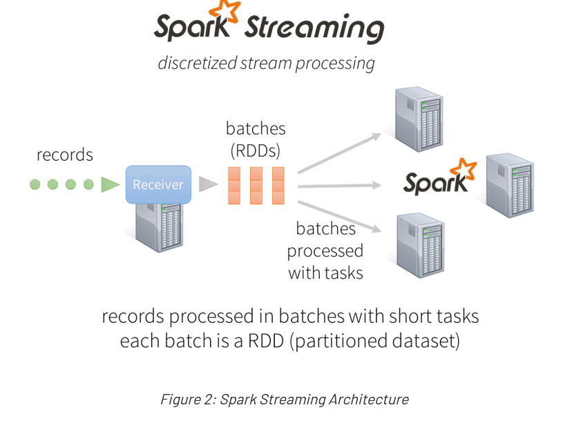

With so many distributed stream processing engines available, people often ask us about the unique benefits of Apache Spark Streaming. From early on, Apache Spark has provided an unified engine that natively supports both batch and streaming workloads. This is different from other systems that either have a processing engine designed only for streaming, or have similar batch and streaming APIs but compile internally to different engines. Spark’s single execution engine and unified programming model for batch and streaming lead to some unique benefits over other traditional streaming systems. In particular, four major aspects are:

    Fast recovery from failures and stragglers
    Better load balancing and resource usage
    Combining of streaming data with static datasets and interactive queries
    Native integration with advanced processing libraries (SQL, machine learning, graph processing)

In this post, we outline Spark Streaming’s architecture and explain how it provides the above benefits. We also discuss some of the interesting ongoing work in the project that leverages the execution model.

Stream Processing Architectures – The Old and the New

At a high level, modern distributed stream processing pipelines execute as follows:

    Receive streaming data from data sources (e.g. live logs, system telemetry data, IoT device data, etc.) into some data ingestion system like Apache Kafka, Amazon Kinesis, etc.
    Process the data in parallel on a cluster. This is what stream processing engines are designed to do, as we will discuss in detail next.
    Output the results out to downstream systems like HBase, Cassandra, Kafka, etc.

To process the data, most traditional stream processing systems are designed with a continuous operator model, which works as follows:

    There is a set of worker nodes, each of which run one or more continuous operators.
    Each continuous operator processes the streaming data one record at a time and forwards the records to other operators in the pipeline.
    There are “source” operators for receiving data from ingestion systems, and “sink” operators that output to downstream systems.

  

Continuous operators are a simple and natural model. However, with today’s trend towards larger scale and more complex real-time analytics, this traditional architecture has also met some challenges. We designed Spark Streaming to satisfy the following requirements:

    Fast failure and straggler recovery – With greater scale, there is a higher likelihood of a cluster node failing or unpredictably slowing down (i.e. stragglers). The system must be able to automatically recover from failures and stragglers to provide results in real time. Unfortunately, the static allocation of continuous operators to worker nodes makes it challenging for traditional systems to recover quickly from faults and stragglers.

    Load balancing – Uneven allocation of the processing load between the workers can cause bottlenecks in a continuous operator system. This is more likely to occur in large clusters and dynamically varying workloads. The system needs to be able to dynamically adapt the resource allocation based on the workload.

    Unification of streaming, batch and interactive workloads – In many use cases, it is also attractive to query the streaming data interactively (after all, the streaming system has it all in memory), or to combine it with static datasets (e.g. pre-computed models). This is hard in continuous operator systems as they are not designed to the dynamically introduce new operators for ad-hoc queries. This requires a single engine that can combine batch, streaming and interactive queries.

    Advanced analytics like machine learning and SQL queries – More complex workloads require continuously learning and updating data models, or even querying the “latest” view of streaming data with SQL queries. Again, having a common abstraction across these analytic tasks makes the developer’s job much easier.

To address these requirements, Spark Streaming uses a new architecture called discretized streams that directly leverages the rich libraries and fault tolerance of the Spark engine.

Architecture of Spark Streaming: Discretized Streams

Instead of processing the streaming data one record at a time, Spark Streaming discretizes the streaming data into tiny, sub-second micro-batches. In other words, Spark Streaming’s Receivers accept data in parallel and buffer it in the memory of Spark’s workers nodes. Then the latency-optimized Spark engine runs short tasks (tens of milliseconds) to process the batches and output the results to other systems. Note that unlike the traditional continuous operator model, where the computation is statically allocated to a node, Spark tasks are assigned dynamically to the workers based on the locality of the data and available resources. This enables both better load balancing and faster fault recovery, as we will illustrate next.

In addition, each batch of data is a Resilient Distributed Dataset (RDD), which is the basic abstraction of a fault-tolerant dataset in Spark. This allows the streaming data to be processed using any Spark code or library.

  

Benefits of Discretized Stream Processing

Let’s see how this architecture allows Spark Streaming to achieve the goals we set earlier.

Dynamic load balancing

Dividing the data into small micro-batches allows for fine-grained allocation of computations to resources. For example, consider a simple workload where the input data stream needs to partitioned by a key and processed. In the traditional record-at-a-time approach taken by most other systems, if one of the partitions is more computationally intensive than the others, the node statically assigned to process that partition will become a bottleneck and slow down the pipeline. In Spark Streaming, the job’s tasks will be naturally load balanced across the workers — some workers will process a few longer tasks, others will process more of the shorter tasks.

  

Fast failure and straggler recovery

In case of node failures, traditional systems have to restart the failed continuous operator on another node and replay some part of the data stream to recompute the lost information. Note that only one node is handling the recomputation, and the pipeline cannot proceed until the new node has caught up after the replay. In Spark, the computation is already discretized into small, deterministic tasks that can run anywhere without affecting correctness. So failed tasks can be relaunched in parallel on all the other nodes in the cluster, thus evenly distributing all the recomputations across many nodes, and recovering from the failure faster than the traditional approach.

  

Unification of batch, streaming and interactive analytics

The key programming abstraction in Spark Streaming is a DStream, or distributed stream. Each batch of streaming data is represented by an RDD, which is Spark’s concept for a distributed dataset. Therefore a DStream is just a series of RDDs. This common representation allows batch and streaming workloads to interoperate seamlessly. Users can apply arbitrary Spark functions on each batch of streaming data: for example, it’s easy to join a DStream with a precomputed static dataset (as an RDD).

// Create data set from Hadoop file
val dataset = sparkContext.hadoopFile("file")
// Join each batch in stream with the dataset
kafkaDStream.transform { batchRDD =>
  batchRDD.join(dataset).filter(...)
}

Since the batches of streaming data are stored in the Spark’s worker memory, it can be interactively queried on demand. For example, you can expose all the streaming state through the Spark SQL JDBC server, as we will show in the next section. This kind of unification of batch, streaming and interactive workloads is very simple in Spark, but hard to achieve in systems without a common abstraction for these workloads.
Advanced analytics like machine learning and interactive SQL

Spark interoperability extends to rich libraries like MLlib (machine learning), SQL, DataFrames, and GraphX. Let’s explore a few use cases:
Streaming + SQL and DataFrames

RDDs generated by DStreams can be converted to DataFrames (the programmatic interface to Spark SQL), and queried with SQL. For example, using Spark SQL’s JDBC server, you can expose the state of the stream to any external application that talks SQL.

val hiveContext = new HiveContext(sparkContext)
// ...
wordCountsDStream.foreachRDD { rdd =>
  // Convert RDD to DataFrame and register it as a SQL table
  val wordCountsDataFrame = rdd.toDF("word", "count") 
  wordCountsDataFrame.registerTempTable("word_counts") 
}
// ...
// Start the JDBC server
HiveThriftServer2.startWithContext(hiveContext)

Then you can interactively query the continuously updated “word_counts” table through the JDBC server, using the beeline client that ships with Spark, or tools like Tableau.

> show tables;
+--------------+--------------+
|  tableName   | isTemporary  |
+--------------+--------------+
| word_counts  | true         |
+--------------+--------------+
1 row selected (0.102 seconds)

> select * from word_counts;
+-----------+--------+
|   word    | count  |
+-----------+--------+
| 2015      | 264    |
| PDT       | 264    |
| 21:45:41  | 27     |

Streaming + MLlib

Machine learning models generated offline with MLlib can applied on streaming data. For example, the following code trains a KMeans clustering model with some static data and then uses the model to classify events in a Kafka data stream.

// Learn model offline
val model = KMeans.train(dataset, ...)
// Apply model online on stream
val kafkaStream = KafkaUtils.createDStream(...)
kafkaStream.map { event => model.predict(featurize(event)) }

We demonstrated this offline-learning-online-prediction at our Spark Summit 2014 Databricks demo. Since then, we have also added streaming machine learning algorithms in MLLib that can continuously train from a labelled data stream. Other Spark libraries can also easily be called from Spark Streaming.
Performance

Given the unique design of Spark Streaming, how fast does it run? In practice, Spark Streaming’s ability to batch data and leverage the Spark engine leads to comparable or higher throughput to other streaming systems. In terms of latency, Spark Streaming can achieve latencies as low as a few hundred milliseconds. Developers sometimes ask whether the micro-batching inherently adds too much latency. In practice, batching latency is only a small component of end-to-end pipeline latency. For example, many applications compute results over a sliding window, and even in continuous operator systems, this window is only updated periodically (e.g. a 20 second window that slides every 2 seconds). Many pipelines collect records from multiple sources and wait for a short period to process delayed or out-of-order data. Finally, any automatic triggering algorithm tends to wait for some time period to fire a trigger. Therefore, compared to the end-to-end latency, batching rarely adds significant overheads. In fact, the throughput gains from DStreams often means that you need fewer machines to handle the same workload.
Future Directions for Spark Streaming

Spark Streaming is one of the most widely used components in Spark, and there is a lot more coming for streaming users down the road. Some of the highest priority items our team is working on are discussed below. You can expect these in the next few releases of Spark:

    Backpressure – Streaming workloads can often have bursts of data (e.g. sudden spike in tweets during the Oscars) and the processing system must be able to handle them gracefully. In the upcoming Spark 1.5 release (next month), Spark will be adding better backpressure mechanisms that allow Spark Streaming dynamically control the ingestion rate for such bursts. This feature represents joint work between us at Databricks and engineers at Typesafe.

    Dynamic scaling – Controlling the ingestion rate may not be sufficient to handle longer terms variations in data rates (e.g. sustained higher tweet rate during the day than night). Such variations can be handled by dynamically scaling the cluster resource based on the processing demands. This is very easy to do within the Spark Streaming architecture — since the computation is already divided into small tasks, they can be dynamically redistributed to a larger cluster if more nodes are acquired from the cluster manager (YARN, Mesos, Amazon EC2, etc). We plan to add support for automatic dynamic scaling.

    Event time and out-of-order data – In practice, users sometimes have records that are delivered out of order, or with a timestamp that differs from the time of ingestion. Spark streaming will support “event time” by allowing user-defined time extraction function. This will include a slack duration for late or out-of-order data.

    UI enhancements – Finally, we want to make it easy for developers to debug their streaming applications. For this purpose, in Spark 1.4, we added new visualizations to the streaming Spark UI that let developers closely monitor the performance of their application. In Spark 1.5, we are further improving this by showing more input information like Kafka offsets processed in each batch.

To learn more about Spark Streaming, read the official programming guide, or the Spark Streaming research paper that introduces its execution and fault tolerance model.