# Dynamo-db

* Dynamo is a highly available key-value store developed by Amazon for their internal use. 
* Many Amazon services, such as shopping cart, bestseller lists, sales rank, product catalog, etc., need only primary-key access to data. 
* Dynamo provides a flexible design to let applications choose their desired level of availability and consistency.
* CAP theorem terms, Dynamo falls within the category of AP systems \(i.e., available and partition tolerant\) and is designed for high availability and partition tolerance at the expense of strong consistency. 
* The primary motivation for designing Dynamo as a highly available system

**Summary of its other design goals:**

* Scalable: The system should be highly scalable. 
* Decentralized: To avoid single points of failure and performance bottlenecks, there should not be any central/leader process.
* Eventually Consistent: Data can be optimistically replicated to become eventually consistent. This means that instead of incurring write-time costs to ensure data correctness throughout the system \(i.e., strong consistency\), inconsistencies can be resolved at some other time \(e.g., during reads\). 

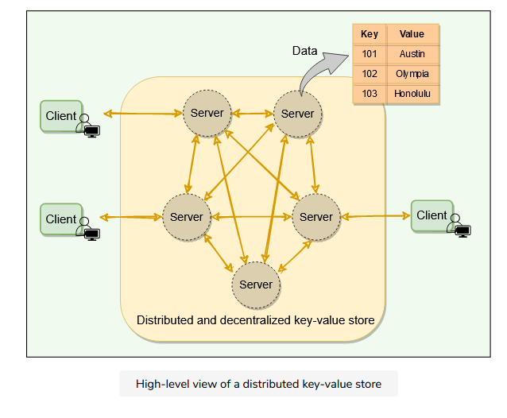

## System APIs

The Dynamo clients use put\(\) and get\(\) operations to write and read data corresponding to a specified key. This key uniquely identifies an object.

* get\(key\): The get operation finds the nodes where the object associated with the given key is located and returns either a single object or a list of objects with conflicting versions along with a context. 
* put\(key, context, object\): The put operation finds the nodes where the object associated with the given key should be stored and writes the given object to the disk. 
* Dynamo treats both the object and the key as an arbitrary array of bytes \(typically less than 1 MB\). It applies the MD5 hashing algorithm on the key to generate a 128-bit identifier which is used to determine the storage nodes that are responsible for serving the key.

## Dynamo’s architecture

Dynamo is a Distributed Hash Table \(DHT\) that is replicated across the cluster for high availability and fault tolerance.

### Data distribution

Dynamo uses Consistent Hashing to distribute its data among nodes.

### Data replication and consistency \#

Data is replicated optimistically, i.e., Dynamo provides eventual consistency.

### Handling temporary failures

To handle temporary failures, Dynamo replicates data to a sloppy quorum of other nodes in the system instead of a strict majority quorum.

### Inter-node communication and failure detection

Dynamo’s nodes use gossip protocol to keep track of the cluster state.

### High availability

* Dynamo makes the system “always writeable” by using hinted handoff.

### Conflict resolution and handling permanent failures

Dynamo resolves potential conflicts using other mechanisms:

* Use vector clocks to keep track of value history and reconcile divergent histories at read time.
* In the background, dynamo uses an anti-entropy mechanism like Merkle trees to handle permanent failures.

## What is data partitioning?

The act of distributing data across a set of nodes is called data partitioning.

There are two challenges when we try to distribute data:

A naive approach will be to use a suitable hash function that maps the data key to a number. Then, find the server by applying modulo on this number and the total number of servers. For example:

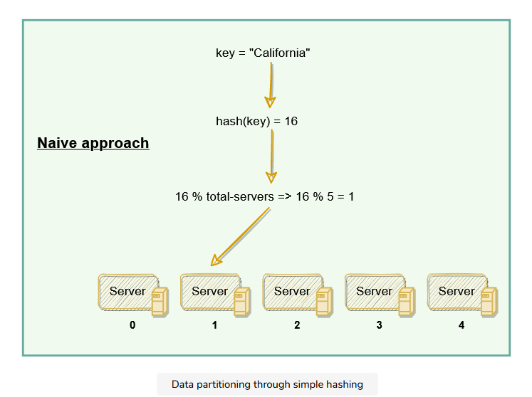

The scheme described in the above diagram solves the problem of finding a server for storing/retrieving the data. But when we add or remove a server, we have to remap all the keys and move the data based on the new server count, which will be a complete mess!

Dynamo uses consistent hashing to solve these problems.

## Consistent hashing: Dynamo’s data distribution

Consistent hashing represents the data managed by a cluster as a ring. Each node in the ring is assigned a range of data. Dynamo uses the consistent hashing algorithm to determine what row is stored to what node. Here is an example of the consistent hashing ring:

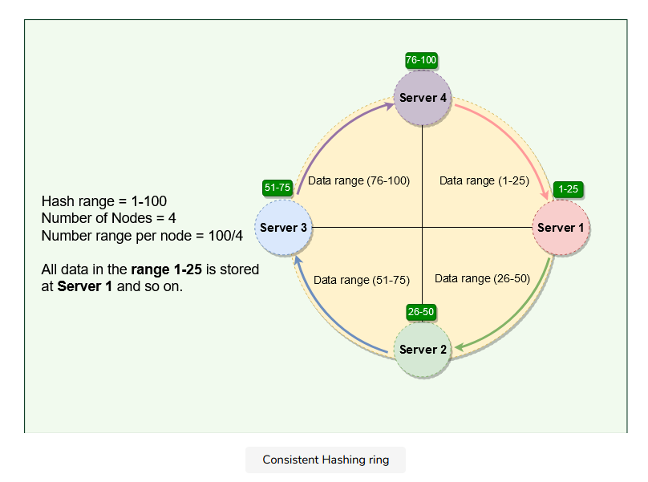

With consistent hashing, the ring is divided into smaller predefined ranges. Each node is assigned one of these ranges. In Dynamo’s terminology, the start of the range is called a token. This means that each node will be assigned one token. The range assigned to each node is computed as follows:

Range start: Token value Range end: Next token value - 1

Whenever Dynamo is serving a put\(\) or a get\(\) request, the first step it performs is to apply the MD5 hashing algorithm to the key. The output of this hashing algorithm determines within which range the data lies and hence, on which node the data will be stored. As we saw above, each node in Dynamo is supposed to store data for a fixed range. Hence, the hash generated from the data key tells us the node where the data will be stored. Here is an example showing how data gets distributed across the Consistent Hashing ring:

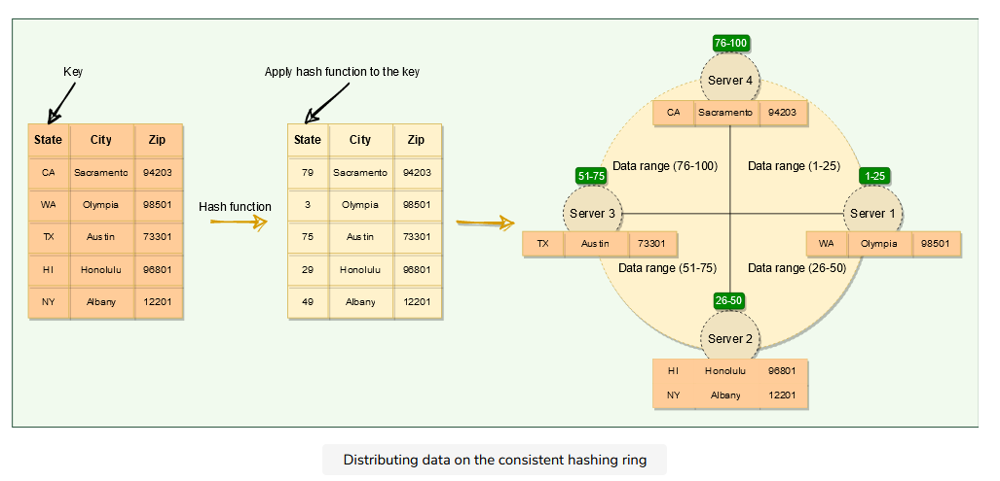

The consistent hashing scheme described above works great when a node is added or removed from the ring; as only the next node is affected in these scenarios. For example, when a node is removed, the next node becomes responsible for all of the keys stored on the outgoing node. However, this scheme can result in non-uniform data and load distribution. Dynamo solves these issues with the help of Virtual nodes.

### Virtual nodes

Adding and removing nodes in any distributed system is quite common. Existing nodes can die and may need to be decommissioned. Similarly, new nodes may be added to an existing cluster to meet growing demands. Dynamo efficiently handles these scenarios through the use of virtual nodes \(or Vnodes\).

As we saw above, the basic Consistent Hashing algorithm assigns a single token \(or a consecutive hash range\) to each physical node. This was a static division of ranges that requires calculating tokens based on a given number of nodes. This scheme made adding or replacing a node an expensive operation, as, in this case, we would like to rebalance and distribute the data to all other nodes, resulting in moving a lot of data. Here are a few potential issues associated with a manual and fixed division of the ranges:

```text
Adding or removing nodes: Adding or removing nodes will result in recomputing the tokens causing a significant administrative overhead for a large cluster.
Hotspots: Since each node is assigned one large range, if the data is not evenly distributed, some nodes can become hotspots.
Node rebuilding: Since each node’s data is replicated on a fixed number of nodes (discussed later), when we need to rebuild a node, only its replica nodes can provide the data. This puts a lot of pressure on the replica nodes and can lead to service degradation.
```

To handle these issues, Dynamo introduced a new scheme for distributing the tokens to physical nodes. Instead of assigning a single token to a node, the hash range is divided into multiple smaller ranges, and each physical node is assigned multiple of these smaller ranges. Each of these subranges is called a Vnode. With Vnodes, instead of a node being responsible for just one token, it is responsible for many tokens \(or subranges\).

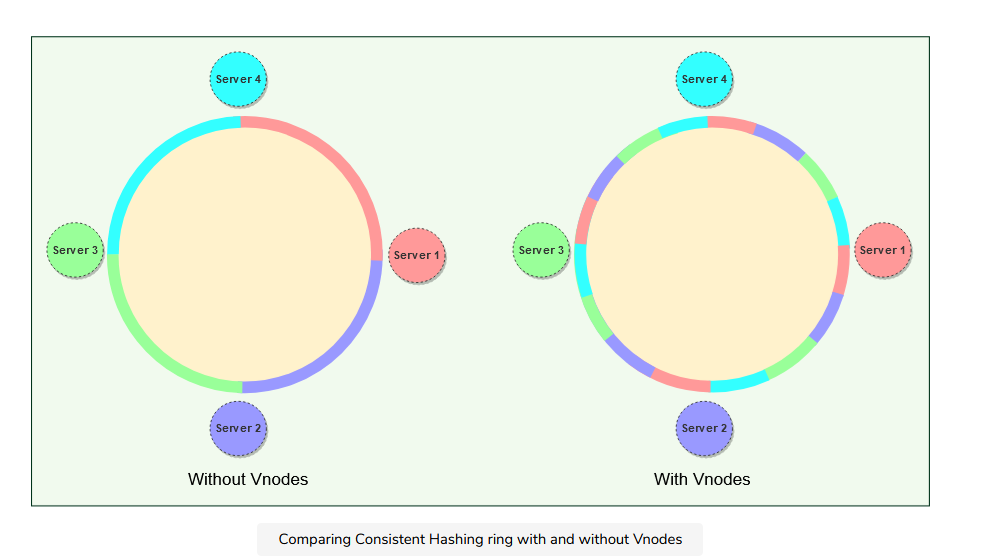

Practically, Vnodes are randomly distributed across the cluster and are generally non-contiguous so that no two neighboring Vnodes are assigned to the same physical node. Furthermore, nodes do carry replicas of other nodes for fault-tolerance. Also, since there can be heterogeneous machines in the clusters, some servers might hold more Vnodes than others. The figure below shows how physical nodes A, B, C, D, & E are using Vnodes of the Consistent Hash ring. Each physical node is assigned a set of Vnodes and each Vnode is replicated once.

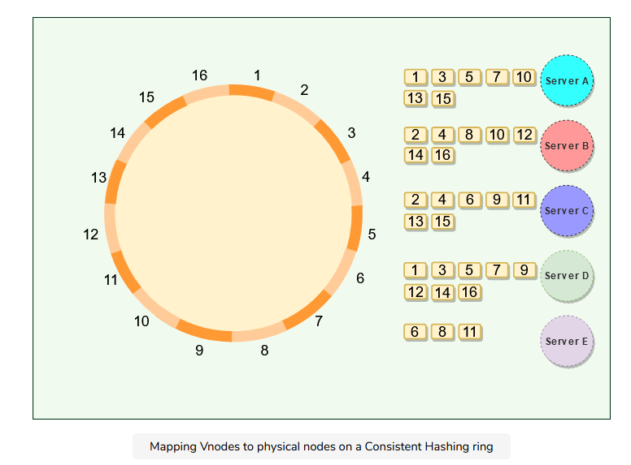

### Advantages of Vnodes

Vnodes give the following advantages:

```text
Vnodes help spread the load more evenly across the physical nodes on the cluster by dividing the hash ranges into smaller subranges. This speeds up the rebalancing process after adding or removing nodes. When a new node is added, it receives many Vnodes from the existing nodes to maintain a balanced cluster. Similarly, when a node needs to be rebuilt, instead of getting data from a fixed number of replicas, many nodes participate in the rebuild process.
Vnodes make it easier to maintain a cluster containing heterogeneous machines. This means, with Vnodes, we can assign a high number of ranges to a powerful server and a lower number of ranges to a less powerful server.
Since Vnodes help assign smaller ranges to each physical node, the probability of hotspots is much less than the basic Consistent Hashing scheme which uses one big range per node.
```

## What is optimistic replication?

To ensure high availability and durability, Dynamo replicates each data item on multiple NNN nodes in the system where the value NNN is equivalent to the replication factor and is configurable per instance of Dynamo. Each key is assigned to a coordinator node \(the node that falls first in the hash range\), which first stores the data locally and then replicates it to N−1N-1N−1 clockwise successor nodes on the ring. This results in each node owning the region on the ring between it and its NthNthNth predecessor. This replication is done asynchronously \(in the background\), and Dynamo provides an eventually consistent model. This replication technique is called optimistic replication, which means that replicas are not guaranteed to be identical at all times. Each node in Dynamo serves as a replica for a different range of data. As Dynamo stores NNN copies of data spread across different nodes, if one node is down, other replicas can respond to queries for that range of data. If a client cannot contact the coordinator node, it sends the request to a node holding a replica.

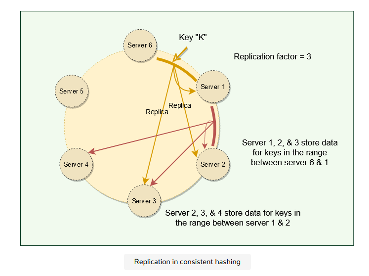

### Preference List

The list of nodes responsible for storing a particular key is called the preference list. Dynamo is designed so that every node in the system can determine which nodes should be in this list for any specific key \(discussed later\). This list contains more than NNN nodes to account for failure and skip virtual nodes on the ring so that the list only contains distinct physical nodes. Sloppy quorum and handling of temporary failures \#

Following traditional quorum approaches, any distributed system becomes unavailable during server failures or network partitions and would have reduced availability even under simple failure conditions. To increase the availability, Dynamo does not enforce strict quorum requirements, and instead uses something called sloppy quorum. With this approach, all read/write operations are performed on the first NNN healthy nodes from the preference list, which may not always be the first NNN nodes encountered while moving clockwise on the consistent hashing ring.

Consider the example of Dynamo configuration given in the figure below with N=3N=3N=3. In this example, if Server 1 is temporarily down or unreachable during a write operation, its data will now be stored on Server 4. Thus, Dynamo transfers the replica stored on the failing node \(i.e., Server 1\) to the next node of the consistent hash ring that does not have the replica \(i.e., Server 4\). This is done to avoid unavailability caused by a short-term machine or network failure and to maintain desired availability and durability guarantees. The replica sent to Server 4 will have a hint in its metadata that suggests which node was the intended recipient of the replica \(in this case, Server 1\). Nodes that receive hinted replicas will keep them in a separate local database that is scanned periodically. Upon detecting that Server 1 has recovered, Server 4 will attempt to deliver the replica to Server 1. Once the transfer succeeds, Server 4 may delete the object from its local store without decreasing the total number of replicas in the system.


## Hinted handoff

The interesting trick described above to increase availability is known as hinted handoff, i.e., when a node is unreachable, another node can accept writes on its behalf. The write is then kept in a local buffer and sent out once the destination node is reachable again. This makes Dynamo “always writeable.” Thus, even in the extreme case where only a single node is alive, write requests will still get accepted and eventually processed.

The main problem is that since a sloppy quorum is not a strict majority, the data can and will diverge, i.e., it is possible for two concurrent writes to the same key to be accepted by non-overlapping sets of nodes. This means that multiple conflicting values against the same key can exist in the system, and we can get stale or conflicting data while reading. Dynamo allows this and resolves these conflicts using Vector Clocks.

Vector Clocks and Conflicting Data

## What is clock skew?

On a single machine, all we need to know about is the absolute or wall clock time: suppose we perform a write to key k with timestamp t1 and then perform another write to k with timestamp t2. Since t2 &gt; t1, the second write must have been newer than the first write, and therefore the database can safely overwrite the original value.

In a distributed system, this assumption does not hold. The problem is clock skew, i.e., different clocks tend to run at different rates, so we cannot assume that time t on node a happened before time t + 1 on node b. The most practical techniques that help with synchronizing clocks, like NTP, still do not guarantee that every clock in a distributed system is synchronized at all times. So, without special hardware like GPS units and atomic clocks, just using wall clock timestamps is not enough. What is a vector clock? \#

Instead of employing tight synchronization mechanics, Dynamo uses something called vector clock in order to capture causality between different versions of the same object. A vector clock is effectively a \(node, counter\) pair. One vector clock is associated with every version of every object stored in Dynamo. One can determine whether two versions of an object are on parallel branches or have a causal ordering by examining their vector clocks. If the counters on the first object’s clock are less-than-or-equal to all of the nodes in the second clock, then the first is an ancestor of the second and can be forgotten. Otherwise, the two changes are considered to be in conflict and require reconciliation. Dynamo resolves these conflicts at read-time. Let’s understands this with an example:

```text
Server A serves a write to key k1, with value foo. It assigns it a version of [A:1]. This write gets replicated to server B.
Server A serves a write to key k1, with value bar. It assigns it a version of [A:2]. This write also gets replicated to server B.
A network partition occurs. A and B cannot talk to each other.
Server A serves a write to key k1, with value baz. It assigns it a version of [A:3]. It cannot replicate it to server B, but it gets stored in a hinted handoff buffer on another server.
Server B sees a write to key k1, with value bax. It assigns it a version of [B:1]. It cannot replicate it to server A, but it gets stored in a hinted handoff buffer on another server.
The network heals. Server A and B can talk to each other again.
Either server gets a read request for key k1. It sees the same key with different versions [A:3] and [A:2][B:1], but it does not know which one is newer. It returns both and tells the client to figure out the version and write the newer version back into the system.
```

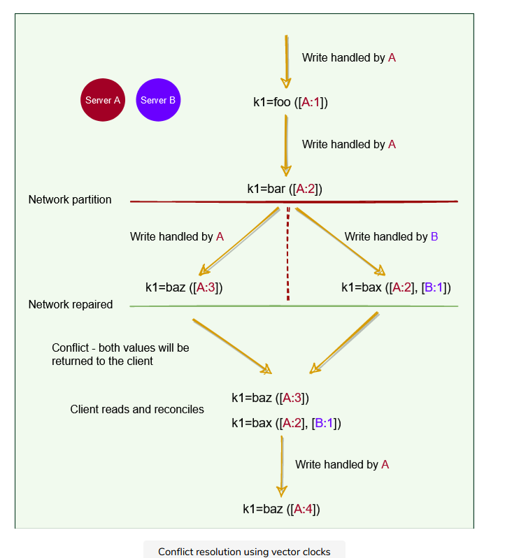

As we saw in the above example, most of the time, new versions subsume the previous version\(s\), and the system itself can determine the correct version \(e.g., \[A:2\] is newer than \[A:1\]\). However, version branching may happen in the presence of failures combined with concurrent updates, resulting in conflicting versions of an object. In these cases, the system cannot reconcile the multiple versions of the same object, and the client must perform the reconciliation to collapse multiple branches of data evolution back into one \(this process is called semantic reconciliation\). A typical example of a collapse operation is “merging” different versions of a customer’s shopping cart. Using this reconciliation mechanism, an add operation \(i.e., adding an item to the cart\) is never lost. However, deleted items can resurface.

```text
Resolving conflicts is similar to how Git works. If Git can merge different versions into one, merging is done automatically. If not, the client (i.e., the developer) has to reconcile conflicts manually.
```

Dynamo truncates vector clocks \(oldest first\) when they grow too large. If Dynamo ends up deleting older vector clocks that are required to reconcile an object’s state, Dynamo would not be able to achieve eventual consistency. Dynamo’s authors note that this is a potential problem but do not specify how this may be addressed. They do mention that this problem has not yet surfaced in any of their production systems.

## Conflict-free replicated data types \(CRDTs\)

A more straightforward way to handle conflicts is through the use of CRDTs. To make use of CRDTs, we need to model our data in such a way that concurrent changes can be applied to the data in any order and will produce the same end result. This way, the system does not need to worry about any ordering guarantees. Amazon’s shopping cart is an excellent example of CRDT. When a user adds two items \(A & B\) to the cart, these two operations of adding A & B can be done on any node and with any order, as the end result is the two items are added to the cart. \(Removing from the shopping cart is modeled as a negative add.\) The idea that any two nodes that have received the same set of updates will see the same end result is called strong eventual consistency. Riak has a few built-in CRDTs.

## Last-write-wins \(LWW\)

Unfortunately, it is not easy to model the data as CRDTs. In many cases, it involves too much effort. Therefore, vector clocks with client-side resolution are considered good enough.

Instead of vector clocks, Dynamo also offers ways to resolve the conflicts automatically on the server-side. Dynamo \(and Apache Cassandra\) often uses a simple conflict resolution policy: last-write-wins \(LWW\), based on the wall-clock timestamp. LWW can easily end up losing data. For example, if two conflicting writes happen simultaneously, it is equivalent to flipping a coin on which write to throw away.

The Life of Dynamo’s put\(\) & get\(\) Operations

## Strategies for choosing the coordinator node

Dynamo clients can use one of the two strategies to choose a node for their get\(\) and put\(\) requests:

```text
Clients can route their requests through a generic load balancer.
Clients can use a partition-aware client library that routes the requests to the appropriate coordinator nodes with lower latency.
```

In the first case, the load balancer decides which way the request would be routed, while in the second strategy, the client selects the node to contact. Both approaches are beneficial in their own ways.

In the first strategy, the client is unaware of the Dynamo ring, which helps scalability and makes Dynamo’s architecture loosely coupled. However, in this case, since the load balancer can forward the request to any node in the ring, it is possible that the node it selects is not part of the preference list. This will result in an extra hop, as the request will then be forwarded to one of the nodes in the preference list by the intermediate node.

The second strategy helps in achieving lower latency, as in this case, the client maintains a copy of the ring and forwards the request to an appropriate node from the preference list. Because of this option, Dynamo is also called a zero-hop DHT, as the client can directly contact the node that holds the required data. However, in this case, Dynamo does not have much control over the load distribution and request handling. 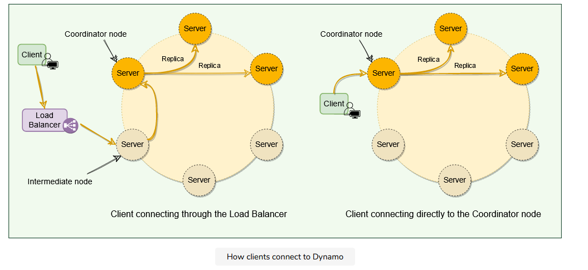

## Consistency protocol

Dynamo uses a consistency protocol similar to quorum systems. If R/WR/WR/W is the minimum number of nodes that must participate in a successful read/write operation respectively:

```text
Then R+W>NR+W > NR+W>N yields a quorum-like system
A Common (N,R,WN, R, WN,R,W) configuration used by Dynamo is (3, 2, 2).
    (3, 3, 1): fast WWW, slow RRR, not very durable
    (3, 1, 3): fast RRR, slow WWW, durable
In this model, the latency of a get() (or put()) operation depends upon the slowest of the replicas. For this reason, RRR and WWW are usually configured to be less than NNN to provide better latency.
In general, low values of WWW and RRR increase the risk of inconsistency, as write requests are deemed successful and returned to the clients even if a majority of replicas have not processed them. This also introduces a vulnerability window for durability when a write request is successfully returned to the client even though it has been persisted at only a small number of nodes.
For both Read and Write operations, the requests are forwarded to the first ‘NNN’ healthy nodes.
```

‘put\(\)’ process \#

Dynamo’s put\(\) request will go through the following steps:

```text
The coordinator generates a new data version and vector clock component.
Saves new data locally.
Sends the write request to N−1N-1N−1 highest-ranked healthy nodes from the preference list.
The put() operation is considered successful after receiving W−1W-1W−1 confirmation.
```

‘get\(\)’ process \#

Dynamo’s get\(\) request will go through the following steps:

```text
The coordinator requests the data version from N−1N-1N−1 highest-ranked healthy nodes from the preference list.
Waits until R−1R-1R−1 replies.
Coordinator handles causal data versions through a vector clock.
Returns all relevant data versions to the caller.
```

Request handling through state machine \#

Each client request results in creating a state machine on the node that received the client request. The state machine contains all the logic for identifying the nodes responsible for a key, sending the requests, waiting for responses, potentially doing retries, processing the replies, and packaging the response for the client. Each state machine instance handles exactly one client request. For example, a read operation implements the following state machine:

```text
Send read requests to the nodes.
Wait for the minimum number of required responses.
If too few replies were received within a given time limit, fail the request.
Otherwise, gather all the data versions and determine the ones to be returned.
If versioning is enabled, perform syntactic reconciliation and generate an opaque write context that contains the vector clock that subsumes all the remaining versions.
```

After the read response has been returned to the caller, the state machine waits for a short period to receive any outstanding responses. If stale versions were returned in any of the responses, the coordinator updates those nodes with the latest version. This process is called Read Repair because it repairs replicas that have missed a recent update.

As stated above, put\(\) requests are coordinated by one of the top NNN nodes in the preference list. Although it is always desirable to have the first node among the top NNN to coordinate the writes, thereby serializing all writes at a single location, this approach has led to uneven load distribution for Dynamo. This is because the request load is not uniformly distributed across objects. To counter this, any of the top NNN nodes in the preference list is allowed to coordinate the writes. In particular, since each write operation usually follows a read operation, the coordinator for a write operation is chosen to be the node that replied fastest to the previous read operation, which is stored in the request’s context information. This optimization enables Dynamo to pick the node that has the data that was read by the preceding read operation, thereby increasing the chances of getting “read-your-writes” consistency.

Anti-entropy Through Merkle Trees As we know, Dynamo uses vector clocks to remove conflicts while serving read requests. Now, if a replica falls significantly behind others, it might take a very long time to resolve conflicts using just vector clocks. It would be nice to be able to automatically resolve some conflicts in the background. To do this, we need to quickly compare two copies of a range of data residing on different replicas and figure out exactly which parts are different.

What are Merkle trees? \#

A replica can contain a lot of data. Naively splitting up the entire data range for checksums is not very feasible; there is simply too much data to be transferred. Therefore, Dynamo uses Merkle trees to compare replicas of a range. A Merkle tree is a binary tree of hashes, where each internal node is the hash of its two children, and each leaf node is a hash of a portion of the original data.

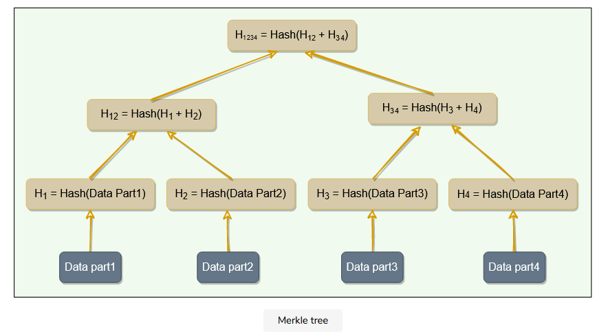

Comparing Merkle trees is conceptually simple:

```text
Compare the root hashes of both trees.
If they are equal, stop.
Recurse on the left and right children.
```

Ultimately, this means that replicas know precisely which parts of the range are different, and the amount of data exchanged is minimized. Merits and demerits of Merkle trees \#

The principal advantage of using a Merkle tree is that each branch of the tree can be checked independently without requiring nodes to download the entire tree or the whole data set. Hence, Merkle trees minimize the amount of data that needs to be transferred for synchronization and reduce the number of disk reads performed during the anti-entropy process.

The disadvantage of using Merkle trees is that many key ranges can change when a node joins or leaves, and as a result, the trees need to be recalculated.

What is gossip protocol? \#

In a Dynamo cluster, since we do not have any central node that keeps track of all nodes to know if a node is down or not, how does a node know every other node’s current state? The simplest way to do this is to have every node maintain heartbeats with every other node. When a node goes down, it will stop sending out heartbeats, and everyone else will find out immediately. But then O\(N2\)O\(N^2\)O\(N​2​​\) messages get sent every tick \(NNN being the number of nodes\), which is a ridiculously high amount and not feasible in any sizable cluster.

Dynamo uses gossip protocol that enables each node to keep track of state information about the other nodes in the cluster, like which nodes are reachable, what key ranges they are responsible for, and so on \(this is basically a copy of the hash ring\). Nodes share state information with each other to stay in sync. Gossip protocol is a peer-to-peer communication mechanism in which nodes periodically exchange state information about themselves and other nodes they know about. Each node initiates a gossip round every second to exchange state information about itself and other nodes with one other random node. This means that any new event will eventually propagate through the system, and all nodes quickly learn about all other nodes in a cluster.

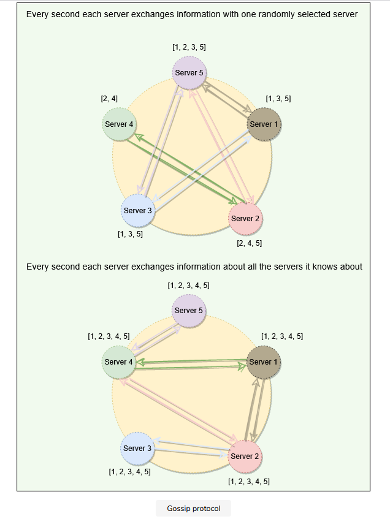

External discovery through seed nodes \#

As we know, Dynamo nodes use gossip protocol to find the current state of the ring. This can result in a logical partition of the cluster in a particular scenario. Let’s understand this with an example:

An administrator joins node A to the ring and then joins node B to the ring. Nodes A and B consider themselves part of the ring, yet neither would be immediately aware of each other. To prevent these logical partitions, Dynamo introduced the concept of seed nodes. Seed nodes are fully functional nodes and can be obtained either from a static configuration or a configuration service. This way, all nodes are aware of seed nodes. Each node communicates with seed nodes through gossip protocol to reconcile membership changes; therefore, logical partitions are highly unlikely.

Responsibilities of a Dynamo’s node \#

Because Dynamo is completely decentralized and does not rely on a central/leader server \(unlike GFS, for example\), each node serves three functions:

```text
Managing get() and put() requests: A node may act as a coordinator and manage all operations for a particular key or may forward the request to the appropriate node.
Keeping track of membership and detecting failures: Every node uses gossip protocol to keep track of other nodes in the system and their associated hash ranges.
Local persistent storage: Each node is responsible for being either the primary or replica store for keys that hash to a specific range of values. These (key, value) pairs are stored within that node using various storage systems depending on application needs. A few examples of such storage systems are:
    BerkeleyDB Transactional Data Store
    MySQL (for large objects)
    An in-memory buffer (for best performance) backed by persistent storage
```

Characteristics of Dynamo \#

Here are a few reasons behind Dynamo’s popularity:

```text
Distributed: Dynamo can run on a large number of machines.
Decentralized: Dynamo is decentralized; there is no need for any central coordinator to oversee operations. All nodes are identical and can perform all functions of Dynamo.
Scalable: By adding more nodes to the cluster, Dynamo can easily be scaled horizontally. No manual intervention or rebalancing is required. Additionally, Dynamo achieves linear scalability and proven fault-tolerance on commodity hardware.
Highly Available: Dynamo is fault-tolerant, and the data remains available even if one or several nodes or data centers go down.
Fault-tolerant and reliable: Since data is replicated to multiple nodes, fault-tolerance is pretty high.
Tunable consistency: With Dynamo, applications can adjust the trade-off between availability and consistency of data, typically by configuring replication factor and consistency level settings.
Durable: Dynamo stores data permanently.
Eventually Consistent: Dynamo accepts the trade-off of strong consistency in favor of high availability.
```

Criticism on Dynamo \#

The following list contains criticism on Dynamo’s design:

```text
Each Dynamo node contains the entire Dynamo routing table. This is likely to affect the scalability of the system as this routing table will grow larger and larger as nodes are added to the system.
Dynamo seems to imply that it strives for symmetry, where every node in the system has the same set of roles and responsibilities, but later, it specifies some nodes as seeds. Seeds are special nodes that are externally discoverable. These are used to help prevent logical partitions in the Dynamo ring. This seems like it may violate Dynamo’s symmetry principle.
Although security was not a concern as Dynamo was built for internal use only, DHTs can be susceptible to several different types of attacks. While Amazon can assume a trusted environment, sometimes a buggy software can act in a manner quite similar to a malicious actor.
Dynamo’s design can be described as a “leaky abstraction,” where client applications are often asked to manage inconsistency, and the user experience is not 100% seamless. For example, inconsistencies in the shopping cart items may lead users to think that the website is buggy or unreliable.
```

Summary \#

```text
Dynamo is a highly available key-value store developed by Amazon for their internal use.
Dynamo shows how business requirements can drive system designs. Amazon has chosen to sacrifice strong consistency for higher availability based on their business requirements.
Dynamo was designed with the understanding that system/hardware failures can and do occur.
Dynamo is a peer-to-peer distributed system, i.e., it does not have any leader or follower nodes. All nodes are equal and have the same set of roles and responsibilities. This also means that there is no single point of failure.
Dynamo uses the Consistent Hashing algorithm to distribute the data among nodes in the cluster automatically.
Data is replicated across nodes for fault tolerance and redundancy. Dynamo replicates writes to a sloppy quorum of other nodes in the system instead of a strict majority quorum.
For anti-entropy and to resolve conflicts, Dynamo uses Merkle trees.
Different storage engines can be plugged into Dynamo’s local storage.
Dynamo uses the gossip protocol for inter-node communication.
Dynamo makes the system “always writeable” by using hinted handoff.
Dynamo’s design philosophy is to ALWAYS allow writes. To support this, Dynamo allows concurrent writes. Writes can be performed by different servers concurrently, resulting in multiple versions of an object. Dynamo attempts to track and reconcile these changes using vector clocks. When Dynamo cannot reconcile an object’s state from its vector clocks, it sends it to the client application for reconciliation (the thought being that the clients have more semantic information on the object and may be able to reconcile it).
Dynamo is able to successfully pull together several distributed techniques such as consistent hashing, p2p, gossip, vector clocks, and quorum, and combine them into a complex system.
Amazon built Dynamo for internal use only, so no security related issues were considered.
```

The following table presents a summary of the list of techniques Dynamo uses and their respective advantages.

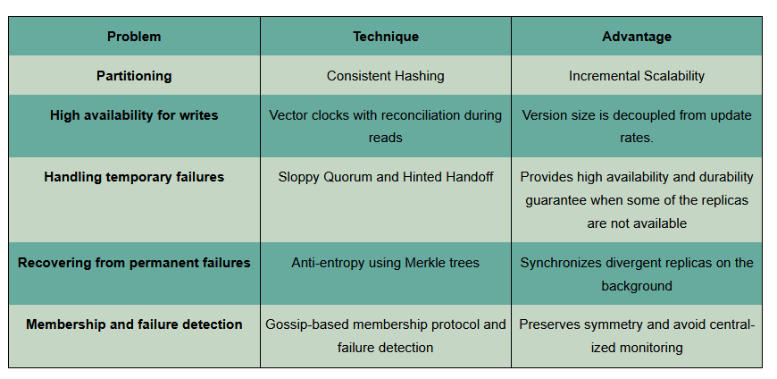

