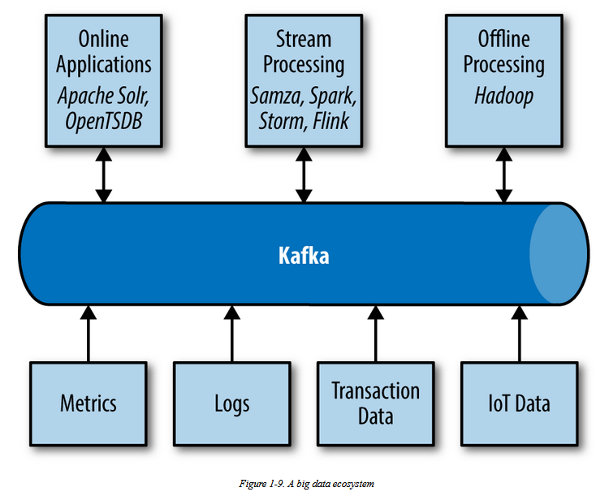
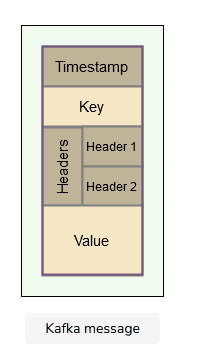
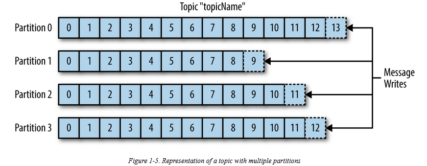
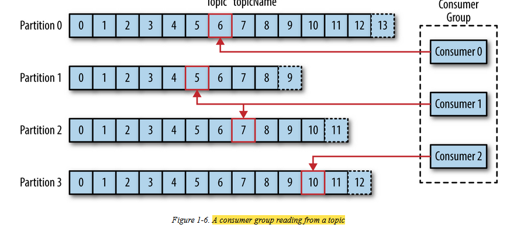
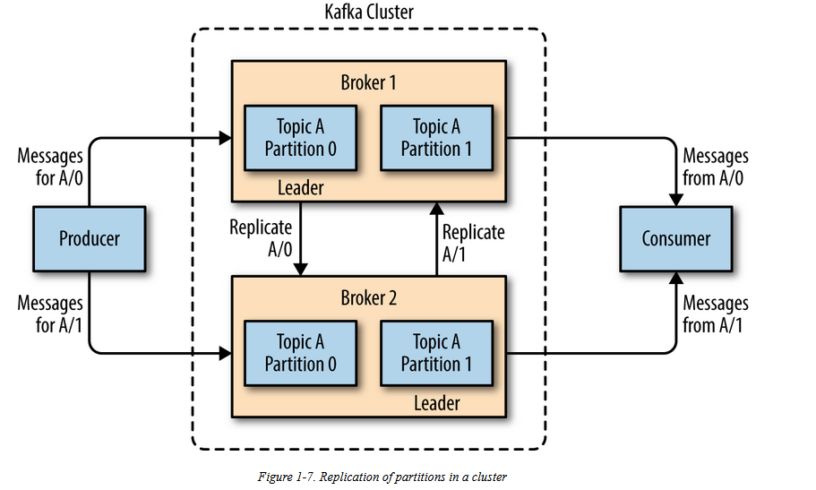
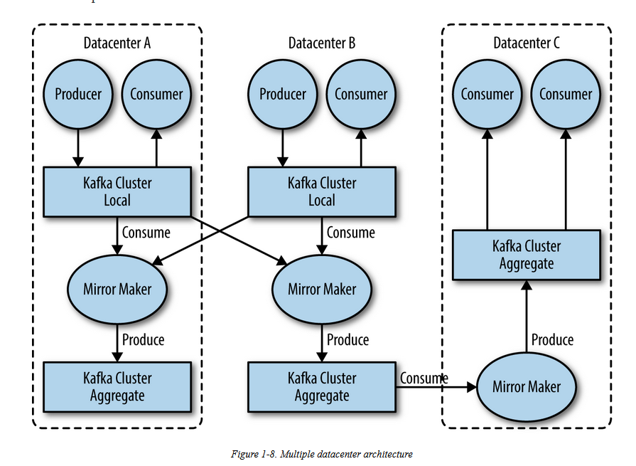
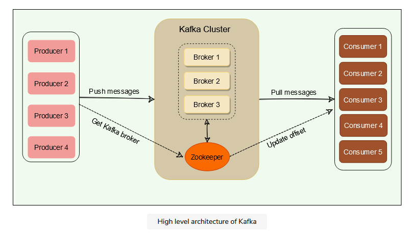
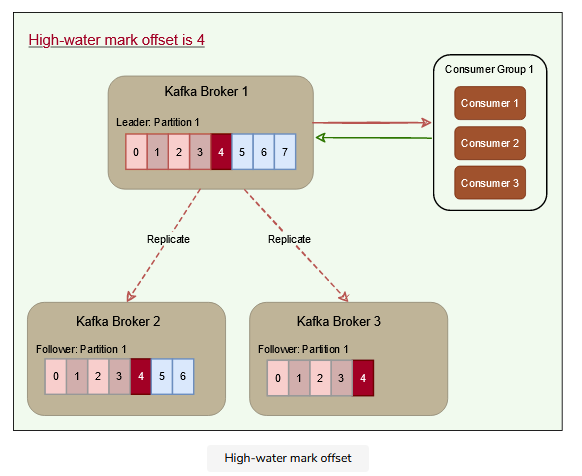

# Kafka

## Publish/Subscribe Messaging

* Publish/subscribe messaging is a pattern in which sender \(publisher\) sends piece of data \(message\)

  to receiver \(subscriber\) or subscribes to receive messages.

* It is often described as a “distributed commit log” or more recently as a “distributing streaming platform.”

  Kafka as a queue, message bus, or data storage platform

## Why Kafka

* Kafka is able to seamlessly handle multiple Producers and consumers of different topics
* Messages are committed to disk, and will be stored with configurable retention rules. allowing for different streams of messages to have different amounts of retention depending on the consumer needs.
* scalability makes it easy to handle any amount of data
* excellent performance under high load.

It carries messages between the various members of the infrastructure

## Use cases

**Activity tracking** A website’s users interact with frontend applications, which generate messages regarding actions the user is taking. This can be passive information, such as page views and click tracking, or it can be more complex actions, such as information that a user adds to their profile.

**Messaging** Kafka is also used for messaging, where applications need to send notifications \(such as emails\) to users.

**Metrics and logging** Applications publish metrics on a regular basis to a Kafka topic, and those metrics can be consumed by systems for monitoring and alerting. They can also be used in an offline system like Hadoop to perform longer-term analysis, such as growth projections.

**Change log database** Since Kafka is based on the concept of a commit log, database changes can be published to Kafka and applications can easily monitor this stream to receive live updates as they happen. This changelog stream can also be used for replicating database updates to a remote system

**Stream processing** Stream processing operates on data in real time, as quickly as messages are produced. Stream frameworks allow users to write small applications to operate on Kafka messages, performing tasks such as counting metrics, partitioning messages for efficient processing by other applications, or transforming messages using data from multiple sources

## Messages

* message or an event that gets stored in Kafka. 
* A record contains a key, a value, a timestamp, and optional metadata headers.

## Messages and Batches

* The unit of data within Kafka is called a message. 
* A message can have an optional bit of metadata, which is referred to as a key. The key is also a byte array and, as with the message, has no specific meaning to Kafka. 
* Keys are used when messages are to be written to partitions in a more controlled manner. 
* The simplest such scheme is to generate a consistent hash of the key, 
* select the partition number for that message by taking the result of the hash modulo, the total number of partitions in the topic. This assures that messages with the same key are always written to the same partition.

## Topics and Partitions

* Messages in Kafka are categorized into topics. The closest analogies for a topic are a database table or a folder in a filesystem. 
* Topics are additionally broken down into a number of partitions. Going back to the “commit log” description, a partition is a single log. Messages are written to it in an append-only fashion, and are read in order from beginning to end
* Each partition can be hosted on a different server, which means that a single topic can be scaled horizontally across multiple servers to provide performance far beyond the ability of a single server.
* a stream is considered to be a single topic of data, regardless of the number of partitions. This represents a single stream of data moving from the producers to the consumers.
* Offset sequences are unique only to each partition. This means, to locate a specific message, we need to know the Topic, Partition, and Offset number.
* Producers can choose to publish a message to any partition. If ordering within a partition is not needed, a round-robin partition strategy can be used, so records get distributed evenly across partitions.
* Messages once written to partitions are immutable and cannot be updated.

**Advantages of seperate partition placement**

* different consumers can concurrently read different partitions present on separate brokers.
* a topic to hold more data than the capacity of one server.

## Producers and Consumers

**Producers**

* Producers/publishers/writers create new messages.
* message key and a partitioner that will generate a hash of the key and map it to a specific partition. This assures that all messages produced with a given key will get written to the same partition. The producer could also use a custom partitioner that follows other business rules for mapping messages to partitions

**Consumers**

* Consumers/subscribers/readers read messages. 
* The consumer subscribes to one or more topics and reads the messages in the order in which they were produced. 
* The consumer keeps track of which messages it has already consumed by keeping track of the offset of messages. 
* The offset is another bit of metadata—an integer value that continually increases—that Kafka adds to each message as it is produced. Each message in a given partition has a unique offset. 
* By storing the offset of the last consumed message for each partition, either in Zookeeper or in Kafka itself, a consumer can stop and restart without losing its place.
* Kafka follows the principle of a dumb broker and smart consumer. 
* consumers, themselves, poll Kafka for new messages and say what records they want to read. This allows them to increment/decrement the offset they are at as they wish, thus being able to replay and reprocess messages

**Consumer group**

* one or more consumers that work together to consume a topic. 
* The group assures that each partition is only consumed by one member. 
* The mapping of a consumer to a partition is often called _ownership of the partition by the consumer_.
* consumers can horizontally scale to consume topics with a large number of messages. Additionally, if a single consumer fails, the remaining members of the group will rebalance the partitions being consumed to take over for the missing member.

* Number of consumers in a group = number of partitions: each consumer consumes one partition.
* Number of consumers in a group &gt; number of partitions: some consumers will be idle.
* Number of consumers in a group &lt; number of partitions: some consumers will consume more partitions than others.

## Brokers and Clusters

* A single Kafka server is called a broker. 
* The broker receives messages from producers, assigns offsets to them, and commits the messages to storage on disk. 
* It also services consumers, responding to fetch requests for partitions and responding with the messages that have been committed to disk.
* a single broker can easily **handle thousands of partitions and millions of messages per second**.

**cluster controller** Kafka brokers are designed to operate as part of a cluster. Within a cluster of brokers, one broker will also function as the cluster controller

* The controller is responsible for administrative operations, including assigning partitions to brokers and monitoring for broker failures. A partition is owned by a single broker in the cluster, and that broker is called the leader of the partition. 
* A partition may be assigned to multiple brokers, which will result in the partition being replicated
* redundancy of messages in the partition, such that another broker can take over leadership if there is a broker failure

* Kafka brokers are configured with a default retention setting for topics, either retaining messages for some period of time \(e.g., 7 days\) or until the topic reaches a certain size in bytes \(e.g., 1 GB\).
* Controller periodically checks the health of other brokers in the system. In case it does not receive a response from a particular broker, it performs a failover to another broker. It also communicates the result of the partition leader election to other brokers in the system.

_Generation clock and Split Brain to handle leader election problems_

## Multiple Clusters

**Reasons why multiple data centers**

* Segregation of types of data
* Isolation for security requirements
* In multiple datacenters messages be copied between them.

> online applications can have access to user activity at both sites. For example, if a user changes public information in their profile, that change will need to be visible regardless of the datacenter in which search results are displayed. Or, monitoring data can be collected from many sites into a single central location where the analysis and alerting systems are hosted.

* The replication mechanisms within the Kafka clusters are designed only to work within a single cluster, not between multiple clusters.
* **MirrorMaker** is simply a Kafka consumer and producer, linked together with a queue. Messages are consumed from one Kafka cluster and produced for another. 

### Use Cases

* **Regional and central clusters** the company has one or more datacenters in different geographical regions, cities, or continents. Each datacenter has its own Kafka cluster.

  > There are many cases when this is a requirement, but the classic example is a company that modifies prices based on supply and demand. This company can have a datacenter in each city in which it has a presence, collects information about local supply and demand, and adjusts prices accordingly. All this information will then be mirrored to a central cluster where business analysts can run company-wide reports on its revenue.

* **High availability \(HA\) and disaster recovery \(DR\)**
* Regulatory compliance

  Companies operating in different countries may need to use different configurations and policies to conform to legal and regulatory requirements in each country. For instance, some data sets may be stored in separate clusters with strict access control, with subsets of data replicated to other clusters with wider access. To comply with regulatory policies that govern retention period in each region, data sets may be stored in clusters in different regions with different configurations.

* **Cloud migrations**

  Many companies these days run their business in both an on-premise datacenter and a cloud provider. Often, applications run on multiple regions of the cloud provider, for redundancy, and sometimes multiple cloud providers are used. In these cases, there is often at least one Kafka cluster in each on-premise datacenter and each cloud region. Those Kafka clusters are used by applications in each datacenter and region to transfer data efficiently between the datacenters. For example, if a new application is deployed in the cloud but requires some data that is updated by applications running in the on-premise datacenter and stored in an on-premise database, you can use _Kafka Connect_ to capture database changes to the local Kafka cluster and then mirror these changes to the cloud Kafka cluster where the new application can use them. This helps control the costs of cross-datacenter traffic as well as improve governance and security of the traffic.

* **Aggregation of data from edge clusters**

  Several industries including retail, telecommunications, transportation and healthcare generate data from small devices with limited connectivity. An aggregate cluster with high availability can be used to support analytics and other use cases for data from a large number of edge clusters. This reduces connectivity, availability and durability requirements on low-footprint edge clusters, for example, in IoT use cases. A highly available aggregate cluster provides business continuity even when edge clusters are offline and simplifies the development of applications that don’t have to directly deal with a large number of edge clusters with unstable networks.

> **Multiple way kafka is used in a single system** credit card transaction processing system, there will be a client application, perhaps an online store, responsible for sending each transaction to Kafka immediately when a payment is made. Another application is responsible for immediately checking this transaction against a rules engine and determining whether the transaction is approved or denied. The approve/deny response can then be written back to Kafka and the response can propagate back to the online store where the transaction was initiated. A third application can read both transactions and the approval status from Kafka and store them in a database where analysts can later review the decisions and perhaps improve the rules engine.

## High level Architecture

* Kafka is run as a cluster of one or more servers, where each server is responsible for running one Kafka broker.
* Kafka uses ZooKeeper to coordinate between Kafka brokers; ZooKeeper maintains metadata information about the Kafka cluster

## Leader

A leader is the node responsible for all reads and writes for the given partition

## Follower

Kafka can replicate partitions and distribute them across multiple broker servers called followers. Each follower’s responsibility is to replicate the leader’s data to serve as a ‘backup’ partition.

## In sync replicas

An in-sync replica \(ISR\) is a broker that has the latest data for a given partition. Only ISRs are eligible to become partition leaders.

## High Water mark index

* brokers keep track of the high-water mark, which is the highest offset that all ISRs of a particular partition share. The leader exposes data only up to the high-water mark offset and propagates the high-water mark offset to all followers.

**why we need high water mark index** If a consumer reads the record with offset ‘7’ from the leader \(Broker 1\), and later, if the current leader fails, and one of the followers becomes the leader before the record is replicated to the followers, the consumer will not be able to find that message on the new leader. The client, in this case, will experience a _non-repeatable read_. Because of this possibility, 

## Kafka workflow as pub-sub messaging

* Producers publish messages on a topic.
* Kafka broker stores messages in the partitions configured for that particular topic. 
* Consumer subscribes to a specific topic.
* Kafka will provide the current offset of the topic to the consumer and also saves that offset in the ZooKeeper.
* Consumer will request Kafka at regular intervals for new messages.
* Once Kafka receives the messages from producers, it forwards these messages to the consumer.
* Once the messages are processed, the consumer will send an acknowledgment to the Kafka broker.
* Upon receiving the acknowledgment, Kafka increments the offset and updates it in the ZooKeeper. - Since offsets are maintained in the ZooKeeper, the consumer can read the next message correctly, even during broker outages.

## Kafka workflow for consumer group

* Producers publish messages on a topic.
* Kafka stores all messages in the partitions
* A single consumer subscribes to a specific topic, assume Topic-01 with Group ID as Group-1.
* Once the new consumer arrives, Kafka switches its operation to share mode, such that each message is passed to only one of the subscribers of the consumer group Group-1.
* This message transfer can go on until the number of consumers reaches the number of partitions configured for that particular topic.
* Once the number of consumers exceeds the number of partitions, the new consumer will not receive any message until an existing consumer unsubscribes. This scenario arises because each consumer in Kafka will be assigned a minimum of one partition. Once all the partitions are assigned to the existing consumers, the new consumers will have to wait.

## Producer delivery semantics

Kafka offers three options to denote the number of brokers that must receive the record before the producer considers the write as successful:

**Async:** Producer sends a message to Kafka and does not wait for acknowledgment from the server. This means that the write is considered successful the moment the request is sent out. This fire-and-forget approach gives the best performance **Committed to Leader:** Producer waits for an acknowledgment from the leader. This ensures that the data is committed at the leader; it will be slower than the ‘Async’ option, as the data has to be written on disk on the leader. Under this scenario, the leader will respond without waiting for acknowledgments from the followers. In this case, the record will be lost if the leader crashes immediately after acknowledging the producer but before the followers have replicated it. **Committed to Leader and Quorum:** Producer waits for an acknowledgment from the leader and the quorum. This means the leader will wait for the full set of in-sync replicas to acknowledge the record. This will be the slowest write but guarantees that the record will not be lost as long as at least one in-sync replica remains alive. This is the strongest available guarantee.

## Consumer delivery semantics

There are three ways of providing consistency to the consumer:

**At-most-once**: a message is delivered a maximum of one time only. Under this option, the consumer upon receiving a message, commit \(or increment\) the offset to the broker. Now, if the consumer crashes before fully consuming the message, that message will be lost, as when the consumer restarts, it will receive the next message from the last committed offset.

**At-least-once** : a message might be delivered more than once, but no message should be lost. This scenario occurs when the consumer receives a message from Kafka, and it does not immediately commit the offset. Instead, it waits till it completes the processing. So, if the consumer crashes after processing the message but before committing the offset, it has to reread the message upon restart. Since, in this case, the consumer never committed the offset to the broker, the broker will redeliver the same message. Thus, duplicate message delivery could happen in such a scenario.

**Exactly-once** : the consumer puts the message processing and the offset increment in one transaction. This will ensure that the offset increment will happen only if the whole transaction is complete. If the consumer crashes while processing, the transaction will be rolled back, and the offset will not be incremented. When the consumer restarts, it can reread the message as it failed to process it last time. This option leads to no data duplication and no data loss but can lead to decreased throughput.

## Storing Messages in Disks

* Disks are generally considered to be slow. 
* However, there is a huge difference in disk performance between random block access and sequential access. 
* Random block access is slower because of numerous disk seeks, whereas the sequential nature of writing or reading, enables disk operations to be thousands of times faster than random access
* Writing or reading sequentially from disks are heavily optimized by the OS, via read-ahead \(prefetch large block multiples\) and write-behind \(group small logical writes into big physical writes\) techniques

## Client Quota

* Kafka producers and consumers to produce/consume very high volumes of data or generate requests at a very high rate and thus problems
* quotas protects against these issues. In Kafka, quotas are byte-rate thresholds defined per client-ID. A client-ID logically identifies an application making a request. 

