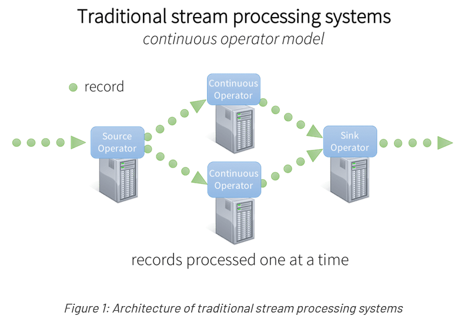
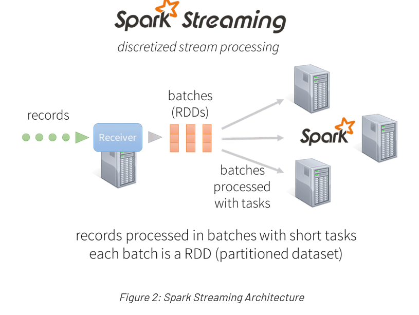
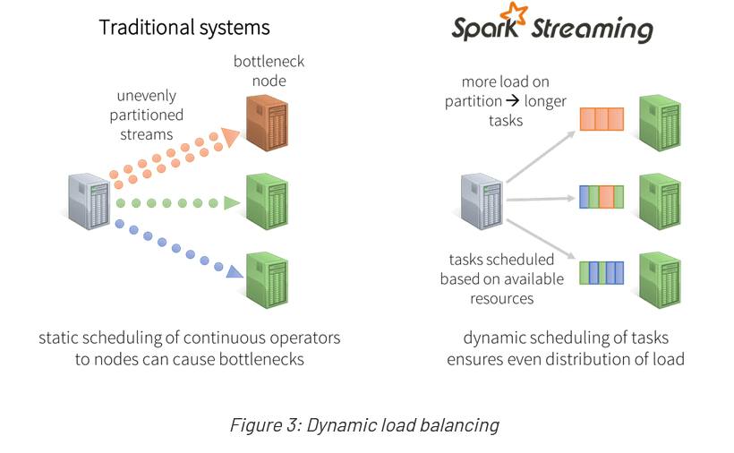
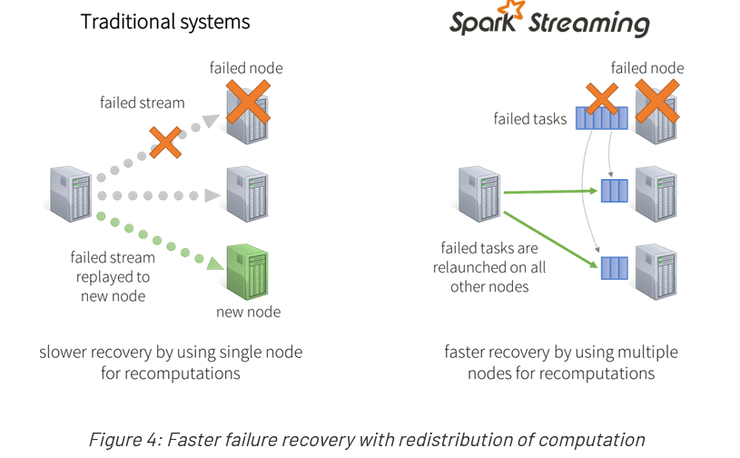

# Spark Streaming

* [stream processing steps](spark-streaming.md#stream-processing-steps)
  * [continuous operator model](spark-streaming.md#continuous-operator-model)
* [Architecture of Spark Streaming: Discretized Streams](spark-streaming.md#architecture-of-spark-streaming-discretized-streams)
  * [Benefits of Discretized Stream Processing](spark-streaming.md#benefits-of-discretized-stream-processing)
* [Unification of batch, streaming and interactive analytics](spark-streaming.md#unification-of-batch-streaming-and-interactive-analytics)
* [Performance](spark-streaming.md#performance)

Apache Spark has provided an unified engine that natively supports both batch and streaming workloads.

Stream Processing Architectures – The Old and the New

## stream processing steps

Modern distributed stream processing pipelines execute as follows:

1. Receive streaming data from data sources \(e.g. live logs, system telemetry data, IoT device data, etc.\) into some data ingestion system like Apache Kafka, Amazon Kinesis, etc.
2. Process the data in parallel on a cluster.
3. Output the results out to downstream systems like HBase, Cassandra, Kafka, etc.

### continuous operator model

To process the data, most traditional stream processing systems are designed with a continuous operator model, which works as follows:

There is a set of worker nodes, each of which run one or more continuous operators. Each continuous operator processes the streaming data one record at a time and forwards the records to other operators in the pipeline. There are “source” operators for receiving data from ingestion systems, and “sink” operators that output to downstream systems.



## Architecture of Spark Streaming: Discretized Streams

To address the problems like straggler recovery, Uneven allocation of the processing load, Spark Streaming uses a new architecture called discretized streams.

1. Instead of processing the streaming data one record at a time, Spark Streaming discretizes the streaming data into tiny, sub-second micro-batches. Meaning, Spark Streaming’s Receivers accept data in parallel and buffer it in the memory of Spark’s workers nodes. 
2. Then the latency-optimized Spark engine runs short tasks to process the batches and output the results to other systems. Note that unlike the traditional continuous operator model, where the computation is statically allocated to a node, Spark tasks are assigned dynamically to the workers based on the locality of the data and available resources. This enables both better load balancing and faster fault recovery.

In addition, each batch of data is a Resilient Distributed Dataset \(RDD\), which is the basic abstraction of a fault-tolerant dataset in Spark. This allows the streaming data to be processed using any Spark code or library.



### Benefits of Discretized Stream Processing

**Dynamic load balancing**

Dividing the data into small micro-batches allows for fine-grained allocation of computations to resources. some workers will process a few longer tasks, others will process more of the shorter tasks.



**Fast failure and straggler recovery**

In case of node failures, failed tasks can be relaunched in parallel on all the other nodes in the cluster, thus evenly distributing all the recomputations across many nodes, and recovering from the failure faster than the traditional approach.



## Unification of batch, streaming and interactive analytics

1. **distributed stream**: 

   Each batch of streaming data is represented by an RDD, which is Spark’s concept for a distributed dataset. Therefore a DStream is just a series of RDDs. This common representation allows batch and streaming workloads to interoperate seamlessly. Users can apply arbitrary Spark functions on each batch of streaming data: for example, it’s easy to join a DStream with a precomputed static dataset \(as an RDD\).

```scala
// Create data set from Hadoop file
val dataset = sparkContext.hadoopFile("file")
// Join each batch in stream with the dataset
kafkaDStream.transform { batchRDD =>
  batchRDD.join(dataset).filter(...)
}
```

1. RDDs generated by DStreams can be converted to DataFrames \(the programmatic interface to Spark SQL\), and queried with SQL. 

## Performance

1. In terms of latency, Spark Streaming can achieve latencies as low as a few hundred milliseconds. 
2. **Backpressure –** Streaming workloads can often have bursts of data \(e.g. sudden spike in tweets during the Oscars\) and the processing system must be able to handle them gracefully. Adding backpressure mechanisms that allow Spark Streaming dynamically control the ingestion rate for such bursts. This feature represents joint work between us at Databricks and engineers at Typesafe.

